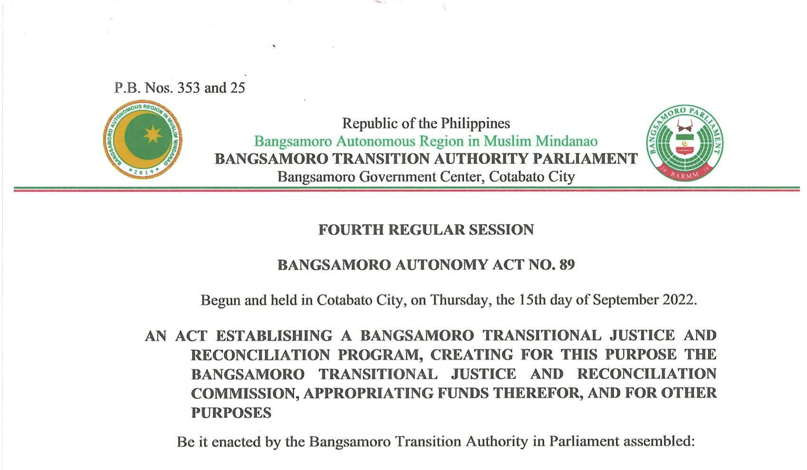
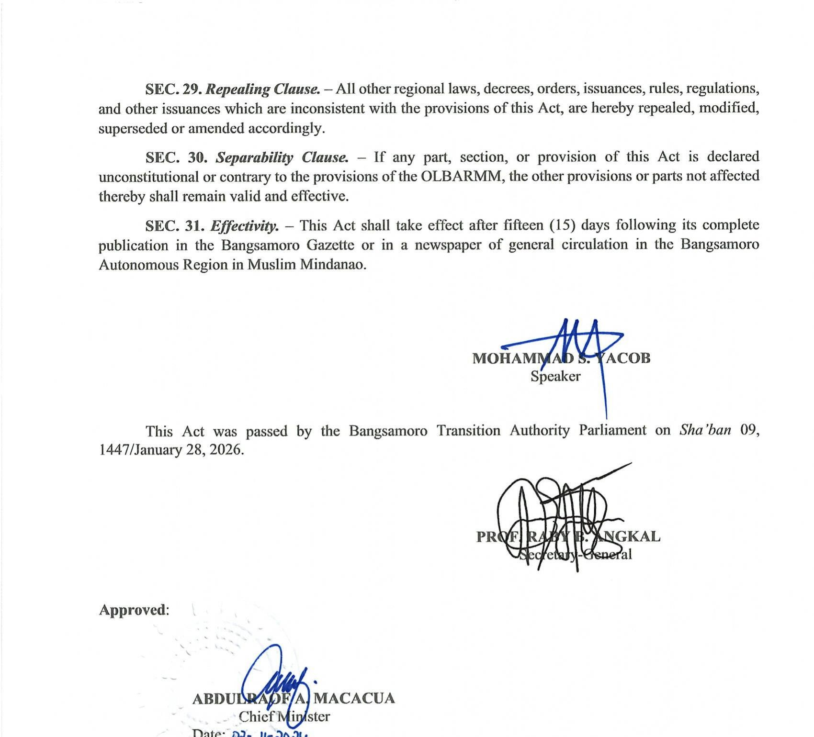
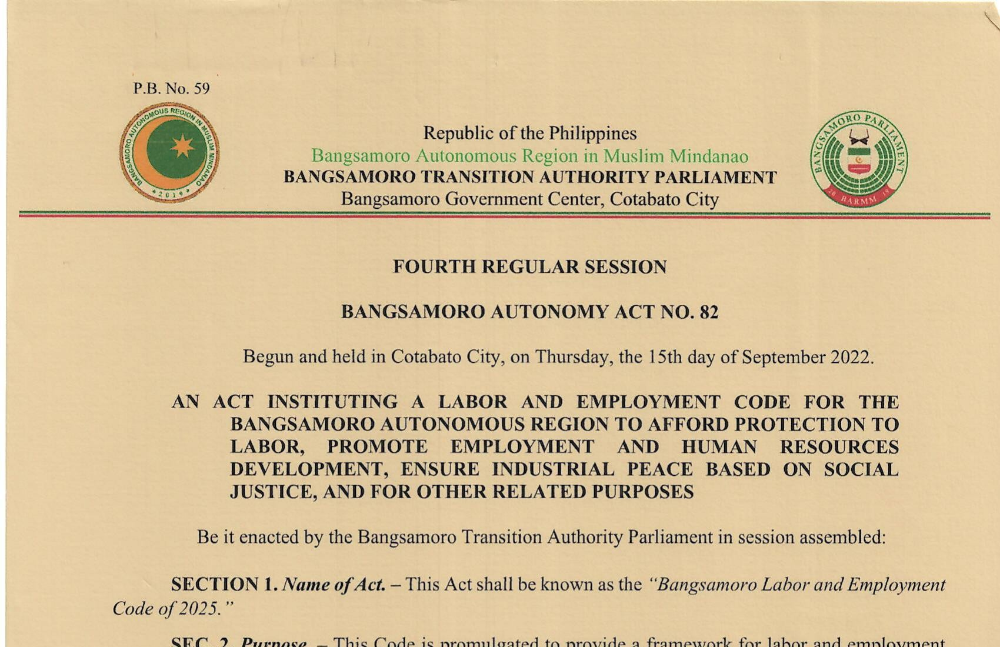

# Chapter 3: Anatomy of a Bill

A bill is not a wish list. It is a set of instructions to the government, written in a form that courts will interpret and agencies will carry out long after the drafter has moved on. The structure of a bill exists for a reason: each part does specific work, and when parts are missing or out of order, the entire law suffers.

This chapter walks through every component of a Bangsamoro Autonomy Act, from the caption down to the effectivity clause, explaining what each part does, how to write it, and what mistakes to avoid. Your job is to get every part right.

---

## 3.1 Overview: The Two-Part Structure

Every bill filed in the Bangsamoro Parliament consists of two distinct parts: the Explanatory Note and the Main Body. They serve different purposes, travel different paths, and follow different rules. Understanding this division is the first step to writing well.

### 3.1.1 The Explanatory Note

The Explanatory Note is the drafter's argument for why the bill should exist. It is not part of the law itself. Once the bill is enacted, the Explanatory Note does not appear in the final text of the Bangsamoro Autonomy Act. But during the legislative process, it is often the first thing Members of Parliament read, and sometimes the only thing they read before deciding whether to support the measure.

The Explanatory Note should answer three questions:

1. **What problem does this bill solve?** Describe the current situation. Use data, reports, or specific incidents where possible. Avoid vague claims about the need for "development" or "progress" without concrete backing.

2. **Why is legislation the right response?** Some problems can be addressed by executive issuance or administrative reform. Explain why a law is necessary — perhaps existing authority is insufficient, or the matter requires funding that only an appropriations act can provide, or a right needs statutory protection.

3. **What does the bill actually do?** Summarize the main features in plain language. This is not a restatement of every section. Hit the key mechanisms: what is being created, changed, funded, prohibited, or required.

The Explanatory Note is usually one to three pages. Keep it direct. Parliament members handle dozens of bills per session. A focused, well-supported note will get more attention than a sprawling essay.

A few practical points:

- Cite your authority. If the Bangsamoro Organic Law mandates the legislation, say so and give the specific provision. For instance, if you are drafting a Revenue Code, note that Section 4(a), Article XVI of Republic Act No. 11054[^1] lists it as a priority legislation for the transition period.
- Use actual data. Enrollment figures, budget allocations, health statistics, employment numbers — these ground your argument in reality.
- Avoid emotional appeals that cannot be substantiated. The Explanatory Note is a policy document, not a campaign speech.
- Sign the note. The principal author or authors affix their names at the end.

### 3.1.2 The Main Body

The Main Body is the actual proposed law. It begins with the caption and bill number, moves through the enacting clause, and proceeds section by section through the preliminary provisions, substantive provisions, administrative provisions, enforcement provisions, and final provisions.

Everything discussed in the rest of this chapter concerns the Main Body. The ordering of its parts is not arbitrary. Philippine and Bangsamoro legislative convention follows a standard sequence:

1. Caption and Bill Number
2. Long Title
3. Enacting Clause
4. Preliminary Provisions (short title, declaration of policy, definitions, scope)
5. Substantive Provisions (the core rules and mechanisms)
6. Administrative Provisions (implementing agencies, oversight, IRR)
7. Enforcement Provisions (penalties, sanctions)
8. Final Provisions (appropriation, transitory, separability, repealing, effectivity)

Not every bill includes all of these. A short bill adopting a symbol or declaring a holiday may have only five or six sections total. A comprehensive code may run to hundreds of sections spread across multiple books and titles. But the sequence remains the same. Do not scatter your effectivity clause in the middle of the bill or place definitions after the substantive provisions. Readers expect things in a certain order, and so do courts when they interpret the law.

---

## 3.2 The Caption and Bill Number

The caption is the header block at the top of every bill. It identifies the filing legislature, the session, and the bill's number within the parliamentary filing system. The format has evolved across the BTA's history. Understanding this evolution helps you use the correct format for the period you are drafting in.

### 3.2.1 Header Block Evolution

*Figure 1: Current header format as used in BAA 89 — P.B. Nos. 353 and 25, Fourth Regular Session, 2nd BTA Parliament.*

The header block changed across three distinct periods:

**1st BTA, Early Sessions (BAA 1-12):**[^2]

> BILL NO. 7
>
> Republic of the Philippines
> **BANGSAMORO PARLIAMENT**
> Bangsamoro Autonomous Region in Muslim Mindanao
> BARMM Compound, Cotabato City
>
> **BANGSAMORO TRANSITION AUTHORITY**
> **(FIRST REGULAR SESSION)**

Note the line order: Republic, then Parliament, then BARMM. The location was "BARMM Compound." The parliamentary body was called "BANGSAMORO PARLIAMENT" without the "Transition Authority" qualifier.

**1st BTA, Later Sessions (BAA 13-30):**

> Republic of the Philippines
> Bangsamoro Autonomous Region in Muslim Mindanao
> **BANGSAMORO PARLIAMENT**
> Bangsamoro Government Center, Cotabato City
>
> **BANGSAMORO TRANSITION AUTHORITY**
> **(SECOND REGULAR SESSION)**

The line order changed: Republic, then BARMM, then Parliament. The location updated to "Bangsamoro Government Center." This format appears in foundational legislation including BAA 13 (Administrative Code)[^3] and BAA 17 (Civil Service Code).[^4]

**2nd BTA (BAA 33-89) — Current Standard:**

> P.B. No. 190
>
> Republic of the Philippines
> Bangsamoro Autonomous Region in Muslim Mindanao
> **BANGSAMORO TRANSITION AUTHORITY PARLIAMENT**
> Bangsamoro Government Center, Cotabato City
>
> **BANGSAMORO TRANSITION AUTHORITY**
> **(SECOND REGULAR SESSION)**
>
> **BANGSAMORO AUTONOMY ACT NO. ___**

This is the current format. Key changes from the earlier format: "BANGSAMORO TRANSITION AUTHORITY PARLIAMENT" replaced "BANGSAMORO PARLIAMENT," and the bill number prefix evolved from "BILL NO." to "P.B. No." (Parliamentary Bill Number) in later sessions (BAA 54 onward). This format appears in BAA 82 (Labor and Employment Code),[^5] BAA 89 (Transitional Justice and Reconciliation Act),[^6] and all recent legislation.

**When drafting new bills during the BTA period, use the 2nd BTA format above.** When an elected Parliament convenes, the parliamentary body line will change — likely to "BANGSAMORO PARLIAMENT" — and the "Bangsamoro Transition Authority" session designation will be replaced.

### 3.2.2 Bill Number Prefixes

The bill number prefix has varied across the BTA's history:

| Format | Period | Examples |
|---|---|---|
| BILL NO. [N] | 1st BTA through early 2nd BTA | BILL NO. 7, BILL NO. 46 |
| BN-[N] | Brief transitional use | BN-128 (BAA 33) |
| P.B. No. [N] | 2nd BTA, later sessions (BAA 54+) | P.B. No. 190, P.B. No. 341 |
| P.B. Nos. [N] and [N] | Consolidated bills | P.B. Nos. 270 and 281 (BAA 72),[^7] P.B. Nos. 353 and 25 (BAA 89) |

The shift from "BILL NO." to "P.B. No." (Parliamentary Bill Number) reflects the evolution of internal parliamentary nomenclature. Use whichever format is current at the time of filing. Some BAAs carry no bill number in the enacted text — this does not mean they were filed without one. The bill number may simply have been omitted from the final published version.

### 3.2.3 Bill Number vs. BAA Number

**The bill number and the BAA number are different.** The bill number is assigned when the bill is filed — it reflects the order of filing in a given session. The BAA number is assigned when the bill is enacted — it reflects the order of enactment across all sessions. For example, what was filed as Bill No. 29 eventually became Bangsamoro Autonomy Act No. 35, the Electoral Code.[^8]

During drafting, you will use the bill number in the caption. The BAA number is assigned later by the Secretary-General after final approval. Leave the BAA number blank or use a placeholder.

### 3.2.4 Session Designation and "Begun and Held" Line

**The session designation matters.** Both the 1st and 2nd BTA Parliament operated under numbered regular sessions (First through Fourth). A future elected Parliament will likely follow a similar convention. Use the correct session designation.

**The "Begun and held in" line.** Enacted BAAs include a line identifying when the Parliament was first constituted:

1st BTA:
> Begun and held in Cotabato City, on Friday, the 29th day of March, 2019.

2nd BTA (Gregorian only):
> Begun and held in Cotabato City, on Thursday, the 15th day of September 2022.

2nd BTA (Dual calendar, after BAA 20):
> Begun and held in Cotabato City, on Thursday, the 19th of Safar 1444/15th day of September 2022.

This date marks when the Parliament was first constituted, not when the particular session began. Follow the convention used in the most recent enacted BAA when drafting this line.

### 3.2.5 Date Format

BAAs passed during or after the Dual Calendar Act (BAA No. 20) include both Hijri and Gregorian dates. BAA No. 36, for instance, records its passage date as "Shawwal 26, 1444/May 17, 2023."[^9] If the dual calendar is in force at the time of your bill's enactment, both dates should appear in the approval block.

---

## 3.3 The Long Title

The long title is the formal description of the bill's contents, usually printed in capital letters between the caption and the enacting clause. It begins with "AN ACT" and describes, in a single sentence, what the bill does.

Here are examples from enacted laws:

> **AN ACT PROVIDING FOR THE BANGSAMORO ADMINISTRATIVE CODE AND FOR OTHER RELATED PURPOSES**
> — BAA No. 13[^10]

> **AN ACT CREATING THE BANGSAMORO ATTORNEY-GENERAL'S OFFICE, DEFINING ITS FUNCTIONS AND POWERS, APPROPRIATING FUNDS THEREFOR, AND FOR OTHER RELATED PURPOSES**
> — BAA No. 5[^11]

> **AN ACT REGULATING THE OPERATIONS OF LOCAL AND FOREIGN RECRUITMENT AGENCIES WITHIN THE BANGSAMORO AUTONOMOUS REGION IN MUSLIM MINDANAO (BARMM)**
> — BAA No. 9[^12]

### 3.3.1 Purpose and Requirements

The long title serves two purposes. First, it tells the reader — quickly, in one sentence — what subject the bill covers. Second, it satisfies the constitutional and organic law requirement that every bill embrace only one subject expressed in the title.

Section 25(a), Article VII of the Bangsamoro Organic Law states: "Every bill passed by the Parliament shall embrace only one subject which shall be expressed in the title thereof."[^13] This mirrors Article VI, Section 26(1) of the 1987 Philippine Constitution.[^14] The rule is not optional. A law whose title fails to cover its contents — or whose contents go beyond the scope indicated by its title — is vulnerable to constitutional challenge.

### 3.3.2 The One Subject, One Title Rule

This rule has two parts.

**One subject.** A bill must deal with a single subject matter. That subject can be broad — the Bangsamoro Administrative Code, for example, covers the entire structure of government — but it must be unified. You cannot combine a fisheries regulation bill with an electoral reform bill. The Supreme Court has struck down laws for violating this rule, and the same risk applies in the Bangsamoro.

What counts as a "single subject" has been interpreted generously by Philippine courts. Provisions need not be identical in nature; they must simply be related to and germane to the subject expressed in the title. A bill creating a government office can include provisions on its funding, staffing, and powers — these are all part of the subject of creating that office. Similarly, the Overseas Bangsamoro Workers Act (BAA No. 19)[^15] covers employment contracts, recruitment regulation, welfare services, and repatriation — all different topics, but all germane to the single subject of overseas employment policy.

The test is germaneness, not identity. If a provision has a rational connection to the bill's subject, it belongs. If it does not, it is a "rider" and should be filed as a separate bill.

**Expressed in the title.** The title must give notice of the bill's contents. It does not need to be an index; it does not need to list every provision. But it should be specific enough that a reader knows what general topic the bill addresses. The phrase "and for other purposes" or "and for other related purposes" has become standard in Philippine legislation as a catch-all for incidental provisions, but it does not license you to smuggle in entirely unrelated subjects.

The purpose of this requirement is notice. A Member of Parliament scanning the order of business should be able to tell from the title what the bill covers. A citizen looking up a law should find it under a title that describes its contents. If the title says "An Act Creating the Bangsamoro Youth Commission" and the bill includes a provision restructuring the education ministry, that education provision violates the rule — no reader would expect it based on the title.

### 3.3.3 Tips for Writing the Long Title

- **Start with the main action.** What is the bill doing? Creating something? Regulating something? Providing for a code? Lead with that.

- **Name the subject.** If you are creating an office, name it. If you are regulating an industry, name the industry. If you are amending an existing law, identify the law.

- **Include key secondary actions.** If the bill appropriates funds, say "APPROPRIATING FUNDS THEREFOR." If it repeals an existing law, name the law being repealed.

- **Use "AND FOR OTHER PURPOSES" sparingly and honestly.** This phrase covers incidental and germane provisions. It does not expand the bill's scope beyond its core subject.

- **Keep it to one sentence.** Long titles can get long — that is fine. BAA No. 39, the Bangsamoro Holidays Act,[^16] has a long title that names the specific law being repealed. BAA No. 50, creating the Bangsamoro Kulliyyah for Islamic Studies,[^17] names the old law being repealed (MMAA No. 164). These are detailed but still one sentence.

- **Use active, specific verbs.** "Creating," "establishing," "regulating," "providing for," "mandating," "extending" — these tell the reader what the bill does.

### 3.3.4 Common Mistakes in Long Titles

**Too vague.** A long title that says "AN ACT FOR THE WELFARE OF THE PEOPLE OF BANGSAMORO" does not express any particular subject. What welfare? What mechanism? This would not survive scrutiny under the one-subject rule.

**Too narrow.** If your title says "AN ACT CREATING THE OFFICE OF THE REGIONAL TREASURER" but the bill also establishes a treasury board, a revenue collection system, and a financial reporting framework, the title does not cover the full contents. Expand it.

**Inconsistent with the bill's contents.** After finishing the main body, go back and read the long title again. Does it still match? Drafting is iterative. The bill you end up with may be different from the bill you started with. If sections were added or removed during committee deliberations, the long title may need updating.

**Using "AND FOR OTHER PURPOSES" to justify unrelated riders.** Courts have invalidated provisions that are not germane to the expressed subject, even when the title includes this catch-all phrase.

---

## 3.4 The Enacting Clause

The enacting clause is the formal statement of legislative authority. It appears after the long title and before the first section of the bill. It is short — one sentence — and its wording is fixed by convention.

### 3.4.1 Enacting Clause Variants in Enacted BAAs

Analysis of all 89 BAAs reveals five distinct wordings used in enacted legislation:[^18]

| Variant | Wording | BAAs | Count |
|---|---|---|---|
| A | "Be it enacted by the Bangsamoro Transition Authority in Parliament assembled:" | 13, 16-20, 22-31, 36-55, 57-58, 62, 64-65, 74, 77, 83-84, 86-89 | ~50 |
| B | "Be it enacted by the Bangsamoro Transition Authority Parliament in session assembled:" | 1-2, 33, 59-60, 63, 73, 76, 78-80, 82 | ~12 |
| C | "Be it enacted by the Bangsamoro Transition Authority Parliament assembled:" | 61, 66-72 | ~8 |
| D | "Be it enacted by the Bangsamoro Transition Authority, in session, assembled:" | 12 | 1 |
| E | "Be it enacted by the Bangsamoro Transition Authority assembled:" | 15 | 1 |

Variant A dominates — it appears in roughly 50 of 89 enacted BAAs, including six of the seven comprehensive codes (BAA 13, 17, 18, 35, 49, 84)[^19] and the majority of legislation from both BTA terms. The exception is BAA 82 (Labor and Employment Code), which uses Variant B.[^20]

### 3.4.2 Prescribed Standard

**For bills drafted during the BTA period, use Variant A:**

> *Be it enacted by the Bangsamoro Transition Authority in Parliament assembled:*

This is the most frequently used formulation across all 89 BAAs. It appears in the Administrative Code, the Electoral Code, the Budget System Act, and the vast majority of other enacted legislation. Use it consistently. (Note: BAA 82, the Labor and Employment Code, uses Variant B — an exception among the comprehensive codes.)

**When the first elected Parliament convenes, the standard form will be:**

> *Be it enacted by the Bangsamoro Parliament:*

**The enacting clause is not optional.** Without it, the text is not properly enacted legislation. It is the legal trigger that transforms a bill from a proposal into a command of the sovereign legislature. In Philippine jurisprudence, the enacting clause is considered one of the essential parts of a valid statute.[^21] A document without an enacting clause — no matter how detailed its provisions — is not a law.

**Do not modify the enacting clause.** Use the standard wording. This is not a place for creativity. Some drafters feel the urge to add phrases like "for the benefit of the Bangsamoro people" or "in the interest of justice." Resist. The enacting clause is a formulaic statement of authority, and any deviation from the standard form raises questions about the law's validity.

**Placement.** The enacting clause sits between the long title and the first section. It is customarily italicized. There is no section number — it stands alone as a clause. The first numbered section of the bill follows immediately after.

---

## 3.5 Preliminary Provisions

The preliminary provisions appear at the start of the bill's substantive text, usually as the first few sections (or, in a code, as the first article or chapter). They set the stage for everything that follows by doing four things: naming the law, declaring its policy intent, defining its key terms, and identifying whom or what it covers.

### 3.5.1 Short Title

The short title gives the law a convenient name for citation. Almost every Bangsamoro Autonomy Act includes one. It appears as Section 1 (or occasionally Section 1 of Article I).

Examples from enacted BAAs:

> **Section 1. Title.** — This Act shall be known and cited as the "Bangsamoro Administrative Code."
> — BAA No. 13[^22]

> **Section 1. Short Title.** — This Act shall be known as "Recruitment Agency Regulation Act of 2020."
> — BAA No. 9[^23]

> **Section 1. Title.** — This Act shall be known and cited as the "Bangsamoro Electoral Code of 2023."
> — BAA No. 35[^24]

> **Section 1. Short Title.** — This Act shall be known as the "Bangsamoro Revolving Fund Act of 2023."
> — BAA No. 36[^25]

A few conventions to follow:

- **Include the year.** Many BAAs append the year to the short title. This is good practice because it helps distinguish the law from earlier or later legislation on the same topic. BAA No. 36 is the "Bangsamoro Revolving Fund Act of 2023," not just the "Bangsamoro Revolving Fund Act."

- **Use the year of expected enactment, not the year of filing.** Bills can spend months or years in committee. The year in the title should reflect when the law takes effect, not when the draft was first filed.

- **Be specific.** The short title should be descriptive enough to identify the law. "Bangsamoro Act of 2024" is useless as a citation. "Bangsamoro Science High School System Act of 2023" (BAA No. 40)[^26] is precise.

- **Use either "Title" or "Short Title" as the section header.** Both are acceptable. The choice is a matter of style. Be consistent within the bill.

### 3.5.2 Declaration of Policy

The declaration of policy (sometimes called "declaration of principles and policies") states the legislative intent behind the law. It articulates what values the legislature aims to advance and what problems it aims to solve. Courts use this section when interpreting ambiguous provisions — if two readings of a substantive provision are possible, the one that aligns with the declared policy will usually prevail.

Here is an example from BAA No. 36, the Revolving Fund Act:[^27]

> **SEC. 2. Declaration of Policy.** — It is the policy of the Bangsamoro Government to provide, maintain, and ensure the delivery of basic and responsive health programs, quality education, appropriate services, and livelihood opportunities, among others, to the Bangsamoro people and other inhabitants of the Bangsamoro. It shall likewise be the policy of the Bangsamoro Government to afford workers in the Bangsamoro full protection and promotion of their general welfare to ensure the efficient and effective delivery of services and programs to the Bangsamoro constituents. Thus, it shall be the policy of the Bangsamoro Government to protect the interests of its workers and personnel, including those deployed in the region under programs funded by the National Government, by providing support and developing a mechanism that will ensure timely payment of authorized salaries, compensation, and emoluments for services rendered by them.

And from BAA No. 39, the Holidays Act:[^28]

> **SEC. 2. Declaration of Policy.** — It is the policy of the Bangsamoro Government to recognize the observance of regional and local public holidays that preserve and promote the rich history, tradition, and cultural heritage of the Bangsamoro and other peoples in the BARMM, reflective of their system of life as prescribed by their faith, uphold the rights and well-being of workers, and promote the vibrance and competitiveness of the regional economy.

### 3.5.3 Tips for Writing the Declaration of Policy

**Root it in the BOL.** Where the Bangsamoro Organic Law states a principle or policy relevant to your bill, cite it. BAA No. 25 (upgrading a hospital) directly invokes "Section 22, Article IX of Republic Act No. 11054"[^29] and its health service mandate. This is not mere formality — it connects your bill to the constitutional authority of the Bangsamoro Government and strengthens it against challenge.

**Be specific to the bill's subject matter.** A declaration of policy that could apply to any bill is not doing its job. "It is the policy of the Bangsamoro Government to promote the welfare of its people" says nothing useful. Compare that with the Revolving Fund Act's declaration, which identifies the exact problem (delayed salary payments for nationally funded workers) and the exact response (a revolving fund mechanism).

**Keep the scope realistic.** Do not promise what the bill cannot deliver. If the bill creates a commission, the declaration should not promise the eradication of poverty.

**Anchor it to the actual contents.** Read through your substantive provisions, then return to the declaration. Every major mechanism in the bill should trace back to a stated policy. And the declaration should not state policies that no provision in the bill actually addresses.

**Do not confuse policy with operative commands.** The declaration of policy is aspirational and interpretive. It should not contain operative provisions (things the government "shall" do or "must" comply with) unless those duties are also established in the substantive sections. In practice, some BAAs blur this line, but the cleaner approach is to reserve mandatory commands for the substantive provisions.

**Use clear, direct language.** Avoid stacking multiple subordinate clauses. One BAA declaration runs to a single sentence of over 100 words with six embedded clauses. Nobody can read that in one pass. Break complex ideas into separate sentences or separate lettered paragraphs.

**Consider using a lettered list for multiple policies.** BAA No. 13 (Administrative Code) and BAA No. 35 (Electoral Code) both use lettered paragraphs to state multiple principles in their declarations.[^30] BAA No. 35 sets out five distinct principles, each in its own paragraph. This is cleaner than cramming multiple ideas into a single block of prose.

**Common mistakes in declarations of policy:**

- Restating the BOL's own declaration of principles verbatim without adding anything specific to the bill. The BOL's principles are general. Your declaration should connect them to the bill's specific subject.
- Writing a declaration so long that it becomes a policy essay rather than a guide for interpretation. Two to four paragraphs is sufficient for most bills. Codes may warrant more.
- Including operative commands ("the Bangsamoro Government shall establish...") that are not repeated in the substantive provisions, creating ambiguity about whether the obligation exists once or twice — and about which formulation controls if they differ.
- Omitting the declaration entirely. A few BAAs skip it. This is not a good practice. The declaration costs you a paragraph. Its absence costs you a tool of interpretation when the law is challenged or applied to an unforeseen situation.

### 3.5.4 Definition of Terms

The definition section tells readers — and courts — exactly what key words mean within the four corners of the law. Terms that have ordinary meanings do not need definitions. Terms that are technical, terms that could be interpreted in multiple ways, and terms that have a specific meaning in the bill that differs from everyday usage — those need definitions.

Look at how BAA No. 5, the Attorney-General's Office Act, handles definitions:[^31]

> **Section 2. Definition of Terms.** — For purposes of this Act, the following terms are hereby defined as follows:
>
> (a) "Attorney-General" refers to the person appointed as such under this Act.
>
> (b) "Employee", when used with reference to a person in the public service, includes any person in the service of the Bangsamoro Government or any of its ministries, agencies, offices, or instrumentalities.
>
> (c) "Legal officer" refers to a person appointed to carry out a legal service in the Bangsamoro ministries, agencies, offices, or instrumentalities.
>
> (d) "Legal service" refers to services involving legal duties such as issuance of legal opinions, initiation or resolution of administrative cases, provision of legal advice, representation in courts, and/or law related matters.

And BAA No. 35, the Electoral Code, defines 23 terms, from "Automated Election System" to "Youth Sector."[^32] These definitions are essential because electoral law is technically dense and many terms have specific legal meanings that differ from their colloquial use.

### 3.5.5 Tips for Writing Definitions

**Define only what needs defining.** Do not define "Bangsamoro Government" if you use it in its ordinary legal sense. Do not define "person" or "law" unless your bill gives these terms an unusual scope. Over-definition clutters the section and can create unintended ambiguities.

**Use the formula "refers to" or "means."** Both are standard. "Refers to" is more common in BAAs. Be consistent — do not switch between "refers to," "means," "shall mean," and "is defined as" within the same section.

**List definitions alphabetically.** Most BAAs do this. It makes terms easy to find. When using lettered paragraphs — (a), (b), (c) — alphabetical order by the defined term is the convention.

**Do not embed substantive rules inside definitions.** A definition should tell the reader what a word means, not what someone must do. If you define "accredited agency" and then add "which shall be required to submit quarterly reports," you have hidden an operative obligation inside the definition section, where nobody will look for it when drafting implementing rules.

**Use the qualifier "for purposes of this Act" or "as used in this Act."** This makes clear that your definition applies only within your bill. A term might mean something different in another law. Without this qualifier, interpretation disputes can arise.

**Be precise about scope.** If "youth" means ages 15 to 40 in your bill (as in BAA No. 10),[^33] say so explicitly. If a term includes something that a reader might not expect — for example, if "employee" includes contractual workers — state the inclusion. If it excludes something, state the exclusion.

**Cross-check defined terms against the rest of the bill.** Every defined term should appear in the substantive provisions. If you define a term but never use it, delete the definition. If you use a term in the bill that needs definition but is not in the definition section, add it. Run a word search after completing the draft.

**Do not define terms that appear only once.** If a technical term appears in a single section, consider defining it in parentheses within that section rather than in the definition article. This reduces the need for the reader to flip back and forth.

### 3.5.6 Scope and Coverage

Some bills include a separate section on scope or coverage, identifying which persons, entities, territories, or situations the law applies to. This is particularly important for regulatory bills, labor legislation, and measures that apply to specific geographic areas or government levels.

BAA No. 39, the Holidays Act, provides a good example:[^34]

> **SEC. 4. Coverage.** — Holidays provided under this Act shall be officially observed by the private sector and all branches, subdivisions, instrumentalities, and agencies of the regional government, including its constituent local government units, established and operating in the BARMM.
>
> All offices of the BARMM located outside of its territorial jurisdiction shall also be covered by the provisions of this Act.

This does two things: it tells the reader who must observe the holidays (both public and private sectors), and it addresses a situation that could otherwise cause confusion (offices outside BARMM territory).

Similarly, BAA No. 9, the Recruitment Agency Regulation Act, specifies that it covers "all local and foreign recruitment and employment agencies operating and/or recruiting within the Bangsamoro Autonomous Region."[^35]

When drafting a scope clause:

- **Be explicit about inclusions.** "All ministries, agencies, offices, commissions, boards, committees, institutes, corporations whether performing governmental or proprietary function" — BAA No. 20[^36] leaves nothing to guesswork.
- **Address borderline cases.** Does the law apply to local government units? To government-owned corporations? To private entities? To entities outside BARMM territory but dealing with BARMM residents?
- **State exclusions.** If certain entities or persons are exempt, say so here.
- **Avoid overly broad statements.** "This Act shall apply to all persons" is nearly always too broad. Be specific about the classes of persons or entities affected.

---

## 3.6 Substantive Provisions

These are the heart of the bill. The substantive provisions contain the rules, rights, obligations, powers, functions, structures, and mechanisms that give the law its operational content. Everything before this section sets the stage. Everything after it deals with implementation, enforcement, and housekeeping. The substantive provisions are where the law does its work.

### 3.6.1 Organizing the Substance of the Bill

The organizing principle depends on the bill's complexity and subject matter.

**Simple bills** may need no formal grouping at all. BAA No. 1, adopting the Bangsamoro flag,[^37] has five sections in a flat sequence: adoption, declaration of policy, design specifications, display rules, and effectivity. No articles, no chapters, no titles. The subject is narrow enough that a linear arrangement works.

**Medium-complexity bills** group related provisions under articles. BAA No. 5, the Attorney-General's Office Act,[^38] uses four articles:
- Article I: Preliminary Provisions
- Article II: Establishment and Functions
- Article III: Legal Liaison Network
- Article IV: Miscellaneous Provisions

**Codes and comprehensive laws** use a hierarchical structure with books, titles, chapters, articles, and sections. BAA No. 13, the Administrative Code,[^39] is organized by books:
- Book I: Bangsamoro Autonomy and Administration
- Book II: Bangsamoro Parliament (within which chapters cover specific topics)

BAA No. 35, the Electoral Code, uses articles, each covering a distinct aspect of the electoral system: introductory provisions, the Bangsamoro Electoral Office, voter registration, political parties, elections, and so on.

When organizing your substantive provisions, follow these principles:

**Group by function, not by the order in which you wrote them.** All provisions about powers go together. All provisions about qualifications go together. All provisions about funding go together.

**Move from the general to the specific.** Establish the institution or right first, then set out its details. BAA No. 10, the Youth Commission Act,[^40] first creates the commission (Section 4), then describes its nature and status (Section 5), then its mandate (Section 6), then its powers (Section 7), then its specific functions (Section 8).

**Keep related provisions close together.** If a reader needs to understand Section 12 to apply Section 15, those sections should be in the same article or chapter, not separated by dozens of provisions on unrelated topics.

**Use transition sentences or headings to signal shifts.** When moving from one major topic to another, an article heading or chapter heading signals the shift. The reader does not have to puzzle out that "now we are talking about something different."

### 3.6.2 Numbering and Subdivisions

Philippine legislative convention, which Bangsamoro legislation follows, uses a specific numbering system.

**Sections** are the basic unit. They are numbered sequentially from 1 through the end of the bill, regardless of article or chapter divisions. In BAA No. 5, Section 12 (Legal Liaison Network) falls under Article III even though the numbering continues from Article II.

Some codes restart section numbering within each article or book. BAA No. 13 restarts section numbers within each chapter. BAA No. 35 restarts within each article. Either approach is acceptable, but be consistent within your bill.

**The SECTION/SEC. convention.** Across all 89 enacted BAAs, the first section uses the full word — "SECTION 1." or "**SECTION 1.**" — while all subsequent sections use the abbreviated form "SEC." — as in "SEC. 2.", "SEC. 3.", and so on.[^41] This pattern is universal in BAA practice and follows Philippine congressional convention. Do not spell out "SECTION" for any section after the first, and do not abbreviate "SEC." for the first section.

**Subdivisions within a section.** BAA practice uses lettered paragraphs as the primary subdivision level. The standard format uses a closing parenthesis only:

> a) First subdivision
> b) Second subdivision
> c) Third subdivision

This `a)` format (closing paren only) is the dominant convention in recent legislation, including BAA 82 (Labor and Employment Code), BAA 84 (Budget System Act),[^42] and most 2nd BTA legislation. Earlier legislation — notably BAA 13 (Administrative Code) — used `a.` (letter followed by period). Either convention is defensible, but **the closing-parenthesis format `a)` is prescribed as the standard going forward** for consistency with the most recent enacted codes.

When deeper nesting is needed, the hierarchy is:

1. **Paragraphs** — lettered: a), b), c)
2. **Subparagraphs** — numbered: (1), (2), (3) or roman numerals: (i), (ii), (iii)
3. **Items** — sub-lettered or dashed: (aa), (bb) or — (dash items)

In practice, most BAAs need only the first level. Codes like BAA 49 (Local Governance Code)[^43] and BAA 82 (Labor and Employment Code) use the deeper levels. The key is internal consistency: pick one approach and maintain it throughout the bill.

**Formatting conventions:**

- Section headers are bolded and italicized: **SEC. 5.** *Short Title.*
- The first section uses the full word: "**SECTION 1.**" or "SECTION 1."
- All subsequent sections use the abbreviation: "**SEC. 2.**" or "SEC. 2."
- The section heading is followed by a period and an em dash (or a period and a dash), then the text begins on the same line.
- Subdivisions are indented.

### 3.6.3 Structural Patterns: Choosing the Right Hierarchy

Not all bills need the same organizational depth. Analysis of all 89 BAAs reveals three distinct structural patterns.[^44] Choose the one that fits your bill's complexity.

**Pattern 1: Flat Sections (Most BAAs — ~68 of 89)**

The bill uses only numbered sections, with no articles, chapters, titles, or books. This is the standard for single-purpose legislation.

> SECTION 1. *Short Title.* — ...
> SEC. 2. *Declaration of Policy.* — ...
> SEC. 3. *[Substantive Provision].* — ...
> ...
> SEC. 10. *Effectivity.* — ...

**When to use:** Simple to medium-complexity bills. Hospital bills (BAA 25-30, 66-69, 73-74, 76, 78-80), municipality creation bills (BAA 41-48, 53-55), agency creation bills (BAA 57, 59, 83, 89), regulatory bills (BAA 9, 20, 36, 39), and amendment bills (BAA 14, 24, 33, 70, 71, 87) all use flat sections. If your bill has fewer than 30-40 sections and addresses a single subject without multiple distinct sub-topics, flat sections are the right choice.

**Pattern 2: Article-Based (Medium Complexity — ~8 BAAs)**

The bill groups related sections under articles. Section numbering may continue sequentially across articles or restart within each article.

> **ARTICLE I**
> PRELIMINARY PROVISIONS
>
> SECTION 1. *Short Title.* — ...
> SEC. 2. *Declaration of Policy.* — ...
>
> **ARTICLE II**
> ESTABLISHMENT AND FUNCTIONS
>
> SEC. 3. *Creation of the [Office].* — ...

**When to use:** Bills that create an institution with multiple functional areas, or bills with distinct thematic blocks. BAA 5 (Attorney-General's Office) uses four articles to separate preliminary provisions, establishment/functions, the legal liaison network, and miscellaneous provisions. BAA 35 (Electoral Code) uses articles to separate voter registration, political parties, elections, and adjudication. BAA 40 (Science High School System) and BAA 89 (Transitional Justice and Reconciliation Act) also use this pattern.

**Pattern 3: Book > Title > Chapter > Section (Comprehensive Codes — 5 BAAs)**

The deepest hierarchy, used only for comprehensive codes that organize entire fields of law.

| BAA | Code | Structure |
|---|---|---|
| 13 | Bangsamoro Administrative Code | Introductory Provisions > Sections (non-standard) |
| 17 | Bangsamoro Civil Service Code | Book > Chapter > Article |
| 49 | Bangsamoro Local Governance Code | Book > Title > Chapter > Section (full 4-level) |
| 82 | Bangsamoro Labor and Employment Code | Book > Section |
| 84 | Bangsamoro Budget System Act | Title > Section |

BAA 49 (Local Governance Code) uses the most elaborate structure — a full four-level hierarchy of books, titles, chapters, and sections. BAA 82 (Labor and Employment Code) simplifies this to books containing sections directly. BAA 84 (Budget System Act) uses titles as the top-level grouping.

**When to use:** Only for comprehensive codes that consolidate an entire area of law — governance, civil service, labor, local government, education, elections, or fiscal management. If your bill is a code that will be the primary reference for an entire government function and will contain hundreds of sections, this pattern provides the navigational structure readers need. For anything smaller, the additional hierarchy creates complexity without benefit.

**Choosing the right pattern.** Start with the simplest structure that works. If your bill has 10-30 sections on a focused topic, use flat sections. If it has 30-80 sections with 3-5 distinct thematic blocks, consider articles. Reserve the book/title/chapter structure for codes that will serve as the comprehensive reference for an entire field.

### 3.6.4 Cross-References

When one provision refers to another, be precise. Do not write "as provided elsewhere in this Act." Specify the section number.

Good cross-references:

> "...pursuant to Section 8, Article XVI of Republic Act No. 11054."[^45]
> — BAA No. 5, citing the BOL provision that mandates the Attorney-General's Office

> "...in accordance with the provisions of Bangsamoro Autonomy Act No. 7."
> — BAA No. 13, referencing an earlier BAA[^46]

> "...subject to the provisions of Republic Act No. 11054 or the Bangsamoro Organic Law."
> — BAA No. 46, referencing the organic law[^47]

Bad cross-references:

> "...as provided by law." (Which law?)
> "...in accordance with applicable rules." (Which rules?)
> "...under the preceding section." (Works only if the preceding section does not change during deliberation. Use the section number.)

When cross-referencing other laws:

- Give the full title on first reference: "Republic Act No. 11054, otherwise known as the 'Organic Law for the Bangsamoro Autonomous Region in Muslim Mindanao.'"
- On subsequent references, you can use the short form: "the Bangsamoro Organic Law" or "R.A. No. 11054."
- For BAAs, use the form: "Bangsamoro Autonomy Act No. 13, otherwise known as the 'Bangsamoro Administrative Code.'"

### 3.6.5 Tips for Substantive Provisions

**One idea per section.** Each section should deal with one topic. If a section addresses qualifications, it should not also set out duties. If it establishes a fund, it should not also prescribe penalties for misuse — that belongs in the enforcement provisions.

**Use the active voice and the mandatory "shall."**[^48] In legislative drafting, "shall" means "must." It imposes a duty or establishes a requirement. "May" grants discretion. Do not confuse them. "The Commission shall submit a quarterly report" is a mandatory duty. "The Commission may establish sub-offices" is discretionary authority.

**Avoid ambiguous modifiers.** "The Minister shall appoint qualified professionals who are residents of the region and have at least five years of experience" — does the five-year requirement apply to the professionals or to the Minister? Restructure: "The Minister shall appoint professionals who meet the following qualifications: (a) they are qualified in their field; (b) they are residents of the region; and (c) they have at least five years of relevant experience."

**Use lists for multiple requirements.** When a provision imposes three or more conditions, requirements, or qualifications, break them into a lettered or numbered list. Embedding five conditions in a single run-on sentence guarantees misinterpretation.

**Anticipate implementation.** Ask yourself: can an agency head read this section and know exactly what to do? If a provision says the government "shall ensure quality education," that means nothing operationally. If it says "the Ministry of Basic, Higher and Technical Education shall establish curriculum standards within sixty (60) days of this Act's effectivity," an agency head can act on that.

**Specify time limits.** "Within thirty (30) days," "within sixty (60) days," "not later than December 31 of each year." Open-ended deadlines produce open-ended delays.

**Write numbers in both words and figures.** This is standard in Philippine legislation: "five (5) years," "One Billion Pesos (Php1,000,000,000.00)," "sixty (60) days." The dual format guards against typographical errors.

**Handle provisos correctly.**[^49] The proviso — a clause beginning with "Provided, That" — is a traditional Philippine legislative device used to introduce exceptions, conditions, or qualifications to a general rule. It appears throughout the BOL and in most BAAs. When using provisos:

- Italicize the word "Provided" and capitalize "That": *Provided,* That
- For additional provisos in the same sentence, use: *Provided, further,* That and *Provided, finally,* That
- Do not stack more than three provisos in a single sentence. After three, the sentence becomes unreadable. Restructure as separate subsections instead.
- Reserve provisos for genuine exceptions or conditions. If a proviso is actually a new rule rather than a qualification of the preceding rule, it should be a separate section.

Look at Section 25(b), Article VII of the BOL for an example of stacked provisos done correctly[^50]: it states the general rule (three readings on separate days), adds a proviso for certified emergency bills, and the structure remains clear.

**Use parallel structure for parallel requirements.** If a section lists three qualifications, each item in the list should follow the same grammatical pattern. Not: "(a) must be a Filipino citizen; (b) a resident of the region; (c) having practiced law for ten years." Instead: "(a) is a citizen of the Philippines; (b) is a bona fide resident of the Bangsamoro Autonomous Region; (c) has been engaged in the practice of law for at least ten (10) years." BAA No. 5 follows this pattern well.[^51]

**Avoid "notwithstanding" unless truly needed.** The word "notwithstanding" means "despite" or "regardless of." It overrides other provisions. Used carelessly, it creates conflicts within the bill. Use it only when you intend a provision to prevail over a specific conflicting provision — and name the provision it overrides.

---

## 3.7 Administrative Provisions

Administrative provisions tell the government how to carry out the law. They identify who is responsible, what oversight mechanisms exist, and how the details will be filled in. If the substantive provisions are the "what," the administrative provisions are the "who" and "how."

### 3.7.1 Implementing Agencies

Most bills designate one or more agencies to implement the law. This designation should be as specific as possible.

BAA No. 20, the Dual Calendar Act,[^52] designates the implementing office clearly:

> **Section 7. Implementing Office.** — The Office of the Chief Minister of the Bangsamoro Autonomous Region in Muslim Mindanao, through the Bangsamoro Darul-Ifta', shall implement this law with the highest degree of integrity, efficiency, responsibility and accountability.

BAA No. 25, upgrading a district hospital,[^53] designates the Ministry of Health:

> **Section 5. Administration, Management, and Organization.** — The Datu Blah Sinsuat Hospital shall be under the administrative supervision of the Ministry of Health (MOH), which is hereby authorized to determine and approve the appropriate organizational structure for the management and operations of the facility.

When designating implementing agencies:

- **Name the specific ministry or office.** "The concerned agency" is not specific enough. Name it: "The Ministry of Labor and Employment," "The Ministry of Finance, Budget and Management."
- **Designate a lead agency when multiple are involved.** If three ministries share responsibility, designate one as the lead to avoid coordination failures.
- **Specify reporting lines.** Does the implementing body report to the Chief Minister, to the Parliament, or to a parent ministry?

### 3.7.2 Reporting and Oversight

Reporting requirements give the Parliament visibility into how the law is being implemented. They also create accountability.

BAA No. 36, the Revolving Fund Act, includes a specific reporting requirement:[^54]

> **SEC. 9. Report on the Utilization of the Fund.** — An official quarterly report on the releases, obligations, and disbursements shall be submitted by the MFBM to the Parliament through the Speaker either in printed form or by way of electronic documents.

Good reporting provisions specify:
- **Who reports:** The ministry, office, or body responsible.
- **To whom:** The Parliament, the Chief Minister, a specific committee.
- **How often:** Quarterly, annually, or at defined milestones.
- **What is reported:** Financial data, implementation progress, performance metrics — be specific.
- **When the first report is due:** "Within six (6) months of the effectivity of this Act" establishes the clock.

### 3.7.3 Rule-Making and IRR

Many laws delegate the details to implementing rules and regulations (IRR). This is normal and often necessary — the legislature sets the policy framework, and the implementing agency fills in the operational details. But the delegation must be properly bounded.

BAA No. 36 provides for IRR with a deadline:[^55]

> **SEC. 8. Implementing Rules and Regulations.** — The MFBM shall issue the implementing rules and regulations to govern the request, utilization, and disbursement of funds pursuant to the provisions of this Act within one (1) month after its complete publication.

BAA No. 25 sets a sixty-day deadline:[^56]

> **Section 7. Implementing Rules and Regulations.** — The MOH-BARMM shall promulgate the necessary implementing rules and regulations within sixty (60) days after the enactment of this Act.

When drafting IRR provisions:

- **Set a deadline.** Laws without IRR deadlines can wait years for their rules to be issued. Sixty (60) days or ninety (90) days is standard.
- **Identify who issues the IRR.** Name the lead agency.
- **Specify the scope.** "The MFBM shall issue the implementing rules and regulations to govern the request, utilization, and disbursement of funds" — this tells the rule-maker what topics the IRR must cover.
- **Include a consultation requirement if appropriate.** Some laws mandate that the IRR be developed "in consultation with affected sectors" or "after public hearing."
- **Do not delegate the policy itself.** The IRR fills in procedural details. The law sets the substantive rules. If your bill says "the penalties for violations shall be determined in the IRR," you have delegated a legislative function to an administrative body, which raises separation-of-powers concerns.

### 3.7.4 Tips for Administrative Provisions

**Do not assume agencies will coordinate on their own.** If two ministries must work together, create a mechanism — a joint committee, a memorandum of agreement requirement, or a designated coordinator.

**Match responsibilities to capabilities.** Do not assign complex financial management tasks to a small office with three employees. Consider the institutional capacity of the implementing agency.

**Build in accountability.** Reporting requirements, audit provisions, and parliamentary oversight mechanisms make it harder for implementation to stall without anyone noticing.

**Address the transition.** If the law replaces an existing program or agency, specify how the transition happens — what happens to existing personnel, pending cases, ongoing contracts, and current budgets.

**Specify what the IRR cannot change.** The IRR should not modify, expand, or restrict rights established in the statute. If your bill grants an entitlement — say, free tuition for qualifying students — the IRR should address enrollment procedures, not redefine who qualifies. Include language such as: "The implementing rules and regulations shall not expand, diminish, or modify the provisions of this Act." This is not always stated explicitly in enacted BAAs, but including it protects the legislative intent from administrative overreach.

**Consider parliamentary oversight mechanisms.** Beyond routine reporting, the Parliament may want a say in how the law is implemented. Options include:
- Requiring the implementing agency to submit the draft IRR to a parliamentary committee for review before issuance
- Creating a congressional oversight committee (though this is more common at the national level)
- Requiring the implementing agency to appear before a committee at regular intervals to report on implementation progress

---

## 3.8 Enforcement Provisions

A law without enforcement is a suggestion. The enforcement provisions establish what happens when someone violates the law's requirements. Depending on the nature of the violation, consequences can be criminal, civil, or administrative.

### 3.8.1 Criminal Penalties

Criminal penalties involve fines, imprisonment, or both. They apply to the most serious violations — those that the legislature deems to warrant punishment as a matter of public interest.

BAA No. 9, the Recruitment Agency Regulation Act, includes criminal-adjacent penalties:[^57]

> **Sec. 5. Prohibited Acts and Penalties.** — It shall be unlawful or illegal for any local or foreign recruitment or employment agencies operating within the Bangsamoro Autonomous Region and recruiting applicants or workers who are residents of BARMM to operate without the Certificate of Accreditation from MOLE.
>
> A. Any recruitment agency found violating any provision of this Act shall be imposed with a fine of not less than One Hundred Fifty Thousand Pesos (Php150,000.00) but not more than Two Hundred Thousand Pesos (Php 200,000.00).
>
> B. Tampering, alteration and forgery of Certificate of Accreditation shall be imposed with the fine of not less than One Hundred Fifty Thousand Pesos (Php 150,000.00) but not more than Two Hundred Thousand Pesos (Php 200,000.00) without prejudice to the criminal action that may be filed.

When drafting criminal penalties:

- **Specify the prohibited act clearly.** Do not penalize vague conduct. "Any person who willfully operates a recruitment agency within the Bangsamoro Autonomous Region without a valid Certificate of Accreditation" is enforceable. "Any person who violates this Act" is too broad to prosecute fairly.
- **Set a range for fines.** "Not less than [minimum] but not more than [maximum]" gives courts discretion while maintaining proportionality.
- **Set a range for imprisonment where appropriate.** "Imprisonment of not less than six (6) months but not more than six (6) years" follows standard Philippine penal conventions.
- **Distinguish between first and repeat offenses** where warranted. Graduated penalties deter repeat violations more effectively.
- **Include the phrase "without prejudice to criminal action that may be filed"** when administrative penalties exist alongside potential criminal liability. This preserves the possibility of criminal prosecution.
- **Be mindful of the Bangsamoro Parliament's penal jurisdiction.** The Bangsamoro Government can impose penal sanctions within its legislative authority. Verify that the penalty provision falls within the powers granted by the BOL.

### 3.8.2 Civil Penalties and Remedies

Civil penalties do not involve imprisonment. They include fines, damages, injunctions, license revocations, and other non-criminal consequences. They are appropriate when the violation causes harm to a private party or to the government's interests, but the conduct does not rise to the level of criminal behavior.

When drafting civil penalty provisions:

- **Identify who can bring the action.** Can the government initiate it? Can a private party sue? Both?
- **Specify available remedies.** Damages, injunctions, specific performance, contract rescission, license revocation — name them.
- **Set the forum.** Regular courts? Shari'ah courts? An administrative tribunal?
- **Address costs.** Can the prevailing party recover attorney's fees and court costs?

### 3.8.3 Administrative Sanctions

Administrative sanctions are imposed by government agencies without going to court. They are faster than litigation but must comply with due process — the affected party must have notice and an opportunity to be heard.

BAA No. 9 gives the Ministry of Labor and Employment the power to suspend or cancel accreditation:[^58]

> **Sec. 6. Authority of the MOLE to Suspend or Cancel Certificate of Accreditation or License to Operate.** — The MOLE shall have the power and authority to suspend or cancel any certificate of accreditation duly issued to employment agencies whether local or foreign for violation of the provisions of this Act and/or Rules and Regulation issued by the MOLE, or, for the violations of any applicable laws.
>
> The said employment recruitment agencies whether local or foreign shall be given at least fifteen (15) upon service of notice of cancellation to explain in writing why no cancellation of certificate of accreditation shall be imposed.

When drafting administrative sanctions:

- **Identify the sanctioning authority.** Which office or official imposes the sanction?
- **List the grounds for sanction.** Be specific about what violations trigger administrative action.
- **Guarantee due process.** At minimum, provide for written notice and an opportunity to respond. BAA No. 9 gives fifteen days. This is standard.
- **Specify the types of sanctions.** Warning, suspension, revocation, fine — list the available sanctions in order of severity.
- **Provide for appeal.** Administrative decisions should be appealable to a higher authority, a quasi-judicial body, or the courts.

### 3.8.4 Tips for Enforcement Provisions

**Proportionality.** Penalties should fit the severity of the violation. Do not impose imprisonment for a minor regulatory infraction. Do not impose a mere fine for corruption involving millions of pesos.

**Specificity.** Vague penalty clauses are difficult to enforce and vulnerable to due process challenges. Specify the prohibited act, the penalty, the imposing authority, and the procedure.

**Complementarity.** Administrative, civil, and criminal sanctions are not mutually exclusive. A single violation can trigger all three. Make it clear whether your bill intends the sanctions to operate independently or whether one bars the others.

**Do not forget defenses and mitigating circumstances.** Should good faith be a defense? Should voluntary cessation of the violation reduce the penalty? Consider these questions during drafting.

**Coordinate with existing law.** If the Revised Penal Code or other national laws already penalize the conduct you are addressing, be aware of potential overlap. You may want to provide "without prejudice to" language to preserve both tracks of liability.

---

## 3.9 Final Provisions

The final provisions wrap up the bill. They handle funding, transition, protection of the law's integrity, and the mechanics of its entry into force. Most bills include at least a separability clause, a repealing clause, and an effectivity clause. More complex bills add appropriation, transitory, sunset, and saving clauses.

### 3.9.1 Appropriation Clause

If the law requires funding, the appropriation clause tells the government where the money comes from — at least initially.

BAA No. 5, the Attorney-General's Office Act, provides a specific initial amount and identifies the fund sources:[^59]

> **Section 19. Appropriations.** — The initial amount of Fifteen Million Pesos (P15,000,000.00) for Personal Services and Three Million Pesos (P3,000,000.00) for the initial operation of the BAGO shall be sourced from the Miscellaneous Personnel Benefits Fund and the Contingent Fund, as appropriated, subject to existing rules and regulations. Additional funding for Personal Services and Capital Outlay may be requested from MPBF and Contingent Fund. Subsequent funding requirements shall be included in the Bangsamoro Appropriations Act.

BAA No. 36, the Revolving Fund Act, appropriates a much larger amount:[^60]

> **SEC. 7. Appropriation.** — The amount of One Billion Pesos (Php1,000,000,000.00) revolving fund is hereby appropriated for the implementation of this Act chargeable against the Contingent Fund.

Some bills take a less specific approach:

> **Section 6. Appropriations.** — Funding is hereby appropriated from the Bangsamoro General Appropriations for the upgrading of the Datu Blah Sinsuat Hospital including the construction of infrastructures, acquisition of medical and office equipment and the annual budget needed for personnel services, maintenance, operations and other expenses for the implementation of this Act, and, thereafter, such amount as may be needed for the continued operations of the hospital.
> — BAA No. 25[^61]

When drafting the appropriation clause:

- **Specify the initial amount** if the bill requires start-up funding.
- **Identify the fund source.** The Contingent Fund, the General Appropriations Act, the Miscellaneous Personnel Benefits Fund, or another specific source.
- **Provide for continuing appropriations.** "Subsequent funding requirements shall be included in the annual Bangsamoro Appropriations Act" ensures the law does not die after its first year.
- **Include the standard accounting qualifier.** "Subject to existing accounting and auditing rules and regulations" or similar language.
- **Be realistic about amounts.** An appropriation clause that names an amount the government clearly cannot fund undermines the law's credibility and implementation.

### 3.9.2 Transitory Provisions

Transitory provisions manage the shift from the old legal regime to the new one. They address questions like: What happens to pending cases? What happens to employees of an office being reorganized? What happens to existing regulations?

These provisions are especially important for bills that replace or substantially amend existing laws. Consider:

- **Personnel.** BAA No. 50, converting the REMAcademy into the Kulliyyah for Islamic Studies,[^62] had to address what happens to existing staff.
- **Pending proceedings.** If the bill changes regulatory requirements, what happens to applications already filed under the old rules?
- **Existing contracts.** If the bill changes procurement rules, do existing contracts continue under their original terms?
- **Existing regulations.** Do IRR issued under the old law remain in effect until new ones are issued?

A standard transitory provision might read: "All rules and regulations issued under [the repealed law] shall remain in effect insofar as they are not inconsistent with this Act, until new implementing rules and regulations are issued pursuant to Section [X] hereof."

The BOL itself provides an example of how transitory provisions work in the Bangsamoro context. Section 4(a), Article XVI states that "until the abovementioned laws are enacted, the Muslim Mindanao Autonomy Act No. 25, otherwise known as the 'Autonomous Region in Muslim Mindanao Local Government Code,' and subsisting laws on elections and other electoral matters shall apply in the Bangsamoro Autonomous Region."[^63] This kept the old ARMM legal framework in place until the BTA could replace it with new Bangsamoro codes — a textbook transitory provision.

When drafting transitory provisions:

- **Be explicit about what continues.** Do not leave agencies guessing about which old rules still apply.
- **Set a transition timeline.** "Within ninety (90) days of the effectivity of this Act, the implementing agency shall issue guidelines for the orderly transition..."
- **Address personnel by name or position.** If existing staff are absorbed, say: "All personnel of [the old office] who meet the qualifications prescribed in this Act shall be given preference in appointment to positions in [the new office]."
- **Address property and assets.** If the old entity had equipment, buildings, or funds, specify how these transfer to the new entity.
- **Address pending matters.** "Cases and proceedings pending before [the old body] at the time of this Act's effectivity shall continue to be processed under the rules in effect at the time of their filing, until resolved."

### 3.9.3 Sunset Clause

A sunset clause provides that the law, or a specific provision of the law, expires after a set period unless the Parliament acts to renew it. Sunset clauses are uncommon in Bangsamoro legislation to date, but they are a useful tool for:

- **Pilot programs.** If you are unsure whether a new approach will work, a sunset clause forces a review.
- **Emergency measures.** Temporary authorities granted in response to a crisis should not become permanent by default.
- **Tax incentives.** Fiscal incentives that distort the economy if left indefinitely in place benefit from automatic expiration.

When drafting a sunset clause:

- **State the expiration date clearly.** "This Act shall remain in force for a period of five (5) years from its effectivity, unless renewed by the Parliament."
- **Provide for a review period before expiration.** "Not less than six (6) months before the expiration of this Act, the implementing agency shall submit to the Parliament a report evaluating the effectiveness of this Act and a recommendation on its renewal, modification, or termination."
- **Address what happens upon expiration.** Do rights already vested survive? Do pending proceedings continue?

### 3.9.4 Saving Clause

A saving clause preserves rights, obligations, or proceedings that exist under a prior law when a new law replaces it. It prevents the new law from retroactively disrupting settled matters.

A standard saving clause reads: "Rights vested and obligations incurred under [the repealed law] prior to the effectivity of this Act shall not be impaired or diminished thereby."

Saving clauses protect:
- Vested property rights
- Accrued benefits
- Pending proceedings
- Contractual obligations entered into under the old law

### 3.9.5 Separability Clause

The separability clause (also called the "severability clause") protects the law from total invalidation if a court strikes down one provision. It says: if one part is declared unconstitutional or invalid, the rest of the law stands.

Nearly every BAA includes one. The standard wording varies slightly:

> **Section 21. Separability Clause.** — The provisions of this Act are hereby declared to be separate and in the event one or more of such provisions are held unconstitutional, the validity of other provisions shall not be affected thereby.
> — BAA No. 5[^64]

> **SEC. 10. Separability Clause.** — In the event any provision of this Act is declared unconstitutional, the validity of the other provisions shall not be affected and shall continue to be in full force and effect.
> — BAA No. 36[^65]

> **SEC. 9. Separability Clause.** — If, for any cause, any part of this Act is declared unconstitutional or contrary to the provisions of Republic Act No. 11054 or the Bangsamoro Organic Law, the rest of the provisions hereof which are not affected shall remain in full force and effect.
> — BAA No. 46[^66]

Note that BAA No. 46 adds a specific reference to the Bangsamoro Organic Law. This is a good practice for Bangsamoro legislation — it acknowledges that a provision could be invalidated not only for constitutional reasons but also for inconsistency with the BOL.

Do not modify the separability clause to exclude specific provisions. The whole point is a blanket protection. If certain provisions are so intertwined that one cannot function without the other, the court will reach that conclusion through interpretation — you do not need to pre-decide it.

### 3.9.6 Repealing Clause

The repealing clause identifies existing laws or provisions that the new law supersedes. It comes in two forms: express repeal (naming the specific law or provision being repealed) and implied repeal (a general statement that all inconsistent laws are modified).

**Express repeal** names the law:

> **Section 22. Repealing Clause.** — All laws, decrees, orders, rules and regulations, and other issuances or parts thereof, which are inconsistent with this Act, are hereby repealed or amended accordingly.
> — BAA No. 5[^67]

BAA No. 39, the Holidays Act, includes an express repeal in its long title and text, specifically naming Muslim Mindanao Autonomy Act No. 17 as the law being repealed. BAA No. 50, creating the Kulliyyah, expressly repeals MMAA No. 164.

**Best practice** combines both: name the specific laws being repealed, then add a general catch-all.

When drafting the repealing clause:

- **Name the specific laws being replaced.** "Muslim Mindanao Autonomy Act No. 17, otherwise known as '[full title],' is hereby repealed."
- **Add the general catch-all.** "All other laws, decrees, orders, rules, regulations, or parts thereof, which are inconsistent with this Act, are hereby repealed or modified accordingly."
- **Be precise about partial repeals.** If you are repealing only certain provisions of an existing law, identify those provisions specifically. "Section 47 of Bangsamoro Autonomy Act No. 03 is hereby amended to read as follows:" — as BAA No. 14 does.[^68]
- **Do not use the repealing clause to amend.** If you are modifying rather than repealing, use an amending provision in the substantive section, not the repealing clause.

### 3.9.7 Effectivity Clause

The effectivity clause states when the law takes effect. In Bangsamoro legislation, there are three common formulations:

**Fifteen days after publication** — the most common:

> **SEC. 12. Effectivity.** — This Act shall take effect fifteen (15) days after its publication in a newspaper of regional circulation in the Bangsamoro Autonomous Region.
> — BAA No. 36[^69]

> **Section 23. Effectivity Clause.** — This Act shall take effect after fifteen (15) days following its complete publication in at least one (1) newspaper of general circulation in the Bangsamoro region.
> — BAA No. 5[^70]

**Publication in the Bangsamoro Gazette or a newspaper:**

> **SEC. 11. Effectivity.** — This Act shall take effect after fifteen (15) days from its publication in the Bangsamoro Gazette or in one (1) newspaper of regional circulation.
> — BAA No. 46[^71]

**Immediate effectivity:**

> **Section 3. Effectivity.** — This Act shall take effect immediately after its publication in a newspaper of regional circulation in the Bangsamoro Autonomous Region.
> — BAA No. 14[^72]

The fifteen-day rule is the default and the safest choice. Under Philippine constitutional law, laws generally take effect fifteen days after publication, unless the law itself provides otherwise.[^73] Publication is constitutionally required for a law to be binding — an unpublished law cannot be enforced, even if the effectivity clause says "upon approval."

When drafting the effectivity clause:

- **Use the fifteen-day standard** unless there is a strong reason for a different timeline.
- **Specify the publication venue.** "A newspaper of general or regional circulation in the Bangsamoro Autonomous Region" is the standard. Adding "or in the Bangsamoro Gazette" provides an alternative venue.
- **Use "complete publication."** This means the entire text of the law must be published, not just a summary or title.
- **Immediate effectivity should be reserved for urgency.** If a measure addresses a public emergency or an imminent deadline, immediate effectivity upon publication may be justified. BAA No. 14, which extended the availability of a fiscal year's appropriations, used immediate effectivity because the deadline was about to lapse.
- **Do not write "upon approval by the Chief Minister."** Publication is still required. A law "approved" by the Chief Minister but never published has no legal effect.

### 3.9.8 Prescribed Standard Clause Templates

*Figure 4: BAA 89 (TJ Act) final page showing Repealing Clause (Sec. 29), Separability Clause (Sec. 30), Effectivity (Sec. 31), Speaker signature, Hijri/Gregorian passage date, and Chief Minister approval — all standard elements in one view.*

The following templates are the prescribed standard wordings for final provisions. They are drawn from the most common and well-drafted formulations across all 89 enacted BAAs.[^74] Use these verbatim unless your bill has a specific reason to deviate.

**Separability Clause:**

> If any provision of this Act or the application of such provision is declared unconstitutional or invalid, the remainder of this Act shall not be affected by such declaration.

This formulation is adapted from BAA 25, 26, and 30[^75], with the addition of "unconstitutional or" to cover both constitutional challenges and other grounds of invalidity. It is concise, clear, and covers both the provision itself and its application to specific circumstances. Of the 15 variants found across enacted BAAs (ranging from 20-word versions to 50-word versions), this strikes the best balance of brevity and coverage.[^76]

For bills that could face challenge under the BOL specifically, add the BOL reference used in BAA 41-48 and 53-55 (municipality creation bills):

> If, for any cause, any part of this Act is declared unconstitutional or contrary to the provisions of Republic Act No. 11054 or the Bangsamoro Organic Law, the rest of the provisions hereof which are not affected shall remain in full force and effect.

**Repealing Clause — General Form:**

> All laws, decrees, executive orders, issuances, rules, and regulations, or parts thereof, that are inconsistent with the provisions of this Act are hereby repealed, amended, or modified accordingly.

This formulation is based on BAA 73[^77] and represents the most comprehensive general repealing clause — it covers laws, decrees, executive orders, issuances, rules, and regulations, and uses the three-verb construction "repealed, amended, or modified" that accounts for partial inconsistencies.

**Repealing Clause — Specific Repeal (combine with the general form above):**

When your bill replaces a specific existing law, name it expressly before the general catch-all:

> [Muslim Mindanao Autonomy Act No. 17, otherwise known as the "(full title)," is hereby repealed.] All other laws, decrees, executive orders, issuances, rules, and regulations, or parts thereof, that are inconsistent with the provisions of this Act are hereby repealed, amended, or modified accordingly.

BAA 39 (Holidays Act) and BAA 50 (Kulliyyah) both use express repeal of named MMAA laws. This is best practice — it eliminates ambiguity about which prior law is being replaced.

**Effectivity Clause:**

> This Act shall take effect fifteen (15) days after its publication in the Bangsamoro Gazette or in one (1) newspaper of regional circulation.

This formulation comes from BAA 41-48, 53-55, 70-71,[^78] and is the recommended standard because it provides two publication venues (the Bangsamoro Gazette and a newspaper), uses the constitutionally standard fifteen-day period, and is concise. Of the 15 effectivity variants found across enacted BAAs, this is the most widely used single formulation (~13 BAAs).

Reserve "immediately after publication" for genuine urgency — appropriation extension bills (BAA 14, 24, 33, 34, 38, 51, 52) and emergency measures.

**IRR Clause (60-day standard):**

> The [implementing agency] shall promulgate the necessary implementing rules and regulations within sixty (60) days from the effectivity of this Act.

Replace "[implementing agency]" with the specific ministry or office responsible. Sixty days is the most common timeframe (BAA 25, 26, 30, 72, 73, 80).[^79] Use ninety (90) days only when the IRR requires inter-agency consultation or broader stakeholder input. BAA 78 and 79 used ninety days for hospital bills requiring MOH coordination.

For bills requiring multi-agency coordination, specify the lead agency and the consultation requirement:

> Within sixty (60) days from the effectivity of this Act, the [lead agency] shall promulgate the necessary implementing rules and regulations, in consultation with [coordinating agency/ies] and other stakeholders, for the effective implementation of this Act.

This formulation follows BAA 73 (hospital bill with provincial government consultation) and BAA 80 (dual-agency MOH/MFBM IRR).[^80]

### 3.9.9 Tips for Final Provisions

**Include all standard clauses.** At minimum, every bill should have a separability clause, a repealing clause, and an effectivity clause. Bills that require funding need an appropriation clause. Bills that replace existing laws should consider transitory and saving clauses.

**Order the final provisions consistently.** A standard order: appropriation, transitory provisions, sunset clause (if any), saving clause (if any), separability, repealing, effectivity. Many BAAs place separability before repealing and effectivity last — follow this convention.

**Make the effectivity clause the last section.** It is the final word of the law and should be the last section numbered. This is universal practice.

**Do not forget the approval block.** After the effectivity clause, the enacted law includes the approval signatures: the Speaker, the Secretary-General (certifying passage), and the Chief Minister (approving the law), along with dates. You do not draft these during the bill stage — they are added after enactment — but be aware they exist.

**Review the final provisions against the rest of the bill.** If you reference a specific fund in the appropriation clause, make sure that fund is actually mentioned in the substantive provisions. If you set a publication requirement in the effectivity clause, make sure the implementing agency knows the publication is its responsibility. If you repeal a law, make sure the transitory provisions address what happens to rights and obligations under that law.

---

## 3.10 Putting It All Together: Real BAA Examples

The best way to internalize the anatomy of a bill is to study actual enacted legislation. Here are three BAAs at different levels of complexity that illustrate how the components discussed in this chapter come together in practice.

### 3.10.1 Simple Bill: BAA 89 — Bangsamoro Transitional Justice and Reconciliation Act of 2025

BAA 89 is a recent bill that establishes a transitional justice program and creates a commission. It uses flat sections (Pattern 1) and follows the standard sequence:

> P.B. Nos. 353 and 25
>
> Republic of the Philippines
> Bangsamoro Autonomous Region in Muslim Mindanao
> **BANGSAMORO TRANSITION AUTHORITY PARLIAMENT**
> Bangsamoro Government Center, Cotabato City
>
> **BANGSAMORO TRANSITION AUTHORITY**
> **(FOURTH REGULAR SESSION)**
>
> **BANGSAMORO AUTONOMY ACT NO. 89**
>
> **AN ACT ESTABLISHING A BANGSAMORO TRANSITIONAL JUSTICE AND RECONCILIATION PROGRAM, CREATING FOR THIS PURPOSE THE BANGSAMORO TRANSITIONAL JUSTICE AND RECONCILIATION COMMISSION, APPROPRIATING FUNDS THEREFOR, AND FOR OTHER PURPOSES**
>
> *Be it enacted by the Bangsamoro Transition Authority in Parliament assembled:*
>
> **SECTION 1.** *Short Title.* — This Act shall be known as the "Bangsamoro Transitional Justice and Reconciliation Act of 2025."

Note the elements: 2nd BTA header format, consolidated bill numbers (P.B. Nos. 353 and 25), Pattern A long title (creating an entity and establishing a program), the prescribed enacting clause (Variant A), and "SECTION 1" for the first section. The bill proceeds through declaration of policy, definition of terms, creation of the commission, its powers and functions, composition, appropriations, and effectivity — all in flat sections.

### 3.10.2 Templated Bill: BAA 67 — Hospital Bill

*Figure 3: BAA 67 page 1 — note the standard hospital bill structure shared across 16 BAAs.*

Hospital bills are the most standardized category in BAA practice. Sixteen hospital bills (BAA 25-30, 66-69, 73-74, 76, 78-80) follow a nearly identical template. BAA 67 is representative:

**Standard hospital bill section order:**
1. Short Title
2. Declaration of Policy (citing Section 22, Article IX of RA 11054)[^81]
3. Upgrading/Establishment of the Hospital
4. Integration of UHC Program (RA 11223)
5. Administration, Management, and Organization (MOH supervision)
6. Appropriations
7. Implementing Rules and Regulations (60 days)
8. Separability Clause
9. Repealing Clause
10. Effectivity

The declaration of policy is virtually identical across all hospital bills:

> It is a policy of the Bangsamoro Autonomous Region in Muslim Mindanao (BARMM) as provided under Section 22, Article IX of Republic Act No. 11054, otherwise known as the "Organic Law for the Bangsamoro Autonomous Region in Muslim Mindanao" to provide for a comprehensive and integrated health service delivery for its constituents and establish by law a general hospital system to serve the health requirements of its people and ensure that the individual's basic right to life shall be attainable through the prompt intervention of excellent and affordable medical services.

When drafting a hospital bill, use this template. The substantive details change (hospital name, location, upgrade level), but the structure and most of the boilerplate language remain constant. Newer hospital bills (BAA 78, 79 from 2025) add provisions for annual development plans, transfer of management to provincial government, and annual reporting requirements — consider including these in new hospital bills.

### 3.10.3 Complex Code: BAA 82 — Bangsamoro Labor and Employment Code of 2025

*Figure 2: BAA 82 page 1 — Book > Title > Chapter > Section hierarchy for comprehensive codes.*

BAA 82 demonstrates how a comprehensive code uses a deeper structural hierarchy (Pattern 3). It organizes hundreds of sections under books:

> **AN ACT PROVIDING FOR THE BANGSAMORO LABOR AND EMPLOYMENT CODE OF THE BANGSAMORO AUTONOMOUS REGION IN MUSLIM MINDANAO AND FOR OTHER RELATED PURPOSES**
>
> *Be it enacted by the Bangsamoro Transition Authority in Parliament assembled:*
>
> **BOOK I**
> [General Provisions]
>
> **SECTION 1.** *Name of Act.* — This Act shall be known and cited as the "Bangsamoro Labor and Employment Code of 2025."
> **SEC. 2.** *Declaration of Basic Principles.* — ...

Key differences from simpler bills:
- Uses "Name of Act" instead of "Short Title" (a code-specific convention)
- Uses "Declaration of Basic Principles" instead of "Declaration of Policy" (expanded scope for a comprehensive code)
- Section numbering continues sequentially across books (unlike BAA 49, which restarts within chapters)
- The definition section is substantially longer and more detailed than in simple bills
- No standalone separability or repealing clause — these are integrated into the final provisions chapter of the code
- The IRR clause includes a publication requirement: "which shall take effect fifteen (15) days after their publication in a newspaper of general circulation in the BARMM"

When drafting a code, study BAA 49 (Local Governance Code) for the most elaborate four-level hierarchy and BAA 82 for a streamlined two-level approach. Your choice depends on how many distinct subject areas the code covers.

---

## Summary

A well-structured bill is a well-structured argument. Each part builds on the one before it: the long title states the subject, the enacting clause asserts authority, the preliminary provisions set the terms and scope, the substantive provisions create the rules, the administrative provisions assign responsibility, the enforcement provisions attach consequences, and the final provisions protect the law and bring it into force.

Deviating from this structure does not make a bill creative — it makes it confusing. Courts, agencies, and the public expect laws to follow a standard format. Meeting that expectation is not rigidity; it is respect for the people who must live under the law.

The BAAs enacted by the Bangsamoro Parliament since 2019 provide a growing library of templates and precedents. Study them. When in doubt about how to structure a provision, look at how similar provisions were drafted in enacted legislation. The best guide to Bangsamoro bill drafting is the body of Bangsamoro law itself.

---

[^1]: Rep. Act No. 11054, sec. 4(a), art. XVI.
[^2]: Analysis of 89 enacted Bangsamoro Autonomy Acts (BAA Nos. 1-89), 2019-2026. Header block formats documented from original enacted texts of BAA Nos. 1-12.
[^3]: BAA No. 13, "Bangsamoro Administrative Code."
[^4]: BAA No. 17, "Bangsamoro Civil Service Code."
[^5]: BAA No. 82, "Bangsamoro Labor and Employment Code of 2025."
[^6]: BAA No. 89, "Bangsamoro Transitional Justice and Reconciliation Act of 2025."
[^7]: BAA No. 72, sec. 1.
[^8]: BAA No. 35, "Bangsamoro Electoral Code of 2023."
[^9]: BAA No. 36, "Bangsamoro Revolving Fund Act of 2023," approval block.
[^10]: BAA No. 13, long title.
[^11]: BAA No. 5, "Bangsamoro Attorney-General's Office Act," long title.
[^12]: BAA No. 9, "Recruitment Agency Regulation Act of 2020," long title.
[^13]: Rep. Act No. 11054, sec. 25(a), art. VII.
[^14]: 1987 Philippine Constitution, art. VI, sec. 26(1).
[^15]: BAA No. 19, "Overseas Bangsamoro Workers Act."
[^16]: BAA No. 39, "Bangsamoro Holidays Act," long title.
[^17]: BAA No. 50, "Bangsamoro Kulliyyah for Islamic Studies Act."
[^18]: Analysis of 89 enacted Bangsamoro Autonomy Acts (BAA Nos. 1-89), 2019-2026. Enacting clause wordings compared across all enacted texts.
[^19]: BAA Nos. 13, 17, 18, 35, 49, and 84 (six of seven comprehensive codes using Variant A enacting clause).
[^20]: BAA No. 82, sec. 1, enacting clause (Variant B).
[^21]: Agpalo, Ruben E., *Statutory Construction*, 5th ed. (Manila: Rex Book Store, 2003). The enacting clause as a prerequisite to valid legislation is a settled principle in Philippine jurisprudence.
[^22]: BAA No. 13, sec. 1.
[^23]: BAA No. 9, sec. 1.
[^24]: BAA No. 35, sec. 1.
[^25]: BAA No. 36, sec. 1.
[^26]: BAA No. 40, "Bangsamoro Science High School System Act of 2023," sec. 1.
[^27]: BAA No. 36, sec. 2.
[^28]: BAA No. 39, sec. 2.
[^29]: Rep. Act No. 11054, sec. 22, art. IX; BAA No. 25, sec. 2.
[^30]: BAA No. 13, sec. 2; BAA No. 35, sec. 2.
[^31]: BAA No. 5, sec. 2.
[^32]: BAA No. 35, sec. 3 (definition of terms).
[^33]: BAA No. 10, "Bangsamoro Youth Commission Act," sec. 3 (definition of "youth").
[^34]: BAA No. 39, sec. 4.
[^35]: BAA No. 9, sec. 3.
[^36]: BAA No. 20, "Dual Calendar Act," sec. 5.
[^37]: BAA No. 1, "An Act Adopting the Official Flag of the Bangsamoro."
[^38]: BAA No. 5, arts. I-IV.
[^39]: BAA No. 13, Books I-II.
[^40]: BAA No. 10, secs. 4-8.
[^41]: Analysis of 89 enacted Bangsamoro Autonomy Acts (BAA Nos. 1-89), 2019-2026. The SECTION/SEC. convention is consistent across all 89 enacted BAAs.
[^42]: BAA No. 82, sec. 1; BAA No. 84, "Bangsamoro Budget System Act," sec. 1.
[^43]: BAA No. 49, "Bangsamoro Local Governance Code."
[^44]: Analysis of 89 enacted Bangsamoro Autonomy Acts (BAA Nos. 1-89), 2019-2026. Structural patterns categorized by organizational hierarchy.
[^45]: Rep. Act No. 11054, sec. 8, art. XVI; BAA No. 5, preamble.
[^46]: BAA No. 13, cross-referencing BAA No. 7.
[^47]: BAA No. 46, cross-referencing Rep. Act No. 11054.
[^48]: Oregon Legislative Counsel Committee, *Oregon Bill Drafting Manual* (Salem: Oregon State Legislature, 2021). The "shall" = mandatory, "may" = permissive distinction is a foundational principle of legislative drafting.
[^49]: Feliciano, Myrna S., *Philippine Manual of Legal Citations*, 10th ed. (Quezon City: U.P. Law Complex, 2019). The proviso convention ("*Provided,* That") is standard Philippine legislative practice.
[^50]: Rep. Act No. 11054, sec. 25(b), art. VII.
[^51]: BAA No. 5, secs. 6-8 (qualifications and appointment provisions).
[^52]: BAA No. 20, sec. 7.
[^53]: BAA No. 25, sec. 5.
[^54]: BAA No. 36, sec. 9.
[^55]: BAA No. 36, sec. 8.
[^56]: BAA No. 25, sec. 7.
[^57]: BAA No. 9, sec. 5.
[^58]: BAA No. 9, sec. 6.
[^59]: BAA No. 5, sec. 19.
[^60]: BAA No. 36, sec. 7.
[^61]: BAA No. 25, sec. 6.
[^62]: BAA No. 50, "Bangsamoro Kulliyyah for Islamic Studies Act," transitory provisions.
[^63]: Rep. Act No. 11054, sec. 4(a), art. XVI.
[^64]: BAA No. 5, sec. 21.
[^65]: BAA No. 36, sec. 10.
[^66]: BAA No. 46, sec. 9.
[^67]: BAA No. 5, sec. 22.
[^68]: BAA No. 14, sec. 1 (amending BAA No. 3, sec. 47).
[^69]: BAA No. 36, sec. 12.
[^70]: BAA No. 5, sec. 23.
[^71]: BAA No. 46, sec. 11.
[^72]: BAA No. 14, sec. 3.
[^73]: Executive Order No. 200 (1987); *Tañada v. Tuvera*, G.R. No. L-63915, 29 December 1986, establishing the publication requirement for laws to take effect.
[^74]: Analysis of 89 enacted Bangsamoro Autonomy Acts (BAA Nos. 1-89), 2019-2026. Standard clause templates derived from comparative analysis of all enacted final provisions.
[^75]: BAA No. 25, separability clause; BAA No. 26, separability clause; BAA No. 30, separability clause.
[^76]: Analysis of 89 enacted Bangsamoro Autonomy Acts (BAA Nos. 1-89), 2019-2026. Fifteen separability clause variants identified and compared.
[^77]: BAA No. 73, repealing clause.
[^78]: BAA Nos. 41-48, 53-55, 70-71, effectivity clauses.
[^79]: BAA Nos. 25, 26, 30, 72, 73, and 80, IRR provisions.
[^80]: BAA No. 73, IRR provision; BAA No. 80, IRR provision.
[^81]: Rep. Act No. 11054, sec. 22, art. IX.
