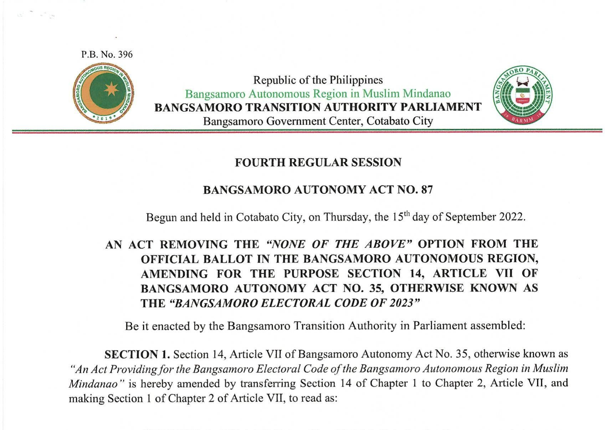

# Chapter 4: Special Bill Types

Your MP wants an appropriation bill. Or a revenue measure. Or a bill creating an entirely new government agency. You know the standard bill structure from Chapter 3 — but these special bill types carry additional requirements that the standard structure does not cover. Constitutional constraints, BOL mandates, procedural rules that apply only to specific categories of legislation. If you draft one of these without knowing the extra rules, your bill will have structural flaws that no amount of polishing can fix.

This chapter covers six categories of bills that require special attention: appropriation bills, revenue and tax measures, bills creating government bodies, regulatory and licensing bills, codification bills, and local and special bills. Each section tells you what makes the category different and what you need to get right.

---

## 4.1 Appropriation Bills

An appropriation bill authorizes the government to spend money. In the Bangsamoro, this means the General Appropriations Act of the Bangsamoro (GAAB), supplemental appropriation bills, and special appropriation bills that fund particular programs or projects.

Appropriation bills are the most consequential legislation the Parliament passes each year. No public money can be spent without an appropriations law. Section 27, Article VII of the Bangsamoro Organic Law states this directly: "No public money, including the block grant and other national government subsidies and support funds given in lump sum, shall be spent without an appropriations law clearly defining the purpose for which it is intended. The Parliament shall pass an annual appropriations law."[^1]

### 4.1.1 Constitutional and BOL Requirements

Several provisions constrain how appropriation bills are drafted and passed.

**The annual appropriation requirement.** The Parliament must pass an appropriations law every fiscal year. This is not discretionary. Section 27, Article VII of the BOL makes it mandatory.[^2]

**The reenacted budget fallback.** Section 29, Article VII of the BOL provides that if the Parliament fails to pass the appropriations bill for the next fiscal year, the preceding year's appropriations law is deemed reenacted. However, only three categories of spending survive reenactment: (1) salaries and wages of existing positions, (2) statutory and contractual obligations, and (3) operating expenses authorized in the preceding annual budget. New programs, capital projects, and unfilled positions cannot be funded under a reenacted budget.[^3]

**Purpose must be clearly defined.** The BOL requires that the appropriations law "clearly defin[e] the purpose" of every expenditure.[^4] This bars lump-sum appropriations without identified purposes. Every item must have a defined program, activity, or project.

**The budget preparation process.** Section 28, Article VII mandates that the form, content, and manner of preparation of the Bangsamoro budget be prescribed by law.[^5] The Parliament created a Bangsamoro Budget Office for this purpose. In practice, the budget process mirrors the national government's: the executive prepares and submits a proposed budget, the Parliament reviews and deliberates, and the final appropriation bill reflects the Parliament's decisions.

**Fiscal autonomy under Article XII.** The Bangsamoro Government enjoys fiscal autonomy under Article XII of the BOL. It has the power to create its own revenue sources, levy taxes and fees, and allocate funds through its own appropriation process. The budget must be "spent in a programmatic, transparent, performance-based, and phased manner."[^6] These principles are not mere aspirations — they constrain how the appropriation bill is structured.

**The audit requirement.** Section 2, Article XII provides that the Commission on Audit is the exclusive auditor of the Bangsamoro Government.[^7] Every appropriation is subject to COA rules. Your appropriation bill should include the standard clause: "subject to existing accounting and auditing rules and regulations."

### 4.1.2 Structure of an Appropriation Bill

BAA No. 3, the first Bangsamoro Appropriations Act (Fiscal Year 2020), shows the standard structure of a GAAB.[^8]

**Long Title.** The long title identifies the fiscal period and the general purpose:

> AN ACT APPROPRIATING FUNDS FOR THE OPERATION OF THE BANGSAMORO GOVERNMENT FROM JANUARY ONE TO DECEMBER THIRTY-ONE, TWO THOUSAND AND TWENTY, AND FOR OTHER PURPOSES

**Section 1 — General Appropriation.** The opening section authorizes the total appropriation from the Bangsamoro Treasury:

> The following sums, or so much thereof as may be necessary, are hereby appropriated out of any available funds in the Bangsamoro Treasury Office of the Bangsamoro Autonomous Region in Muslim Mindanao not otherwise appropriated, for the operation of the Bangsamoro Government from January One to December Thirty-One, Two Thousand and Twenty...

**Agency-by-agency breakdowns.** The bulk of the bill consists of detailed appropriations for each agency — the Office of the Speaker, each ministry, each commission and office. For each agency, the bill provides:

- Total appropriations
- Breakdowns by program: General Administrative and Support, Support to Operations, Operations
- Breakdowns by expenditure class: Personnel Services, Maintenance and Other Operating Expenses (MOOE), Capital Outlays
- Breakdowns by object of expenditure: basic salary, allowances, social insurance premiums, supplies, utilities, and so on

This level of detail is what makes appropriation bills long and dense. A drafter working on a GAAB must coordinate with the budget office and each ministry to produce accurate figures.

**General Provisions.** After the agency appropriations, the GAAB includes a set of general provisions — rules that apply across all agencies. These address matters like:

- The availability period for appropriations (how long agencies have to obligate and disburse the funds)
- Rules on realignment of funds between items
- Restrictions on the use of savings
- Conditions for the release of funds
- Reporting requirements

BAA No. 14, for example, was a stand-alone bill that amended a single general provision in BAA No. 3, extending the availability period for 2020 MOOE and Capital Outlay appropriations to December 31, 2021 (while keeping Personnel Services at the original deadline).[^9] This shows how tightly the general provisions control the operation of the budget.

**Drafting tips for appropriation bills:**

- **Follow the national budget format.** The Bangsamoro budget mirrors the structure of the national General Appropriations Act. Use the same categories: Programs, Activities, and Projects (PAP); the same expenditure classifications (PS, MOOE, CO); the same object codes.
- **Double-check every figure.** A single misplaced zero in an appropriation bill can mean billions. Verify amounts in both words and figures.
- **Include both current operating expenditures and capital outlays** where applicable. Agencies that need infrastructure or equipment need capital outlay authorization.
- **Coordinate with the Ministry of Finance, Budget and Management (MFBM).** The MFBM prepares the executive budget proposal. Your draft should reflect their input on available resources.
- **Remember the fiscal year.** The Bangsamoro fiscal year runs from January 1 to December 31. Make sure your appropriation matches this period.
- **Address special funds.** If the bill creates or draws on special funds (like the revolving fund in BAA No. 36), identify the fund source and the conditions for access.

---

## 4.2 Revenue and Tax Measures

Revenue bills create new taxes, fees, or charges, or modify existing ones. They are among the most politically sensitive measures a Parliament can pass, and they carry special requirements rooted in both the Constitution and the BOL.

**The taxing power.** Section 6, Article XII of the BOL grants the Bangsamoro Government the power to "create its own sources of revenues and to levy taxes, fees, and charges, subject to the provisions of this Organic Law and consistent with the principles of equalization, equity, accountability, administrative simplicity, harmonization and economic efficiency, and fiscal autonomy."[^10] Taxes, fees, and charges levied under this authority accrue exclusively to the Bangsamoro Government.

**The Revenue Code mandate.** Section 4(a), Article XVI of the BOL lists the Bangsamoro Revenue Code as one of the priority legislations for the transition period.[^11] As of this writing, this code has not yet been enacted, making it one of the most significant remaining legislative tasks.

**Intergovernmental Fiscal Policy Board.** The BOL creates an Intergovernmental Fiscal Policy Board (IGFPB) co-chaired by the Philippine Secretary of Finance and the appropriate Bangsamoro minister.[^12] The IGFPB addresses disputes between the national and Bangsamoro governments on tax matters, recommends fiscal policy adjustments, and can recommend additional fiscal powers for the Bangsamoro. Revenue bills should be drafted with awareness of this body's role.

**Types of revenue measures in the Bangsamoro context:**

1. **Tax legislation.** Bills that impose taxes on income, property, goods, services, or transactions within the Bangsamoro.
2. **Fee and charge schedules.** Bills that authorize regulatory agencies to impose fees for permits, licenses, certifications, and similar services.
3. **Revenue-sharing adjustments.** Bills that implement or adjust the revenue-sharing arrangements between the Bangsamoro Government and its constituent local government units, or between the Bangsamoro Government and the national government.
4. **Tax incentive measures.** Bills that grant tax holidays, exemptions, or reduced rates to attract investment or support specific sectors.

**Structural requirements for revenue bills:**

- **Statement of revenue impact.** Include an estimate of the expected revenue. How much will the tax or fee generate annually? What assumptions support the estimate?
- **Identify the taxpayer or fee-payer.** Who pays? Individuals? Corporations? Specific industries? Be precise.
- **Specify the tax base and rate.** The tax base is what is being taxed (income, sales, property value). The rate is the percentage or fixed amount applied to the base. Both must be stated in the bill — you cannot delegate the determination of tax rates to an implementing agency.
- **Administration and collection.** Which office collects the tax? What is the filing procedure? What is the deadline for payment? Where are the funds deposited?
- **Penalties for non-payment.** Interest on late payments, surcharges, and penalties for fraud must be specified.
- **Harmonization.** Section 6, Article XII requires consistency with the principle of harmonization. Your revenue measure should not create double taxation or conflict with national tax laws without justification. Work with the IGFPB framework.
- **Effectivity.** Tax laws often take effect at the start of a fiscal year rather than fifteen days after publication, to allow taxpayers time to adjust. Consider whether a delayed effectivity date is appropriate.

**Shari'ah-compliant financing and Islamic economic principles.** Revenue measures in the Bangsamoro should be drafted with awareness of Islamic economic principles. The BOL recognizes the Bangsamoro identity and the role of Islamic law. While the taxing power itself is not constrained to Shari'ah-compliant forms, the drafter should consider how Islamic finance principles interact with the tax system. Two concepts matter most: the prohibition of *riba* (interest) and the concept of *zakat*. If the Revenue Code incorporates *zakat* collection, it raises unique drafting questions about the relationship between religious obligation and state taxation.

**Revenue-sharing with local government units.** Section 35, Article XII of the BOL provides a specific formula for sharing revenues from natural resources: 30% to the Bangsamoro Government, 20% to provinces, 15% to cities, 20% to municipalities, and 15% to barangays.[^13] Any revenue bill that affects revenue distribution must be consistent with this formula or must amend it through the proper process.

**Common mistakes in revenue bills:**

- Imposing taxes without specifying the base, rate, or collection mechanism — leaving everything to the IRR.
- Failing to coordinate with national tax laws, creating conflicts or double taxation.
- Granting tax exemptions so broad that they undermine the revenue purpose of the measure.
- Neglecting to provide for refunds and appeals when a taxpayer disputes an assessment.
- Ignoring the IGFPB. Revenue measures that affect the national-Bangsamoro fiscal relationship should be developed in coordination with the IGFPB, or they risk being unenforceable.
- Failing to include transitional provisions for existing businesses or taxpayers who need time to adjust to new requirements.

---

## 4.3 Bills Creating Government Bodies

Bills that create new government offices, commissions, agencies, or corporations are among the most structurally complex measures a drafter will handle. The Bangsamoro Parliament has enacted several: the Bangsamoro Attorney-General's Office (BAA No. 5), the Bangsamoro Youth Commission (BAA No. 10), the Bangsamoro Sports Commission (BAA No. 12), and the Bangsamoro Kulliyyah for Islamic Studies (BAA No. 50), among others.[^14]

These bills share a common structural framework, but the details vary depending on whether you are creating a ministry, a commission, a government-owned corporation, or an educational institution.

### 4.3.1 Structure and Composition

Every bill creating a government body must answer several questions:

**What is the body's legal nature?** Is it a ministry, an independent commission, an attached office, or a government-owned corporation? The answer determines its relationship to the rest of government.

BAA No. 10, the Youth Commission Act, specifies that the commission "shall have the same status as the other agencies/offices of the Bangsamoro Regional Government attached to the Office of the Chief Minister."[^15] BAA No. 50, the Kulliyyah Act, creates a corporate body "attached to the Ministry of Basic, Higher and Technical Education."[^16] These are different structural choices with different implications for supervision, budgeting, and accountability.

**Who leads it?** Name the position (Chairperson, Director-General, President, Attorney-General) and specify:

- Qualifications. BAA No. 5 requires the Attorney-General to be "a citizen of the Philippines, a member of the Philippine Bar in good standing, of recognized competence, a bonafide resident of the Bangsamoro Autonomous Region, and has been engaged in the practice of law for at least ten (10) years."[^17]
- Appointing authority. In most Bangsamoro agencies, the Chief Minister is the appointing authority for heads of offices, consistent with Section 32(b), Article VII of the BOL.[^18]
- Term. Is the position coterminous with the appointing authority? Fixed term? Subject to a search committee process?
- Salary grade. BAA No. 5 sets the Attorney-General's salary at Grade 28.[^19] BAA No. 50 sets the Kulliyyah President at Grade 26.[^20]

**What is its internal structure?** Describe the organizational subdivisions. BAA No. 5 creates four divisions: Litigation, Legal Research and Opinion, Intergovernmental Relations, and Administrative and Finance.[^21] BAA No. 50 creates a Board of Trustees with ten members, an Office of the President, and supporting services.[^22]

**What is its governing body (if any)?** Commissions and corporations usually have boards. Specify:

- Composition. BAA No. 50 lists ten board members by position: the MBHTE Minister as Chair, two directors-general as vice-chairs, the Kulliyyah President, the parliamentary committee chair, the Bangsamoro Mufti, and representatives of faculty, students, alumni, and private Islamic institutions.[^23]
- Quorum requirements. BAA No. 50 requires a simple majority.[^24]
- Meeting frequency. "At least once every quarter" is the standard in BAA No. 50.[^25]
- Honoraria for members.

### 4.3.2 Powers and Functions

This section is the operational core of any bill creating a government body. It tells the new entity what it can and must do.

**Distinguish between powers (authority to act) and functions (duties to perform).** BAA No. 10 makes this distinction explicitly, with Section 7 covering "Powers of the Commission" and Section 8 covering "Functions of the Commission."[^26]

Powers typically include:
- Regulatory authority (issuing rules, setting standards, accrediting entities)
- Administrative authority (appointing staff, managing budgets, entering contracts)
- Quasi-judicial authority (hearing cases, imposing sanctions — if applicable)
- Corporate powers (acquiring property, receiving donations, entering joint ventures)

Functions typically include:
- Policy formulation
- Program implementation
- Coordination with other agencies
- Research and data collection
- Reporting and monitoring

BAA No. 50 gives the Kulliyyah's Board an extensive list of powers: formulating institutional policies, managing funds, establishing research centers, receiving donations, approving curricula, granting honorary degrees, fixing tuition fees, and establishing branches.[^27] This level of detail ensures the institution can operate without returning to the Parliament for authorization of routine activities.

**Draft powers broadly enough to allow effective operation, but specifically enough to prevent abuse.** "Perform such other functions as may be assigned by the Chief Minister" is a standard catch-all, but it should supplement — not replace — an enumerated list.

### 4.3.3 Funding

Every new body needs money. The bill must address:

**Initial funding.** Where does the start-up money come from? BAA No. 5 appropriates P15 million for Personal Services and P3 million for initial operations, sourced from the Miscellaneous Personnel Benefits Fund and the Contingent Fund.[^28]

**Continuing appropriations.** After the initial year, the body needs a regular budget line. "Subsequent funding requirements shall be included in the Bangsamoro Appropriations Act" is the standard formulation.

**Revenue-generating authority.** If the body can collect fees, tuition, or other charges, the bill should authorize this and specify how the revenue is treated. BAA No. 50 allows the Kulliyyah to retain income from tuition, auxiliary services, and land grants as special trust funds — a provision that gives the institution financial flexibility.[^29]

**Special funds.** If the bill creates a trust fund, endowment fund, or revolving fund, specify: the initial capitalization, the fund source, the management authority, the permissible uses, and the disbursement procedures. BAA No. 81, the Salamat Excellence Award for Leadership Act, creates an endowment fund that, as far as practicable, shall be invested in Shari'ah-compliant products — a reminder that financial provisions in Bangsamoro legislation may need to account for Islamic finance principles.[^30]

**Drafting tips for bills creating government bodies:**

- **Do not create a new body for a function an existing body can perform.** Before drafting, ask whether an existing ministry or office could handle the mandate with an expanded function or a new division. Unnecessary proliferation of government bodies strains the budget and creates coordination problems.
- **Align the body's mandate with BOL authority.** The new body must operate within the Bangsamoro Government's enumerated powers under Article V of the BOL.[^31]
- **Provide for an organizational review.** Include a provision allowing the body's structure to be reorganized by the Parliament or by the Chief Minister (within parameters set by the law) as needs evolve.
- **Address overlap with national agencies.** If the new body's mandate touches on areas where national agencies also operate — education, labor, health, environment — define the relationship. Which body takes the lead? How do they coordinate?
- **Include a personnel transition provision** if the new body absorbs functions from an existing office. Specify what happens to employees of the old office: Are they automatically absorbed? Do they have priority in hiring? What about their tenure and benefits?

---

## 4.4 Regulatory and Licensing Bills

Regulatory bills impose requirements on private conduct — businesses, professions, industries, or activities that the government seeks to control, manage, or standardize. BAA No. 9, the Recruitment Agency Regulation Act, is a clear example: it requires local and foreign recruitment agencies operating in the Bangsamoro to register and obtain accreditation from the Ministry of Labor and Employment.[^32]

These bills are structurally distinct from other legislation because they create an ongoing relationship between the government and regulated entities. They do not just set rules and walk away — they establish regulatory frameworks that operate continuously through licensing cycles, compliance monitoring, and enforcement.

**Core structural elements of a regulatory bill:**

**Scope and coverage.** Who is regulated? BAA No. 9 covers "all local and foreign recruitment and employment agencies operating and/or recruiting within the Bangsamoro Autonomous Region."[^33] Be precise. If only agencies above a certain size are covered, say so. If certain categories are exempt, list them.

**Registration or licensing requirements.** What must the regulated entity do to operate lawfully? BAA No. 9 requires agencies to "register and secure accreditation from the Ministry of Labor and Employment every three (3) years."[^34] Specify:
- The issuing authority
- The application requirements (documents, fees, qualifications)
- The validity period of the license or registration
- The renewal process
- Conditions for denial

**Standards and conditions.** What ongoing requirements apply to licensed entities? These might include:
- Capital requirements (BAA No. 9 requires a minimum paid-up capital of P5 million)[^35]
- Ownership requirements (Filipino citizens must own at least 75% of voting stock)[^36]
- Operational standards (record-keeping, reporting, facility requirements)
- Ethical standards (prohibited acts, conflicts of interest)

**Disqualifications.** Who cannot be licensed? BAA No. 9 provides a detailed list: travel agencies, officers of travel agency corporations, insurance company officers, individuals with derogatory records, and government officials involved in deployment processes.[^37] These disqualifications prevent conflicts of interest and protect the public.

**Compliance monitoring.** How does the government verify compliance? BAA No. 9 authorizes the MOLE to "conduct inspections to ensure compliance" and to "publish an updated list of accredited recruitment agencies in a newspaper of general circulation or in its website."[^38]

**Enforcement and penalties.** As discussed in Chapter 3, but particularly important for regulatory bills. Include:
- Administrative sanctions (suspension, revocation of license)
- Financial penalties (fines with specified ranges)
- Criminal penalties (for serious violations like fraud or forgery)
- Due process protections (notice and opportunity to be heard before sanctions)

**Drafting tips for regulatory bills:**

- **Start with the problem, not the regulation.** Why does this activity need regulation? What harm occurs without government oversight? The answer shapes the regulatory framework.
- **Do not regulate for the sake of regulating.** Every regulatory requirement imposes costs on the regulated entity and the government. Each requirement should address a specific risk or concern.
- **Build in flexibility.** Regulatory needs change as industries evolve. Grant the implementing agency rule-making authority for procedural details, while keeping the core standards in the statute.
- **Provide for transition.** BAA No. 9 gives existing agencies thirty days after the law's effectivity to obtain accreditation.[^39] Without a transition period, enforcement on day one would shut down every existing operator.
- **Consider the regulated entity's perspective.** Can a small business owner in Sulu realistically comply with every requirement? If the compliance burden is disproportionate, the regulation will be ignored or evaded rather than obeyed.

---

## 4.5 Codification Bills (Priority Codes)

A codification bill is the most ambitious type of legislation a drafter can undertake. Rather than addressing a single issue, a code organizes an entire area of law into a unified, systematic framework. It replaces scattered, sometimes contradictory laws with one coherent statute.

The Bangsamoro Organic Law, in Section 4(a), Article XVI, identifies specific codes as priority legislation for the transition period:[^40]

> "Enactment of priority legislations such as the Bangsamoro Administrative Code, Bangsamoro Revenue Code, Bangsamoro Electoral Code, Bangsamoro Local Government Code, and Bangsamoro Education Code..."

The same section adds that the BTA "may also enact a Bangsamoro Civil Service Code" and that a law recognizing indigenous peoples' rights shall also be enacted. While the BOL does not use the word "code" for the IP law, the mandate is equally clear.

Beyond these express mandates, the Investment Code has been identified as a priority based on the broader governance and economic development needs of the region.

**Status of the Priority Codes**

The BTA Parliament has enacted five of the priority codes identified in the BOL and its broader legislative agenda:[^41]

| Code | BAA Number | Year Enacted |
|------|-----------|--------------|
| Bangsamoro Administrative Code | BAA No. 13 | 2020 |
| Bangsamoro Civil Service Code | BAA No. 17 | 2021 |
| Bangsamoro Education Code | BAA No. 18 | 2021 |
| Bangsamoro Electoral Code | BAA No. 35 | 2023 |
| Bangsamoro Local Government Code | BAA No. 49 | 2023 |

Three codes remain to be enacted: the **Revenue Code**, the **Investment Code**, and a potential **Indigenous Peoples' Rights Code**. These are among the most complex legislative undertakings the Parliament will face.

### What Makes a Code Different

A code differs from an ordinary bill in several ways.

**Scale.** Codes are long. BAA No. 13 (Administrative Code) runs to hundreds of sections organized across multiple books and chapters.[^42] BAA No. 49 (Local Government Code) is similarly extensive.[^43] A drafter working on a code is not writing a single bill — they are designing an entire legal system for a field of governance.

**Comprehensiveness.** A code aims to cover its subject matter completely. The Electoral Code does not just address one aspect of elections — it covers the Bangsamoro Electoral Office, voter registration, political parties, candidacy requirements, campaigning, voting procedures, canvassing, proclamation, election offenses, and everything in between. The goal is that anyone who needs to know the electoral rules can find them in one place.

**Internal consistency.** Because a code covers so much ground, its provisions must work together without contradiction. A definition in Article I must mean the same thing in Article XII. A power granted in one chapter must not be negated by a prohibition in another chapter. Achieving internal consistency across hundreds of sections requires meticulous cross-checking.

**Relationship to existing law.** A code typically replaces or consolidates existing legislation. The Bangsamoro Local Government Code (BAA No. 49) replaces the ARMM Local Government Code (MMAA No. 25) that applied before the Bangsamoro transition.[^44] The repealing clause of a code must be comprehensive, identifying every law and provision that the code supersedes.

### Structural Framework of a Code

Codes in the Bangsamoro follow a hierarchical structure:

**Books** — the broadest division, grouping related titles. BAA No. 13 (Administrative Code) uses books: Book I covers Bangsamoro Autonomy and Administration, and subsequent books cover the Parliament, the executive branch, and government-owned corporations.

**Titles** — subdivisions within books, covering major subject areas.

**Chapters** — subdivisions within titles, covering specific topics.

**Articles** — subdivisions within chapters, or used as the primary division in some codes. BAA No. 35 (Electoral Code) uses articles as its primary structural unit.[^45]

**Sections** — the basic operative units, containing the actual rules.

Not every code uses all five levels. Some use only articles and sections. The choice depends on the code's breadth and complexity.

### The Remaining Priority Codes

A brief note on the three major codes still awaiting enactment, because drafters who take these on will face distinct challenges.

**The Bangsamoro Revenue Code** will be the most technically demanding of the remaining codes. It must define the Bangsamoro's full taxing power, harmonize with the national tax system, address the unique fiscal relationship outlined in Article XII of the BOL, and create a revenue administration system from the ground up. The drafter will need to work closely with the IGFPB, the MFBM, the Bureau of Internal Revenue, and the Department of Finance. The code must also address *zakat* and other elements of Islamic finance where they intersect with the tax system.

**The Bangsamoro Investment Code** will need to create an investment promotion and regulation framework suited to the region's development stage. It must balance the desire to attract investment with protections for local communities and natural resources. The code should address investment incentives, business registration, special economic zones, foreign investment rules, and investor protections — all within the powers granted by Article XIII of the BOL.

**The Indigenous Peoples' Rights Code** carries the mandate from Article XVI, Section 4(a) of the BOL, which requires the BTA to "enact a law to recognize, protect, promote, and preserve the rights of the indigenous peoples in the Bangsamoro Autonomous Region."[^46] This is a sensitive piece of legislation that must balance the rights of non-Moro indigenous peoples with the broader Bangsamoro governance framework. The drafter should study Republic Act No. 8371 (the national Indigenous Peoples Rights Act) and the specific provisions of the BOL on indigenous peoples' rights in Articles IV and IX.[^47]

### Drafting Tips for Codification Bills

**Start with an outline.** Before writing a single section, map out the code's entire structure. What books or articles will it have? What topics does each cover? Where does each existing legal provision fit? The outline is the most important document in the code-drafting process. The outline should be reviewed and approved by the sponsoring committee or the technical working group before drafting begins. Revising the structure of a 200-section code after it has been drafted is orders of magnitude harder than revising a two-page outline.

**Study the existing body of law.** A code does not create law from nothing. It organizes, updates, and replaces existing law. Before drafting the Revenue Code, for example, you need to know every existing Bangsamoro revenue measure, every applicable national tax law, and every BOL provision that grants or limits the taxing power. Miss one, and you create a gap or a conflict.

**Look at both national and regional models.** The national Administrative Code (Executive Order No. 292) served as a reference for BAA No. 13. The national Local Government Code (RA 7160) informed BAA No. 49. The national Tax Code (RA 8424) will be a starting point for the Bangsamoro Revenue Code. But models are starting points, not templates. The Bangsamoro's parliamentary system, its asymmetric relationship with the national government, its cultural context, and its distinct governance needs require adaptation. Simply copying a national code and replacing "Philippines" with "Bangsamoro" produces a law that does not fit the region's institutions.

**Build in flexibility.** A code that is too rigid will need constant amendment. Include provisions that allow administrative adjustment for procedural matters while keeping substantive policy decisions in the statute. The Administrative Code (BAA No. 13), for example, sets the basic structure of government but allows the Parliament to create additional offices by subsequent law — it does not freeze the bureaucracy in place.[^48]

**Plan for the IRR.** A code of 200 or 300 sections cannot be implemented without detailed implementing rules. Build in the IRR mandate early, with clear deadlines, designated lead agencies, and specified scope. Consider whether different portions of the code require separate IRRs from different agencies.

**Use a consistent definition framework.** In a code, the definition section in the preliminary provisions should cover terms used throughout. If a term has a special meaning only in one chapter, define it locally at the start of that chapter, but note the local definition's limited scope. The Administrative Code (BAA No. 13) provides a good example — its definition section in Section 4 defines 17 terms that appear across the entire code.[^49]

**Coordinate multiple drafters.** A code is rarely the work of one person. Different teams may draft different books or titles. A lead drafter or editor must ensure consistency in terminology, style, numbering, and cross-references. Establish a style guide at the outset: how will defined terms be formatted? How will sections be numbered? How will cross-references be structured? Disagreements about style that are trivial in a five-section bill become maddening in a 300-section code.

**Build in a comprehensive repealing clause.** The repealing clause of a code does more work than the repealing clause of an ordinary bill. It must identify every existing law and provision that the code replaces. The Electoral Code (BAA No. 35) does not just repeal one or two laws — it supersedes the entire existing body of electoral regulation in the Bangsamoro. The drafter must audit every existing law in the field and list every provision being repealed, modified, or superseded.

**Test the code against real scenarios.** Before finalizing the draft, walk through real-world scenarios. For the Electoral Code: what happens when a voter moves from one district to another? What happens when a candidate is disqualified after the deadline for substitution? For the Revenue Code: what happens when a business operates in both BARMM and non-BARMM territory? How is income allocated? These scenario-based tests reveal gaps and contradictions that abstract review misses.

---

## 4.6 Local and Special Bills

Local and special bills apply to specific geographic areas, particular entities, or named beneficiaries, rather than to the Bangsamoro region as a whole. The Bangsamoro Parliament has enacted many of these: bills creating municipalities, upgrading hospitals, declaring memorial sites, and establishing institutions in specific locations.

**Bills creating municipalities.** The Bangsamoro Government, under Section 2(l), Article V of the BOL, has authority over the "creation, division, merger, abolition or alteration of boundaries of municipalities and barangays."[^50] The Parliament has exercised this power in BAA No. 46 (creating the Municipality of Malidegao) and BAA No. 47 (creating the Municipality of Tugunan).[^51]

These bills follow a consistent template:

1. **Declaration of Policy** — citing the BOL authority.
2. **Creation of the Municipality** — naming the component barangays and identifying the mother municipality from which they are separated.
3. **Seat of Government** — designating which barangay will host the new municipal government.
4. **Territorial Boundary** — referencing the existing boundaries of the component barangays, usually supplemented with a technical description and map in an appendix.
5. **Plebiscite Requirement** — the municipality acquires corporate existence only upon ratification by majority vote in a plebiscite within sixty (60) days of the Act's approval.
6. **Conduct of Plebiscite** — assigning the Commission on Elections, through the Bangsamoro Electoral Office, to supervise.
7. **Appointment of Municipal Officials** — since the municipality is newly created, the first set of officials (mayor, vice-mayor, Sangguniang Bayan members) are appointed by the Chief Minister until the next general election.
8. **Financial Assistance** — the Bangsamoro Government appropriates operating funds until the new municipality receives its share of the national tax allotment.
9. **Standard closing provisions** — separability, repealing, effectivity.

Both BAA No. 46 and BAA No. 47 include a technical description appendix with precise boundary coordinates and a political boundary map. This is not optional — without it, the new municipality's territory is legally uncertain.

**Hospital upgrading bills.** BAA No. 25 (upgrading the Datu Blah Sinsuat District Hospital) is an example.[^52] These bills:

- Identify the existing facility and its current level
- Specify the target level and capacity
- Require compliance with national health standards (DOH Bureau of Health Facilities and Services)
- Integrate the facility with existing programs like the Universal Health Care Act (RA 11223)
- Assign administrative supervision to the Ministry of Health
- Appropriate funds for construction, equipment, and operations

**Memorial site and cultural heritage bills.** BAA No. 60 (Hashim and Mimbantas Memorial Site) is an example.[^53] These bills:

- Declare a specific location as a memorial or heritage site
- Create a management board with specified composition
- Provide for preservation and, where necessary, reconstruction
- Appropriate initial funding
- Include standard closing provisions

**Bills declaring holidays and observances.** BAA No. 39, the Holidays Act, is both general (establishing the holiday calendar for the entire BARMM) and rooted in local cultural specificities (preserving Islamic and Bangsamoro historical observances).[^54]

**Key considerations for local and special bills:**

**The plebiscite requirement.** For bills that create, divide, merge, or abolish municipalities and barangays, a plebiscite is constitutionally required. Section 2(l), Article V of the BOL grants this authority, and Article VI, Section 10 conditions it on approval by majority of votes cast in a plebiscite in the political units directly affected.[^55] The bill must include detailed plebiscite provisions — who conducts it, when, where, and who pays.

**Territorial precision.** For bills affecting geographic boundaries, vague descriptions create legal disputes. Use technical descriptions with bearings and distances, reference existing barangay boundaries, and attach maps.

**Coordination with national agencies.** Hospital upgrading bills must align with DOH standards. Municipality creation bills involve COMELEC for the plebiscite and the Department of Budget and Management for national tax allotment computations. Do not draft these bills in isolation from the national agencies whose cooperation is needed.

**Financial sustainability.** Creating a new municipality means creating a new set of government offices, salaries, and operating expenses. The bill must realistically address how the municipality will be funded — through BARMM appropriations, national tax allotment, or both — during the period before it achieves financial self-sufficiency.

**Do not legislate what should be administrative.** Not every local decision requires a law. Renaming a road or designating a local holiday for a single municipality might be better handled through an executive proclamation or a local government resolution. Reserve legislative action for matters that genuinely require a statute — creating legal entities, altering boundaries, establishing permanent institutions.

**Gender considerations.** Both BAA No. 46 and BAA No. 47 include the clause "with due regard to representation of women of the Bangsamoro" in the provision on the appointment of the first set of municipal officials. This is not a rhetorical flourish — the BOL's gender and development provisions (Section 5, Article XIII) require attention to gender in all aspects of governance.[^56] Include similar provisions where the bill creates appointive bodies or leadership positions.

**The Special Geographic Area question.** Both municipality creation acts designate the new municipalities as part of the "Special Geographic Area of the Bangsamoro Autonomous Region." This refers to the barangays in North Cotabato that voted to join the BARMM in the 2019 plebiscite but are geographically located in a province that is not part of the region. Bills affecting these areas must be drafted with particular care regarding territorial jurisdiction and the relationship between the new municipality and the province from which its barangays were separated.

### 4.6.1 Hospital Bill Template

Sixteen BAAs (25-30, 66-69, 73-74, 76, 78-80) follow a near-identical hospital bill structure.[^57] This is the most templated bill type in Bangsamoro legislation. If your MP asks for a hospital upgrading or establishment bill, start with this template and fill in the blanks.

**Standard section order:**

1. Short Title
2. Declaration of Policy (citing Section 22, Article IX of RA 11054)[^58]
3. Upgrading/Establishment of [Hospital]
4. Integration of UHC Program (RA 11223)
5. Administration, Management, and Organization (MOH supervision)
6. Appropriations
7. Implementing Rules and Regulations (60 days)
8. Separability Clause
9. Repealing Clause
10. Effectivity

Newer hospital bills (BAA 78, 79 from 2025) add four sections: Submission of Annual Development Plan, Transfer of Management to Provincial Government, Sunset/Continuity Provision, and Annual Report requirement. Consider whether these additional provisions are appropriate for your bill.

**Fill-in-the-blank template:**

```
AN ACT [UPGRADING THE / ESTABLISHING A LEVEL] [HOSPITAL NAME]
[IN THE MUNICIPALITY OF / IN] [MUNICIPALITY], [PROVINCE],
[FROM A [CURRENT LEVEL] TO A [TARGET LEVEL] [BED CAPACITY]-BED CAPACITY
[DISTRICT/GENERAL] HOSPITAL], APPROPRIATING FUNDS THEREFOR,
AND FOR OTHER PURPOSES

Be it enacted by the Bangsamoro Transition Authority in Parliament assembled:

SECTION 1. Short Title. -- This Act shall be known as the
"[HOSPITAL NAME] Act of [YEAR]".

SEC. 2. Declaration of Policy. -- It is a policy of the Bangsamoro
Autonomous Region in Muslim Mindanao (BARMM) as provided under
Section 22, Article IX of Republic Act No. 11054, otherwise known as
the "Organic Law for the Bangsamoro Autonomous Region in Muslim
Mindanao" to provide for a comprehensive and integrated health service
delivery for its constituents and establish by law a general hospital
system to serve the health requirements of its people and ensure that
the individual's basic right to life shall be attainable through the
prompt intervention of excellent and affordable medical services.

SEC. 3. [Upgrading/Establishment] of the [HOSPITAL NAME]. -- The
[HOSPITAL NAME] in [MUNICIPALITY], [PROVINCE] is hereby
[upgraded from a [CURRENT LEVEL] to a Level [TARGET LEVEL]
[DISTRICT/GENERAL] Hospital with a [BED CAPACITY]-bed capacity /
established as a Level [TARGET LEVEL] [DISTRICT/GENERAL] Hospital
with a [BED CAPACITY]-bed capacity], in accordance with the standards
set by the Department of Health -- Bureau of Health Facilities and
Services.

SEC. 4. Integration of Universal Health Care Program. -- The
[HOSPITAL NAME] shall be integrated with existing government programs
including those established under Republic Act No. 11223, otherwise
known as the "Universal Health Care Act", to ensure comprehensive
health coverage for the constituents of [MUNICIPALITY], [PROVINCE]
and the surrounding areas.

SEC. 5. Administration, Management, and Organization. -- The
[HOSPITAL NAME] shall be under the administrative supervision of the
Ministry of Health -- BARMM. The organizational structure, staffing
pattern, and operational guidelines shall be determined by the MOH in
accordance with existing rules and regulations.

SEC. 6. Appropriations. -- [An initial amount of [AMOUNT IN WORDS]
([AMOUNT IN FIGURES]), necessary to carry out the provisions of this
Act, shall be charged against the [YEAR] General Appropriations Act
of the Bangsamoro. / Funding is hereby appropriated from the
Bangsamoro General Appropriations for the [HOSPITAL NAME], including
the construction of infrastructures, acquisition of medical and office
equipment and the annual budget needed for personnel services,
maintenance, operations and other expenses for the implementation of
this Act.] Thereafter, the funds required for the continued operation
and maintenance shall be included in the annual appropriations of the
Bangsamoro Government.

SEC. 7. Implementing Rules and Regulations. -- [The MOH-BARMM shall
promulgate the necessary implementing rules and regulations within
sixty (60) days after the enactment of this Act. / Within sixty (60)
days from the effectivity of this Act, the MOH shall promulgate the
necessary rules and regulations, in consultation with the Provincial
Government of [PROVINCE] and other stakeholders, for the effective
implementation of this Act.]

SEC. [8]. Separability Clause. -- If any provision or part of this Act
is declared invalid or unconstitutional, the remaining provisions or
parts not affected thereby shall remain in full force and effect.

SEC. [9]. Repealing Clause. -- All laws, decrees, executive orders,
issuances, rules, and regulations, or parts thereof, that are
inconsistent with the provisions of this Act are hereby repealed,
amended, or modified accordingly.

SEC. [10]. Effectivity. -- This Act shall take effect fifteen (15) days
after its publication in the Bangsamoro Gazette or in one (1) newspaper
of regional circulation.
```

The bracketed alternatives (separated by `/`) indicate the two main variations found across hospital BAAs. Choose the wording that fits your specific bill.

### 4.6.2 Municipality Creation Template

Eleven BAAs (41-48, 53-55) follow an identical structure for creating new municipalities.[^59] This template is the most standardized in the entire body of Bangsamoro legislation -- every municipality creation bill uses the same eleven sections in the same order, with the same verbatim policy language.

**Fill-in-the-blank template:**

```
AN ACT CREATING THE MUNICIPALITY OF [MUNICIPALITY NAME],
[PROVINCE], APPROPRIATING FUNDS THEREFOR, AND FOR OTHER PURPOSES

Be it enacted by the Bangsamoro Transition Authority in Parliament assembled:

SECTION 1. Declaration of Policy. -- In the exercise of genuine
autonomy and self-governance, the Bangsamoro Government is empowered
to create, divide, merge, abolish, or substantially alter boundaries
of municipalities or barangays in accordance with a law enacted by the
Parliament. The municipalities or barangays created, divided, merged,
or whose boundaries are substantially altered, shall be entitled to
their appropriate share in the national tax allotment: Provided, That
it shall be approved by a majority of the votes cast in a plebiscite
in the political units directly affected.

SEC. 2. Creation of the Municipality of [MUNICIPALITY NAME]. -- There
is hereby created the Municipality of [MUNICIPALITY NAME] in
[PROVINCE], to be composed of the following barangays separated from
the [Mother Municipality/Municipalities]:

[LIST OF BARANGAYS]

SEC. 3. Seat of Government. -- The seat of government of the
Municipality of [MUNICIPALITY NAME] shall be in Barangay
[BARANGAY NAME].

SEC. 4. Territorial Boundary. -- The territorial boundary of the
Municipality of [MUNICIPALITY NAME] shall comprise the present limits
of the above-mentioned barangays as defined by existing laws, in
accordance with the technical description and map hereto attached as
integral parts of this Act.

SEC. 5. Plebiscite Requirement. -- The Municipality of [MUNICIPALITY
NAME] shall acquire corporate existence only upon the ratification of
this Act by a majority of votes cast in a plebiscite to be held within
sixty (60) days from the approval of this Act.

SEC. 6. Conduct of Plebiscite. -- The Commission on Elections, through
the Bangsamoro Electoral Office, shall supervise the conduct of the
plebiscite prescribed herein.

SEC. 7. Appointment of Municipal Officials. -- The first set of
officials of the Municipality of [MUNICIPALITY NAME], consisting of
a Municipal Mayor, a Municipal Vice-Mayor, and [NUMBER] Sangguniang
Bayan Members, with due regard to representation of women of the
Bangsamoro, shall be appointed by the Chief Minister of the Bangsamoro
Government until the next general election.

SEC. 8. Financial Assistance. -- Pending entitlement to its share in
the [national tax allotment / internal revenue allotment], the
Bangsamoro Government shall provide the Municipality of [MUNICIPALITY
NAME] a monthly financial assistance of not less than [AMOUNT]
(PHP [AMOUNT]) to be sourced from the Bangsamoro General
Appropriations Act, to defray its operating expenses.

SEC. 9. Separability Clause. -- If, for any cause, any part of this
Act is declared unconstitutional or contrary to the provisions of
Republic Act No. 11054 or the Bangsamoro Organic Law, the rest of the
provisions hereof which are not affected shall remain in full force
and effect.

SEC. 10. Repealing Clause. -- All laws, decrees, executive orders or
regulations or any part thereof which may be contrary or inconsistent
to this Act are hereby repealed, amended, modified or altered
accordingly.

SEC. 11. Effectivity. -- This Act shall take effect after fifteen (15)
days from its publication in the Bangsamoro Gazette or in one (1)
newspaper of regional circulation.
```

**Important notes for the municipality creation template:**

- The Declaration of Policy (Section 1) is verbatim across all eleven BAAs. Do not modify it.
- The separability clause in municipality creation bills uniquely references the BOL ("contrary to the provisions of Republic Act No. 11054"), unlike the standard separability clause used in other bill types.
- The second batch of municipality creation bills (BAA 53-55) switched from "national tax allotment" to "internal revenue allotment" and specified a minimum monthly financial assistance of PHP 2,500,000.00. Use the more recent formulation.
- A technical description appendix with boundary coordinates and a political boundary map is required. Without it, the municipality's territory is legally uncertain.

### 4.6.3 Amendment Bill Guidance


*Figure 5: BAA 87 — a concise amendment bill modifying the Bangsamoro Electoral Code (BAA 35).*

Twelve BAAs (14, 24, 33, 34, 38, 51, 52, 70, 71, 77, 87, 88) are amendment bills.[^60] These are structurally the simplest bills in the Bangsamoro corpus, but they require precision because every word of the amended text becomes law.

**The standard amendment formula.** The dominant pattern across all amendment BAAs uses this wording:

> "Section [N] of Bangsamoro Autonomy Act No. [N], otherwise known as '[Short Title]', is hereby amended to read as follows:"

The amended text is then placed in quotation marks, often italicized, and the full replacement text is reproduced in its entirety -- not just the changed portions. This is the "amendatory restatement" method: you reproduce the entire section as amended, so the reader does not have to cross-reference two documents to understand the law.

**Long title pattern for amendment bills:**

> AN ACT AMENDING [SECTION] OF BANGSAMORO AUTONOMY ACT NO. [N], OTHERWISE KNOWN AS [TITLE]

Amendment bills typically do not have a short title, a declaration of policy, or a definition of terms. They are concise and single-purpose.

**Structure of an amendment bill:**

1. **Section 1:** The amendment formula, followed by the full replacement text in quotation marks
2. **Additional amendment sections** (if amending multiple sections of the same BAA)
3. **Repealing Clause**
4. **Effectivity**

**Example from actual Bangsamoro legislation (BAA 87, amending BAA 35):**

The long title follows the standard pattern:

> AN ACT REMOVING THE "NONE OF THE ABOVE" OPTION FROM THE OFFICIAL BALLOT IN THE BANGSAMORO AUTONOMOUS REGION, AMENDING FOR THE PURPOSE SECTION 14, ARTICLE VII OF BANGSAMORO AUTONOMY ACT NO. 35, OTHERWISE KNOWN AS THE "BANGSAMORO ELECTORAL CODE OF 2023"

Each section of the bill amends a specific provision:

> **SECTION 1.** Section 14, Article VII of Bangsamoro Autonomy Act No. 35, otherwise known as "An Act Providing for the Bangsamoro Electoral Code of the Bangsamoro Autonomous Region in Muslim Mindanao" is hereby amended to read as follows:
>
> *"SEC. [X]. [Title]. -- [Full amended text]"*

**Drafting tips for amendment bills:**

- **Always reproduce the entire section being amended**, not just the changed words. This prevents ambiguity about which portions were changed.
- **Identify the parent BAA by both its number and short title** in the long title and in Section 1. This is standard practice across all twelve amendment BAAs.
- **No short title is needed** unless the amendment creates a standalone regime (BAA 77 is the only amendment bill with a short title).
- **Appropriation extension bills** (BAA 14, 24, 33, 34, 38, 51, 52) are a special subset of amendment bills. They amend the Cash Budgeting System section of prior GAAs to extend the validity period for appropriations. They follow the same amendment formula but are even shorter -- typically three to five sections.
- **Use "immediately after publication" for effectivity** when the amendment addresses a time-sensitive matter (like extending appropriation validity periods). All seven appropriation extension bills use this variant.

### 4.6.4 GAA/Appropriations Bills

The General Appropriations Act of the Bangsamoro (GAAB) is the most consequential legislation the Parliament passes each year. Seven GAAs have been enacted (BAA 3, 15, 23, 32, 56, 65, 85), along with three supplemental appropriations (BAA 22, 63, 75).[^61]

GAA bills differ from all other bill types in several structural ways that a drafter must understand:

**No standard bill provisions.** GAAs typically omit the short title, declaration of policy, definition of terms, IRR clause, and separability clause. They also lack an explicit effectivity clause in most cases. The bill's structure is dominated by financial tables, not narrative sections.

**Long title pattern (verbatim across all seven GAAs):**

> AN ACT APPROPRIATING FUNDS FOR THE OPERATION OF THE BANGSAMORO GOVERNMENT FROM JANUARY ONE TO DECEMBER THIRTY-ONE, TWO THOUSAND AND [YEAR], AND FOR OTHER PURPOSES

Note that the fiscal year dates are always spelled out in words, not numerals.

**Internal structure:**

1. **Section 1 -- General Appropriation.** Authorizes the total appropriation from the Bangsamoro Treasury, using the standard formula: "The following sums, or so much thereof as may be necessary, are hereby appropriated out of any available funds in the Bangsamoro Treasury Office..."
2. **Agency-by-agency tables.** The bulk of the document consists of detailed appropriation tables for each agency, broken down by:
   - Program: General Administrative and Support, Support to Operations, Operations
   - Expenditure class: Personnel Services (PS), Maintenance and Other Operating Expenses (MOOE), Capital Outlays (CO)
   - Object of expenditure: basic salary, allowances, social insurance premiums, supplies, utilities, etc.
3. **General Provisions.** Numbered sections that apply across all agencies, covering the cash budgeting system, transparency requirements, reporting obligations, rules on realignment and savings, and conditions for fund release.

**Supplemental appropriations** (BAA 22, 63, 75) follow the same table-heavy format but are limited to specific agencies or purposes. They are shorter than a full GAAB.

**Appropriation extension/revalidation bills** (BAA 14, 24, 33, 34, 38, 51, 52) are amendment bills that modify the General Provisions of a prior GAA -- specifically the Cash Budgeting System section -- to extend the validity period for MOOE and Capital Outlay appropriations. They are the shortest bills in the corpus, typically three to five sections.

**Key drafting considerations for GAA bills:**

- **Coordinate with the Ministry of Finance, Budget and Management (MFBM)** throughout the process. The MFBM prepares the executive budget proposal and provides the figures.
- **Verify every figure twice.** A misplaced decimal in a GAA means millions or billions misstated. Amounts should appear in both words and figures.
- **Follow the national budget format.** Use the same categories (Programs, Activities, and Projects), the same expenditure classifications (PS, MOOE, CO), and the same object codes as the national GAA.
- **The General Provisions section requires legal drafting skill**, not just accounting. Provisions on fund realignment, savings, and release conditions have legal consequences that must be drafted with precision.

### When a Local Bill Becomes a General Law

Some bills start as local measures but end up setting precedents that affect broader policy. The first hospital upgrading bill (BAA No. 25) established a template that subsequent hospital bills followed. The first municipality creation bill set patterns for every municipality creation that came after.

If you are drafting a local bill that is the first of its kind in Bangsamoro legislation, draft it with awareness that it will become a model. Future drafters and committee staff will study your bill and replicate its structure. Errors in the template propagate. Good choices in the template become conventions.

This is another reason to take local bills seriously. They may seem modest in scope compared to a comprehensive code, but they are the bricks from which the body of Bangsamoro law is built, one municipality, one hospital, and one institution at a time.

**Common structural issues in local and special bills:**

- Missing technical descriptions for territory-related bills.
- Failure to include plebiscite provisions where required.
- Unrealistic funding provisions — naming an amount without identifying a viable fund source.
- Duplication with existing laws. Before filing a bill to create a local institution, verify that no existing law already authorizes its creation.
- Neglecting the transition. If a new municipality is carved from an existing one, what happens to the mother municipality's budget, personnel, and pending obligations? Both BAA No. 46 and BAA No. 47 address this by specifying that incumbent elected officials from the mother municipality continue to serve their terms in the mother municipality.

---

## Summary

Special bill types are not exotic. They are the bills the Parliament passes most often — annual budgets, revenue measures, institutional creation acts, regulatory frameworks, codes, and local measures. What makes them "special" is that they carry requirements beyond the standard bill format. The drafter who knows these requirements produces bills that survive legal scrutiny. The drafter who does not knows only after the bill is enacted and challenged.

The common thread across all special bill types is this: know the source of your authority. Appropriation bills must comply with Article XII of the BOL. Revenue bills must align with the fiscal autonomy provisions and the IGFPB framework. Bills creating government bodies must fit within the Bangsamoro Government's enumerated powers. Codification bills must address the priority code mandate in Article XVI. Local bills must satisfy plebiscite and boundary requirements.

In every case, start with the BOL. It is the foundation of Bangsamoro legislative authority, and no bill can survive that contradicts it.

---

[^1]: Rep. Act No. 11054, sec. 27, art. VII.
[^2]: *Id.*
[^3]: Rep. Act No. 11054, sec. 29, art. VII.
[^4]: Rep. Act No. 11054, sec. 27, art. VII.
[^5]: Rep. Act No. 11054, sec. 28, art. VII.
[^6]: Rep. Act No. 11054, art. XII (fiscal autonomy provisions).
[^7]: Rep. Act No. 11054, sec. 2, art. XII.
[^8]: BAA No. 3, "General Appropriations Act of the Bangsamoro, Fiscal Year 2020."
[^9]: BAA No. 14, amending BAA No. 3 (extending the availability period for FY 2020 MOOE and Capital Outlay appropriations).
[^10]: Rep. Act No. 11054, sec. 6, art. XII.
[^11]: Rep. Act No. 11054, sec. 4(a), art. XVI.
[^12]: Rep. Act No. 11054, secs. 37-38, art. XII (Intergovernmental Fiscal Policy Board).
[^13]: Rep. Act No. 11054, sec. 35, art. XII.
[^14]: BAA No. 5, "Bangsamoro Attorney-General's Office Act"; BAA No. 10, "Bangsamoro Youth Commission Act"; BAA No. 12, "Bangsamoro Sports Commission Act"; BAA No. 50, "Bangsamoro Kulliyyah for Islamic Studies Act."
[^15]: BAA No. 10, "Bangsamoro Youth Commission Act."
[^16]: BAA No. 50, "Bangsamoro Kulliyyah for Islamic Studies Act."
[^17]: BAA No. 5, "Bangsamoro Attorney-General's Office Act."
[^18]: Rep. Act No. 11054, sec. 32(b), art. VII.
[^19]: BAA No. 5, "Bangsamoro Attorney-General's Office Act."
[^20]: BAA No. 50, "Bangsamoro Kulliyyah for Islamic Studies Act."
[^21]: BAA No. 5, "Bangsamoro Attorney-General's Office Act."
[^22]: BAA No. 50, "Bangsamoro Kulliyyah for Islamic Studies Act."
[^23]: *Id.*
[^24]: *Id.*
[^25]: *Id.*
[^26]: BAA No. 10, "Bangsamoro Youth Commission Act," secs. 7-8.
[^27]: BAA No. 50, "Bangsamoro Kulliyyah for Islamic Studies Act."
[^28]: BAA No. 5, "Bangsamoro Attorney-General's Office Act."
[^29]: BAA No. 50, "Bangsamoro Kulliyyah for Islamic Studies Act."
[^30]: BAA No. 81, "Salamat Excellence Award for Leadership Act."
[^31]: Rep. Act No. 11054, art. V (enumerated powers of the Bangsamoro Government).
[^32]: BAA No. 9, "Recruitment Agency Regulation Act."
[^33]: *Id.*
[^34]: *Id.*
[^35]: *Id.*
[^36]: *Id.*
[^37]: *Id.*
[^38]: *Id.*
[^39]: *Id.*
[^40]: Rep. Act No. 11054, sec. 4(a), art. XVI.
[^41]: Analysis of 89 enacted BAAs, 2019-2026.
[^42]: BAA No. 13, "Bangsamoro Administrative Code."
[^43]: BAA No. 49, "Bangsamoro Local Government Code."
[^44]: *Id.*, repealing clause.
[^45]: BAA No. 35, "Bangsamoro Electoral Code of 2023."
[^46]: Rep. Act No. 11054, sec. 4(a), art. XVI.
[^47]: Rep. Act No. 8371, "Indigenous Peoples Rights Act of 1997"; Rep. Act No. 11054, arts. IV, IX.
[^48]: BAA No. 13, "Bangsamoro Administrative Code."
[^49]: *Id.*, sec. 4.
[^50]: Rep. Act No. 11054, sec. 2(l), art. V.
[^51]: BAA No. 46, "Municipality of Malidegao Act"; BAA No. 47, "Municipality of Tugunan Act."
[^52]: BAA No. 25, upgrading the Datu Blah Sinsuat District Hospital.
[^53]: BAA No. 60, "Hashim and Mimbantas Memorial Site Act."
[^54]: BAA No. 39, "Bangsamoro Holidays Act."
[^55]: Rep. Act No. 11054, sec. 2(l), art. V; 1987 Const., art. X, sec. 10.
[^56]: Rep. Act No. 11054, sec. 5, art. XIII.
[^57]: Analysis of 89 enacted BAAs, 2019-2026. Template derived from BAA Nos. 25-30, 66-69, 73-74, 76, 78-80.
[^58]: Rep. Act No. 11054, sec. 22, art. IX.
[^59]: Analysis of 89 enacted BAAs, 2019-2026. Template derived from BAA Nos. 41-48, 53-55.
[^60]: Analysis of 89 enacted BAAs, 2019-2026.
[^61]: *Id.*
