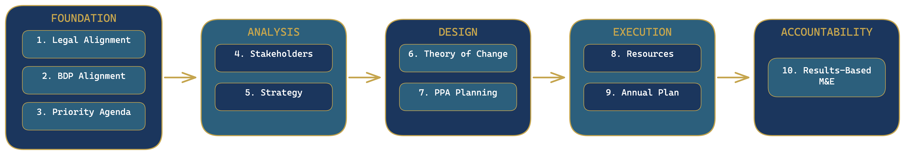

# Chapter 1: Introduction to Strategic Planning in BARMM

Your Minister has asked the planning unit to prepare the Ministry's Strategic Plan for the next three years. The directive is clear, but the questions pile up fast. Where do you start? What format should the plan follow? How do you connect your Ministry's work to the Bangsamoro Development Plan 2023-2028? What happens when the budget team asks how your plan links to the annual financial plan, and you have no answer? What does BPDA expect when you submit?

This guidebook gives you a structured, repeatable process for building a strategic plan that answers all of those questions. It walks you through a 10-point framework designed specifically for Ministries, Offices, and Agencies (MOAs) in the Bangsamoro Autonomous Region. Whether you work in a large ministry with a dedicated planning division or in a small office where one person handles planning, budgeting, and M&E, the process is the same.

By the time you finish this guidebook, you will have produced a complete MOA Strategic Plan that is legally grounded, aligned with the BDP 2023-2028, linked to your annual budget, and ready for BPDA review.

---

## The Problem This Guidebook Solves

The Bangsamoro Government has a clear development vision. The Bangsamoro Development Plan 2023-2028 lays out six development goals, eight strategies, and hundreds of targets across every sector. The Enhanced 12-Point Priority Agenda (institutionalized under OCM Memorandum Circular No. 49, s. 2022) organized the administration's commitments from 2022 through early 2026; it has since been succeeded by the Mas Matatag na Bangsamoro Agenda (OCM Executive Order No. 2, s. 2026), which organizes the 2026-2028 period around five pillars: Mas Matatag na Gobyerno, Mas Matatag na Kabuhayan, Mas Matatag na Pamayanan, Mas Matatag na Seguridad, and Mas Matatag na Paniniwala. Together, these successive agenda frameworks translate the BDP vision into actionable priorities for the transition period. The Bangsamoro Organic Law and the Administrative Code establish the legal mandates of every MOA.

What is missing is a standardized process for connecting all of these elements at the MOA level.

Today, strategic planning across MOAs looks different everywhere. Some ministries produce detailed plans with clear outcome indicators. Others submit documents that list activities without explaining how those activities contribute to development goals. Some offices have no strategic plan at all --- they operate year-to-year, responding to the budget call with a list of activities carried over from the previous fiscal year.

The consequences of this inconsistency are serious:

- **BPDA cannot compare plans across MOAs.** When each MOA uses a different format, different terminology, and different levels of detail, the Bangsamoro Economic and Development Council has no basis for evaluating whether the region's collective efforts add up to the BDP 2023-2028 targets.

- **MFBM cannot link plans to budgets.** The Ministry of Finance, Budget and Management needs to see how proposed Programs, Projects, and Activities (PPAs) flow from strategic objectives. Without that logic chain, budget proposals become wish lists rather than investment plans.

- **Parliament cannot evaluate MOA performance.** When strategic plans do not specify measurable outcomes, parliamentary oversight committees have no benchmark against which to assess implementation. Oversight becomes anecdotal rather than evidence-based.

- **MOAs themselves suffer.** Without a planning framework, staff waste time reinventing the process each cycle. Knowledge walks out the door when personnel transfer. New leadership inherits plans they cannot build on because the logic behind the previous plan was never documented.

This guidebook solves these problems by giving every MOA the same 10-point framework, the same templates, and the same submission standards. When all MOAs follow the same process, BPDA can aggregate plans into a coherent regional picture, MFBM can trace budget proposals back to strategic objectives, and Parliament can hold MOAs accountable against their own commitments.

---

## What Is Strategic Planning in BARMM?

Strategic planning in the Bangsamoro context is not corporate strategy. It is not a vision-and-mission exercise that produces a framed poster for the lobby. It is the process by which a MOA translates its legal mandate into concrete programs, aligns those programs with the Bangsamoro Development Plan 2023-2028, and builds the accountability structures --- budgets, work plans, and monitoring systems --- that ensure those programs deliver results.

Three legal and policy foundations anchor strategic planning in BARMM:

**First, the Bangsamoro Organic Law (Republic Act No. 11054).** Article V, Section 2 of the BOL enumerates the powers of the Bangsamoro Government, including authority over administrative organization, budgeting, and urban and rural planning development.[^1] Article VII, Section 2 vests the powers of government in the Parliament, which "shall set policies, legislate on matters within its authority, and elect a Chief Minister who shall exercise executive authority on its behalf."[^2] Every MOA strategic plan must trace its mandate back to these constitutional powers.

**Second, the Bangsamoro Administrative Code (BAA No. 13).** The Administrative Code establishes the structural and functional framework of the Bangsamoro Government. It declares the policy of the Bangsamoro Government "to pursue the acceleration of the socio-economic development of the region and promote the welfare of its constituents through a holistic, effective and responsive planning, coordination, and monitoring and evaluation of the implementation of policies, plans, programs, and projects in the region."[^3] The Code also creates the Bangsamoro Economic and Development Council (BEDC), chaired by the Chief Minister, which directs plan formulation and recommends the BDP for parliamentary approval.[^4] The Bangsamoro Planning and Development Authority (BPDA) serves as the technical secretariat of the BEDC and the planning, coordinating, and monitoring agency for all development plans, policies, programs, and projects.[^5]

**Third, the Bangsamoro Development Plan 2023-2028.** The BDP 2023-2028 is the medium-term development framework for the Bangsamoro Autonomous Region. It sets six development goals --- Moral Governance, Security and Justice, Economic Development, Social Development, Environment, and Infrastructure --- along with eight cross-cutting strategies and sector-specific targets. Every MOA strategic plan must demonstrate how its programs contribute to the BDP goals and targets. The BDP is not a separate document that sits on a shelf. It is the reference point against which all MOA plans are evaluated.

Together, these three pillars mean that a MOA strategic plan is not optional or aspirational. It is a legal and institutional requirement. Your MOA has a mandate, and strategic planning is how you operationalize that mandate.

> *Can you identify the specific BOL provision, BAA, or executive order that establishes your MOA? If not, that is your first task --- you cannot build a strategic plan without knowing the exact legal basis for your office's existence.*

[^1]: Republic Act No. 11054, Article V, Section 2. The full list of Bangsamoro Government powers includes 55 enumerated areas of authority, from administration of justice to water supply and services.

[^2]: Republic Act No. 11054, Article VII, Section 2.

[^3]: Bangsamoro Autonomy Act No. 13, Book V (Administrative Agencies), Section 12 (Declaration of Policy under the Bangsamoro Economic and Development Council).

[^4]: Bangsamoro Autonomy Act No. 13, Section 13 (The Bangsamoro Economic and Development Council) and Section 15 (Powers and Functions), paragraph 1: "Direct the plan formulation and recommend for approval by the Parliament the Bangsamoro Development Plan."

[^5]: Bangsamoro Autonomy Act No. 13, Section 39 (Bangsamoro Planning and Development Authority): "The BPDA shall serve as the planning, coordinating, and monitoring agency for all development plans, policies, programs and projects of the Bangsamoro Government."

---

## The 10-Point Strategic Planning Framework

This guidebook is organized around a **10-Point Strategic Planning Framework** designed to guide MOAs from legal mandate to measurable results. The framework is structured in five layers, each building on the one before it.

### Framework Overview

<table>
<colgroup><col style="width:15%"><col style="width:15%"><col style="width:70%"></colgroup>
<thead><tr><th>Layer</th><th>Points</th><th>Purpose</th></tr></thead>
<tbody>
<tr><td><strong>Foundation</strong></td><td>Points 1-3</td><td>Establish your MOA's legal basis, development alignment, and priority commitments</td></tr>
<tr><td><strong>Analysis</strong></td><td>Points 4-5</td><td>Identify who your MOA serves and define your strategic direction</td></tr>
<tr><td><strong>Design</strong></td><td>Points 6-7</td><td>Map your theory of change and design specific programs, projects, and activities</td></tr>
<tr><td><strong>Execution</strong></td><td>Points 8-9</td><td>Plan resources and translate strategy into annual work and financial plans</td></tr>
<tr><td><strong>Accountability</strong></td><td>Point 10</td><td>Build results-based monitoring and evaluation into your plan from the start</td></tr>
</tbody>
</table>

### The 10 Points

<table>
<colgroup><col style="width:8%"><col style="width:17%"><col style="width:75%"></colgroup>
<thead><tr><th>Point</th><th>Title</th><th>One-Line Description</th></tr></thead>
<tbody>
<tr><td>1</td><td><strong>Legal Alignment</strong></td><td>Identify your MOA's constitutional and legal mandate --- BOL provisions, Administrative Code references, enabling laws, executive orders, and applicable national legislation.</td></tr>
<tr><td>2</td><td><strong>BDP Alignment</strong></td><td>Map your MOA's work to the Bangsamoro Development Plan 2023-2028 goals, strategies, and sector targets.</td></tr>
<tr><td>3</td><td><strong>Priority Agenda</strong></td><td>Align your programs with the government's current strategic agenda (the Mas Matatag na Bangsamoro Agenda for 2026-2028, which succeeds the Enhanced 12-Point Priority Agenda) and specify your MOA's mode of contribution --- direct implementation, policy support, regulatory function, or advocacy and coordination.</td></tr>
<tr><td>4</td><td><strong>Stakeholder Analysis</strong></td><td>Identify primary beneficiaries, institutional partners, and key actors. Map their power and interest. Plan engagement strategies.</td></tr>
<tr><td>5</td><td><strong>Strategy Analysis</strong></td><td>Define your MOA's vision, mission, core values, problem statements, and SMART strategic objectives.</td></tr>
<tr><td>6</td><td><strong>Theory of Change</strong></td><td>Map the causal pathway from your activities to outputs, outcomes, and long-term impact. State your assumptions explicitly.</td></tr>
<tr><td>7</td><td><strong>PPA Planning</strong></td><td>Design your Programs, Projects, and Activities (PPAs) with UACS-compliant coding, logical frameworks, and clear deliverables.</td></tr>
<tr><td>8</td><td><strong>Resource Planning</strong></td><td>Plan the financial, human, physical, and partnership resources required to implement your PPAs.</td></tr>
<tr><td>9</td><td><strong>Annual Work and Financial Plan</strong></td><td>Translate your multi-year strategy into annual targets, quarterly milestones, a financial plan, and a procurement plan.</td></tr>
<tr><td>10</td><td><strong>Results-Based M&E</strong></td><td>Design your monitoring and evaluation framework with indicators at every level --- input, process, output, outcome, and impact --- with clear data collection plans.</td></tr>
</tbody>
</table>

### Visual Flow

The framework is sequential for first-time users --- you start at Point 1 and work through to Point 10. But it is also modular. An experienced planning team updating an existing strategic plan can jump directly to the point that needs revision. The key rule: **if you change a foundation point, review all downstream points for consistency.**

> *Does your MOA already have a strategic plan? If so, which of the 10 points need updating versus building from scratch --- and have you checked whether your foundation points (1-3) changed since the last plan?*

---

## What You Will Produce

By working through the 10-point framework, you will produce eleven outputs:

<table>
<colgroup><col style="width:8%"><col style="width:62%"><col style="width:30%"></colgroup>
<thead><tr><th>#</th><th>Output</th><th>Source Point</th></tr></thead>
<tbody>
<tr><td>1</td><td>Legal Mandate Statement with verified citations</td><td>Point 1</td></tr>
<tr><td>2</td><td>BDP Alignment Matrix with contribution pathways</td><td>Point 2</td></tr>
<tr><td>3</td><td>Priority Agenda Alignment Statement</td><td>Point 3</td></tr>
<tr><td>4</td><td>Stakeholder Analysis Matrix with engagement plan</td><td>Point 4</td></tr>
<tr><td>5</td><td>Strategic Direction Document (vision, mission, values, objectives)</td><td>Point 5</td></tr>
<tr><td>6</td><td>Theory of Change narrative and diagram</td><td>Point 6</td></tr>
<tr><td>7</td><td>PPA Register with logical frameworks</td><td>Point 7</td></tr>
<tr><td>8</td><td>Resource Plan (financial, human, physical, partnerships)</td><td>Point 8</td></tr>
<tr><td>9</td><td>Annual Work and Financial Plan</td><td>Point 9</td></tr>
<tr><td>10</td><td>Results-Based M&E Framework with indicator matrix</td><td>Point 10</td></tr>
<tr><td>11</td><td><strong>Consolidated MOA Strategic Plan</strong></td><td>All points</td></tr>
</tbody>
</table>

The eleventh output --- the consolidated plan --- is what you submit to BPDA for review and certification. It integrates all ten component outputs into a single document that tells the complete story of your MOA's strategic direction.

> *Can you name the person on your team who will be responsible for consolidating these eleven outputs into a single document? If no one is assigned, who has the institutional knowledge to do it?*

**Appendix D** provides blank templates for each of the ten component outputs and the consolidated plan. **Appendix E** provides a fully worked example using a hypothetical ministry, showing what a completed plan looks like at each stage.

---

## Who Does What

Strategic planning is not a one-person job. This guidebook is designed for planning teams, and each team member has a defined role across the 10 points.

<table>
<colgroup><col style="width:14%"><col style="width:36%"><col style="width:14%"><col style="width:36%"></colgroup>
<thead><tr><th>Role</th><th>Primary Responsibility</th><th>Points Led</th><th>Key Deliverables</th></tr></thead>
<tbody>
<tr><td><strong>Planning Officer</strong></td><td>Drafts the foundation, analysis, and design layers; consolidates all outputs into the final plan</td><td>Points 1-7</td><td>Legal Mandate Statement, BDP Alignment Matrix, Priority Agenda Statement, Stakeholder Analysis, Strategic Direction Document, Theory of Change, PPA Register, Consolidated Plan</td></tr>
<tr><td><strong>Budget Officer</strong></td><td>Leads resource and financial planning; ensures PPAs comply with budget ceilings and MFBM requirements</td><td>Points 8-9</td><td>Resource Plan, Annual Financial Plan, Procurement Plan</td></tr>
<tr><td><strong>M&E Officer</strong></td><td>Designs the monitoring and evaluation framework; defines indicators, baselines, targets, and data collection methods</td><td>Point 10</td><td>M&E Framework, Indicator Matrix, Data Collection Plan</td></tr>
<tr><td><strong>Minister / Executive Director</strong></td><td>Provides strategic direction and approves outputs at each stage; makes final decisions on priorities, resource allocation, and plan submission</td><td>Approval at all stages</td><td>Approved plan at each milestone</td></tr>
<tr><td><strong>BPDA</strong></td><td>Reviews submitted plans for completeness, BDP alignment, and technical quality; certifies compliant plans</td><td>External review</td><td>Plan certification or feedback for revision</td></tr>
<tr><td><strong>MFBM</strong></td><td>Reviews resource and financial plans for budget feasibility and compliance with fiscal policies</td><td>External review</td><td>Budget feasibility assessment</td></tr>
</tbody>
</table>

> *Which of these roles does your MOA actually have filled? If your office has no dedicated M&E Officer or Budget Officer, who will take on those responsibilities --- and do they have the capacity to do so alongside their regular duties?*

### A Note for Decision-Makers

Each chapter in this guidebook includes a **"For Decision-Makers"** callout. These callouts summarize the key questions you need to answer and the decisions you need to make at each stage. If you are a Minister, Deputy Minister, or Executive Director, you do not need to read every chapter in full. Read the opening section for context, then focus on the decision-maker callouts to understand what your planning team needs from you.

> *Has your Minister or Executive Director been briefed on this planning process and committed to providing timely decisions at each stage? A planning team that completes its work but cannot get leadership sign-off on time will miss the budget cycle.*

---

## The Planning Calendar

Strategic planning does not happen in isolation. It follows the rhythm of the BARMM fiscal year and budget cycle. The table below shows when each layer of the 10-point framework typically takes place.

<table>
<colgroup><col style="width:10%"><col style="width:14%"><col style="width:20%"><col style="width:56%"></colgroup>
<thead><tr><th>Quarter</th><th>Months</th><th>Framework Layer</th><th>Key Activities</th></tr></thead>
<tbody>
<tr><td><strong>Q1</strong></td><td>January -- March</td><td><strong>Foundation</strong> (Points 1-3)</td><td>Conduct strategic review of previous plan performance. Update legal alignment for any new legislation enacted in the previous year. Review BDP 2023-2028 targets and assess progress. Reaffirm or adjust Priority Agenda alignment.</td></tr>
<tr><td><strong>Q2</strong></td><td>April -- June</td><td><strong>Analysis and Design</strong> (Points 4-6)</td><td>Conduct stakeholder analysis. Update or develop vision, mission, and strategic objectives. Build or revise the Theory of Change. This is also when the BARMM Budget Call typically arrives, providing budget ceilings for the coming fiscal year.</td></tr>
<tr><td><strong>Q3</strong></td><td>July -- September</td><td><strong>Design and Execution</strong> (Points 7-9)</td><td>Design or update PPAs with logical frameworks. Develop the resource plan within budget ceilings. Prepare the Annual Work and Financial Plan, including the procurement plan.</td></tr>
<tr><td><strong>Q4</strong></td><td>October -- December</td><td><strong>Accountability and Submission</strong> (Point 10, consolidation)</td><td>Finalize the M&E framework. Consolidate all outputs into the MOA Strategic Plan. Submit to the Minister/Executive Director for approval. Submit to BPDA for review and certification.</td></tr>
</tbody>
</table>

### Alignment with the Budget Cycle

The planning calendar is designed to feed directly into the budget process. When the Budget Call arrives (typically Q2-Q3), your MOA should already have its foundation and analysis layers complete. This means your budget proposals are grounded in legal mandate, aligned with BDP 2023-2028 goals, and supported by a Theory of Change --- not assembled from scratch under time pressure.

Point 9 (Annual Work and Financial Plan) produces the annual targets, financial plan, and procurement plan that flow directly into your MOA's budget submission. The PPAs you design in Point 7 map to the BBP budget forms that MFBM requires. When your planning and budgeting are integrated, the budget defense becomes a conversation about strategy rather than a negotiation over line items.

> *When does your MOA typically receive the MFBM Budget Call? Count backward from that deadline --- do you have enough lead time to complete the foundation and analysis layers before the Budget Call arrives?*

### For Existing Plans

If your MOA already has a strategic plan, you do not need to start from scratch each year. The planning calendar supports annual updating:

- **Q1**: Review the foundation points (1-3) for any changes in law, policy, or BDP targets.
- **Q2-Q3**: Update the analysis and design points (4-7) based on lessons learned from implementation.
- **Q3**: Revise resource and annual plans (8-9) within the new budget ceiling.
- **Q4**: Update the M&E framework (10) and resubmit the consolidated plan.

---

## How to Read This Guidebook

This guidebook is designed for multiple audiences. Choose the reading path that matches your role and experience.

### If You Are a First-Time Planner

Read this introduction, then follow Chapters 2 through 12 in order. Each chapter covers one point of the framework and includes step-by-step instructions, templates, examples, and common mistakes to avoid. Chapter 12 covers plan consolidation and the BPDA submission process.

> *Before you begin Chapter 2, do you have access to the three foundational documents: the BOL (RA 11054), the Bangsamoro Administrative Code (BAA No. 13), and the BDP 2023-2028? If any are missing, obtain them now --- you will need all three throughout the process.*

### If You Are an Experienced Planner Updating a Specific Component

Jump directly to the chapter that covers the point you need to revise. Each chapter is self-contained enough to use independently, though you should check the "upstream dependencies" section at the start of each chapter to ensure your foundation is still current.

### If You Are a Decision-Maker (Minister, Deputy Minister, Executive Director)

Read this introduction for the overall framework. Then, for each chapter, read only the **"For Decision-Makers"** callout boxes and the chapter summary. Focus especially on Chapter 12 (Plan Consolidation and Submission), which explains what you are approving and what BPDA will evaluate. You do not need to master the technical details of Theory of Change construction or indicator design --- that is what your planning team does. Your role is to provide strategic direction and approve the outputs.

### If You Are a BPDA Reviewer

Start with Chapter 12 (Plan Consolidation and Submission), which specifies the submission format, completeness criteria, and quality standards. Then review **Appendix D** (blank templates) to understand the expected structure of each component. **Appendix E** (worked example) shows what a compliant plan looks like. You can then refer to individual chapters for the technical criteria behind each point.

---

## Conventions Used in This Guidebook

Throughout this guidebook, you will encounter the following formatting conventions:

- **Bold text** highlights key terms, framework names, and definitions
- *Italic text* marks document titles and template names on first reference
- **TIP** callouts provide practical advice from experienced planning practitioners
- **CAUTION** callouts warn about common mistakes and their consequences
- **FOR DECISION-MAKERS** callouts summarize the key decisions required at each stage
- **BANGSAMORO NOTE** callouts highlight adaptations specific to BARMM governance and fiscal processes
- Blockquoted text presents verbatim legal provisions from the BOL, Administrative Code, or other legislation
- Footnotes provide full legal citations following the Philippine Manual of Legal Citations format
- Section references use "Chapter X, Section X.X" for cross-referencing within this guidebook

---

## Companion Resources

This guidebook complements several other key BARMM publications:

- The **Bill Drafting Guidebook for the Bangsamoro Parliament** covers the technical craft of writing legislation. If your MOA's strategic plan identifies legislative gaps that require new BAAs, consult the Bill Drafting Guidebook for drafting standards.

- The **Complete Staff Work (CSW) Guidebook** provides the ADDRESS IT methodology for analytical and decision-support work. Strategic planning draws on CSW skills --- particularly the research, analysis, and options-evaluation steps. If your planning team needs to strengthen their analytical process, the CSW Guidebook is the reference.

- The **Bangsamoro Development Plan 2023-2028** is the primary reference document for BDP alignment (Point 2). You will need a copy of the BDP accessible to your team throughout the planning process.

---

**Now turn to Chapter 2 to begin the first point of the framework: establishing your MOA's legal alignment.**
