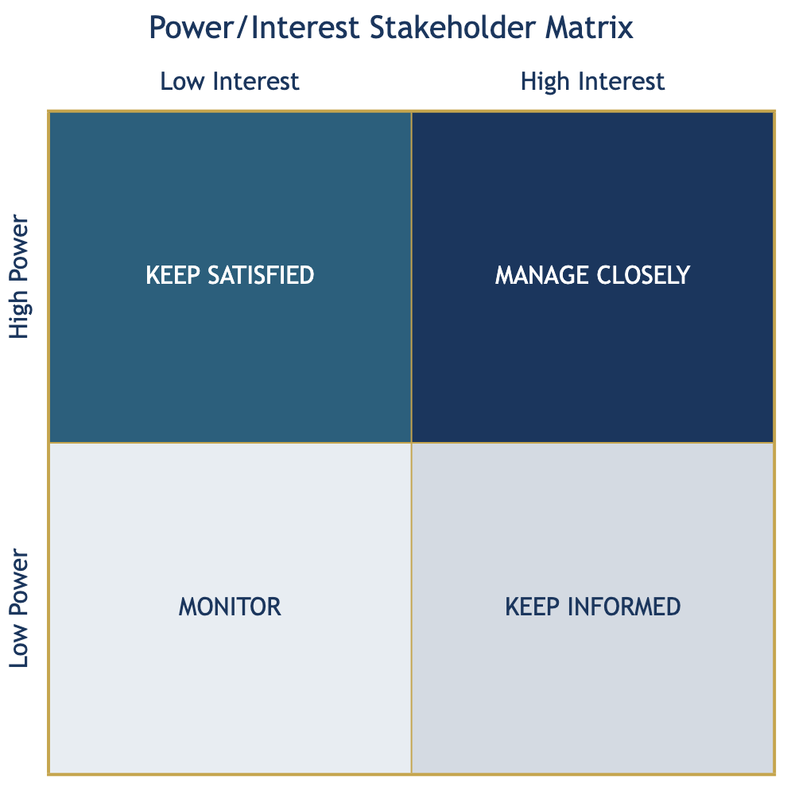

# Chapter 5: Analyzing Your Stakeholders

Your MOA does not plan in isolation. Every program you implement affects people, organizations, and institutions --- and many of those same actors have the power to shape whether your programs succeed or fail. Some control resources you need. Some represent communities you serve. Some have the authority to approve or block your plans. Some oppose your direction entirely.

Stakeholder analysis is the systematic process of identifying all of these actors, understanding what they care about and how much influence they hold, and designing engagement strategies that match their position. It is Point 4 of the 10-Point Framework because it bridges the *institutional* work of Points 1 through 3 (legal mandate, BDP alignment, priority agenda) with the *strategic* work that follows (strategy analysis, theory of change, program design). The first three points answer: *What is your MOA authorized and expected to do?* Stakeholder analysis answers: *Who will help, hinder, benefit from, or be affected by what you do --- and how will you engage them?*

In BARMM, stakeholder analysis carries particular weight. The Bangsamoro governance landscape includes not only the formal institutions of the Bangsamoro Government --- Parliament, ministries, offices, agencies, and local government units --- but also traditional authority structures (Sultanate systems, council of elders), religious institutions (Ulama councils, Da'wah organizations), indigenous peoples' communities with distinct governance traditions, a large and active development partner community (international organizations, bilateral donors, NGOs), and civil society organizations that serve as intermediaries between government and communities. Missing any of these categories in your analysis creates blind spots that can derail implementation.

This chapter gives you a step-by-step process for identifying your MOA's full stakeholder landscape, assessing each stakeholder's power and interest, plotting them on a Power/Interest matrix, assigning engagement strategies, and completing a Stakeholder Register and Engagement Plan.

---

## 5.1 Purpose

Stakeholder analysis serves four strategic purposes in your planning process:

**First, it prevents blind spots.** Without a systematic process, most planning teams default to listing the stakeholders they already know --- the partner agencies they work with, the LGUs they coordinate with, the development partners that fund their programs. They miss the communities that will be affected by the programs, the Parliament committees that will scrutinize them, the traditional leaders whose cooperation is essential for community-level implementation, and the critics whose objections must be addressed rather than ignored. A structured stakeholder analysis ensures you identify actors across all relevant categories.

**Second, it enables differentiated engagement.** Not all stakeholders require the same level of attention. A BTA committee with oversight authority over your MOA demands a fundamentally different engagement approach than a community organization in a remote municipality. The Power/Interest matrix gives you a principled basis for allocating your limited time and resources to the stakeholders that matter most --- without neglecting those who matter less but still deserve attention.

**Third, it builds coalitions for implementation.** Strategic plans fail most often not because of technical deficiency but because of political and institutional failure --- lack of support, active opposition, coordination breakdown, or community resistance. Stakeholder analysis forces you to identify which actors are essential for plan approval and implementation, and to design engagement strategies that secure their support before implementation begins.

**Fourth, it surfaces risks early.** Stakeholders with high power and low interest can become obstacles if they are surprised by your programs. Stakeholders with competing interests can create conflicts that delay implementation. Stakeholders who feel excluded from the planning process can become active opponents. Identifying these dynamics during the planning stage --- rather than discovering them during implementation --- gives you time to address them.

> *Has your MOA ever been surprised by opposition to a program --- from a Parliament member, an LGU, a traditional leader, or a community group you did not anticipate? What stakeholder category did that opponent belong to, and would a systematic analysis have flagged them earlier?*

The Bangsamoro Administrative Code (BAA No. 13) establishes that the Bangsamoro Economic and Development Council (BEDC) shall "direct the plan formulation and recommend for approval by the Parliament the Bangsamoro Development Plan."[^1] This means your MOA's strategic plan will be evaluated at multiple institutional levels --- from BPDA technical review to BEDC deliberation to parliamentary scrutiny. Your stakeholder analysis must account for these institutional checkpoints and the actors who inhabit them.

---

## 5.2 Key Concepts

### Stakeholder Categories in BARMM

A stakeholder is any individual, group, or organization that can affect or is affected by your MOA's programs. In BARMM, stakeholders fall into fifteen primary categories. Your analysis must consider all fifteen, even if some categories are more relevant than others to your specific MOA.

**Category A: BTA Parliament and Committees.** The Bangsamoro Transition Authority Parliament has legislative oversight over every MOA. The committee with jurisdiction over your sector --- whether it is the Committee on Basic Education, the Committee on Environment, the Committee on Health, or any other --- reviews your budget proposals, conducts oversight hearings, and can direct inquiry into your operations.[^2] Members of Parliament from provinces and districts where your programs operate have a direct interest in your MOA's work. Parliament is a stakeholder in every MOA's plan. Forgetting this is one of the most common errors in BARMM stakeholder analysis.

**Category B: MOAs (Ministries, Offices, and Agencies).** The Bangsamoro Government has 15 primary ministries and numerous offices and agencies, many of which share mandates or coordinate on cross-cutting programs.[^3] Your MOA does not operate in isolation. The Ministry of Finance, Budget and Management (MFBM) reviews your budget. The BPDA evaluates your plan. The Bangsamoro Information Office may communicate your programs. Other sector ministries may implement complementary or competing programs. Identify every MOA that your work intersects with.

**Category C: National Government.** BARMM operates within the Philippine constitutional framework, and the national government --- across all three branches --- remains a significant stakeholder in every MOA's work. The BOL (Article VI) establishes formal intergovernmental relations mechanisms that require ongoing coordination between Bangsamoro and national institutions.[^8]

- **Office of the President and attached offices.** The President exercises general supervision over BARMM and has the power to appoint BTA members. Attached offices include the Office of the Presidential Adviser on Peace, Reconciliation and Unity (OPAPRU), which oversees the peace process and normalization program; the Presidential Legislative Liaison Office (PLLO), which coordinates with Congress on BARMM legislation; and other presidential offices that issue executive orders and directives affecting the Bangsamoro region.
- **Philippine Senate.** The Senate has jurisdiction over legislation affecting BARMM, including amendments to the BOL, the annual General Appropriations Act that includes the Bangsamoro block grant, and treaties or agreements with international implications for the region. The Senate Committee on Local Government and the Committee on Peace, Unification, and Reconciliation are particularly relevant.
- **House of Representatives.** The House of Representatives originates all appropriation bills, including the block grant. The House Committee on Bangsamoro Affairs directly oversees BARMM-related legislation. Representatives from Bangsamoro party-list groups and from districts within or adjacent to BARMM have direct political interest in your MOA's work.
- **Fiscal and planning agencies.** The Department of Budget and Management (DBM) processes the Bangsamoro block grant through the GAA. The National Economic and Development Authority (NEDA) coordinates on development planning alignment between the PDP and BDP. The Commission on Audit (COA) audits BARMM expenditures. The Intergovernmental Fiscal Policy Board --- co-chaired by the DOF Secretary and the BARMM MFBM Minister, with DBM, DTI, and NEDA as members --- coordinates fiscal policy between the two governments (BOL, Article XII, Sections 37-38).
- **Sector agencies with shared or concurrent mandates.** Not all government functions transferred fully to BARMM. Agencies like the Civil Service Commission (CSC), COMELEC, DILG, and national regulatory bodies retain authority in areas where the BOL establishes shared or concurrent powers. The IGRB (Intergovernmental Relations Body) mediates disputes and coordinates between Bangsamoro and national institutions.
- **Agencies with regional offices and national programs in BARMM territory.** Many NGAs maintain regional offices that implement national programs alongside BARMM programs. The BOL (Article VI, Section 13) explicitly lists national programs that continue to be funded by the National Government in BARMM: the Pantawid Pamilyang Pilipino Program (4Ps), Health Facility Enhancement Program, School Building Program, DOH retained hospitals, PhilHealth, and social pension for senior citizens.

**Category D: Local Government Units (LGUs).** BARMM comprises five provinces (Maguindanao del Norte, Maguindanao del Sur, Lanao del Sur, Basilan, and Sulu), three cities (Cotabato City, Marawi City, and Lamitan City), 116 municipalities, and over 2,500 barangays.[^4] Your MOA's programs are ultimately delivered at the local level. Provincial governors, city and municipal mayors, and barangay captains are both implementers and gatekeepers. LGU cooperation is often the difference between a program that reaches communities and a program that remains on paper.

**Category E: Civil Society Organizations (CSOs) and NGOs.** BARMM has a vibrant civil society sector. CSOs provide essential services, conduct advocacy, monitor government performance, and represent community interests. They include local NGOs, people's organizations, cooperatives, women's organizations, youth groups, and professional associations. CSOs can be implementing partners, advocacy allies, constructive critics, or all three simultaneously.

**Category F: International Development Partners (ODA Community).** The Bangsamoro region has one of the most active Official Development Assistance (ODA) landscapes in the Philippines. BPDA convenes the Bangsamoro International Development Partners Forum (BIDPF) --- now on its 5th edition (February 2026) --- to coordinate development assistance. As of the latest forum, the ODA community in BARMM includes **14 donor countries, 18 UN agencies, and 23 international NGOs**.[^5]

- **Bilateral donors and their implementing agencies.** Active bilateral partners include JICA (Japan), USAID, Australian Aid (DFAT), the European Union (through SUBATRA --- Support to Bangsamoro Transition), Global Affairs Canada, the Royal Norwegian Embassy, GIZ (Germany), and the Spanish Agency for International Development Cooperation (AECID). Each donor has its own reporting requirements, program priorities, and coordination mechanisms.
- **Multilateral development banks.** The World Bank (through the Bangsamoro Autonomy and Development Fund) and the Asian Development Bank provide both grant financing and technical assistance. ODA loans to BARMM follow formal guidelines approved by the Intergovernmental Fiscal Policy Board, requiring a grant element of at least 25% and coordination with the National Government.
- **UN System agencies.** UNDP, UNICEF, UN-FAO, UNWFP, UNOPS, and other UN agencies operate programs aligned with the BDP. The UN System has pledged significant contributions to BARMM development, and coordinates through the UN Country Team.
- **International NGOs.** Organizations like the International Committee of the Red Cross (ICRC) and international development NGOs implement programs in peacebuilding, humanitarian assistance, governance reform, and social development.

BPDA's ODA-Nationally Funded Programs Projects Coordination Division (ODANFPPCD) coordinates this landscape. Your MOA's strategic plan should account for how ODA support aligns with your priorities --- and where it may pull you in directions that do not align.

> *Which development partners currently fund or support programs in your MOA's sector? Are their priorities aligned with your BDP goals and strategic agenda contributions --- or are they pulling your MOA toward activities outside your core mandate?*

**Category G: Private Sector.** Businesses, industry associations, chambers of commerce, and private enterprises operating in BARMM are stakeholders in programs that affect the business environment, infrastructure, labor, trade, investment, and regulation. Even MOAs that do not directly regulate the private sector may find that private sector actors are affected by their programs --- a health ministry's regulations affect private health facilities, an education ministry's standards affect private schools, an environment ministry's policies affect extractive industries.

**Category H: Traditional Leaders and Indigenous Governance.** The Bangsamoro political landscape includes traditional authority structures that predate the modern state and continue to exercise significant social and cultural authority:[^6]

- **Sultanate structures.** The Sultanates of Sulu and Maguindanao are historical polities with continuing social and cultural authority. While they do not exercise formal governmental power under the BOL, their leaders command respect and influence in their communities. Programs that affect ancestral domains or cultural heritage often require engagement with Sultanate structures.
- **Council of elders and traditional governance.** Many communities retain traditional leadership structures --- *datu*, *bai a labi*, tribal chieftains, and community elders --- who exercise authority on matters of customary law, conflict resolution, and community decision-making. Programs that require community participation often cannot succeed without the endorsement of traditional leaders.
- **Indigenous peoples' governance structures.** IP communities in the Bangsamoro region maintain distinct governance systems recognized under the BOL and the Indigenous Peoples' Rights Act (RA 8371). Their free, prior, and informed consent (FPIC) may be required for programs affecting ancestral domains.

**Category I: Islamic Institutions.** This category is distinctive to BARMM and critically important. Islamic institutions exercise authority rooted in religious scholarship and faith --- a fundamentally different power base from the customary authority of traditional leaders. The BOL recognizes Islam as a defining feature of Bangsamoro identity and Shari'ah as a source of law in the region.[^7]

- **Ulama councils.** Islamic scholars and religious leaders (Ulama) provide moral and religious guidance, adjudicate personal and family law matters through the Shari'ah system, and shape public opinion on governance and development issues. The BOL establishes Shari'ah courts with jurisdiction over personal and family law of Muslims.
- **Da'wah and Islamic propagation organizations.** Da'wah organizations are active in community outreach, education, and social welfare. They reach populations that government programs sometimes do not and can serve as implementing partners for community-level programs.
- **Madaris networks and Islamic educational institutions.** The Bangsamoro region has thousands of madaris (Islamic schools) and Islamic foundations that deliver education and social services. The BOL (Article IX, Section 18) establishes the Madaris Education System and provides for coordination with national education agencies.
- **Islamic finance and halal economy organizations.** With the Mas Matatag na Bangsamoro Agenda emphasizing halal economy under Pillar E, Islamic finance institutions and halal certification bodies are increasingly important stakeholders for MOAs with economic development mandates.

> *Have you included Islamic institutions in your stakeholder list --- not just as a courtesy, but as actors with real influence over community acceptance of your programs? For programs involving family welfare, education, or community development, Ulama endorsement can determine whether communities participate or resist.*

**Category I: National Government Agencies (NGAs).** BARMM operates within the Philippine constitutional framework, and national government agencies remain significant stakeholders in every MOA's work. The BOL (Article VI) establishes formal intergovernmental relations mechanisms --- the IGRB (Intergovernmental Relations Body), the Philippine Congress-Bangsamoro Parliament Forum (PCBPF), and the Intergovernmental Fiscal Policy Board --- that require ongoing coordination between Bangsamoro and national institutions.[^8] NGAs with direct relevance include:

- **Fiscal and planning agencies.** The Department of Budget and Management (DBM) processes the Bangsamoro block grant through the annual General Appropriations Act. The National Economic and Development Authority (NEDA) coordinates on development planning alignment between the PDP and BDP. The Commission on Audit (COA) audits BARMM expenditures.
- **Sector agencies with shared or concurrent mandates.** Not all government functions transferred fully to BARMM. Agencies like the Civil Service Commission (CSC), the Department of the Interior and Local Government (DILG) on certain matters, and national regulatory bodies retain authority in areas where the BOL establishes shared or concurrent powers. Your MOA must identify which national agencies operate in your sector space.
- **Agencies with regional offices and national programs in BARMM territory.** Many NGAs maintain regional offices that implement national programs alongside BARMM programs. The BOL (Article VI, Section 13) explicitly lists national programs that continue to be funded by the National Government in BARMM: the Pantawid Pamilyang Pilipino Program (4Ps), Health Facility Enhancement Program, School Building Program, DOH retained hospitals, PhilHealth, and social pension for senior citizens. Your MOA must identify which national programs operate in your sector space and how they interact with your own programs.
- **Congressional committees.** The Philippine Congress retains legislative authority over matters not devolved to the Bangsamoro Parliament. Congressional committees with jurisdiction over BARMM-related legislation --- particularly the appropriations committees that approve the block grant --- are high-power stakeholders.

**Category J: Media.** Media organizations shape public narratives about your MOA's programs and can amplify support or generate opposition. In BARMM, the media landscape includes:

- **Bangsamoro Information Office (BIO).** The government's official communications office, which coordinates public information and media relations for the Bangsamoro Government.
- **Local radio stations.** Community radio remains one of the most powerful communication channels in BARMM, particularly in areas with limited internet connectivity. Radio stations in Cotabato City, Marawi, Jolo, and provincial capitals are influential opinion shapers.
- **Online and social media.** Social media platforms are increasingly important for reaching Bangsamoro communities, particularly younger populations. Facebook pages of MOAs, MPs, and community groups can rapidly amplify or distort information about your programs.
- **National media.** National news outlets cover BARMM governance, peace process developments, and major programs. National media attention can bring scrutiny, political pressure, or public support. Your engagement strategy for national media differs fundamentally from local media engagement.

Media stakeholders require distinct engagement strategies --- press briefings, access to information protocols, media kits, spokesperson designation --- that do not fit the engagement patterns of any other category.

**Category K: Academia and Research Institutions.** Universities, research centers, and think tanks play a unique role as knowledge producers and evidence generators. In BARMM:

- **The Mindanao State University (MSU) System** is the primary public university system in the Bangsamoro region, with campuses across the five provinces. MSU produces research on Bangsamoro governance, development, culture, and society that can inform your MOA's strategic planning.
- **Private universities and colleges** --- Notre Dame institutions, Jamiatu Muslim Mindanao, and other higher education institutions --- train the human capital pipeline for BARMM and conduct applied research.
- **Think tanks and research organizations** --- both local and national --- produce policy analysis and evaluation research relevant to BARMM governance. The Bangsamoro Development Agency, academic research centers, and international research organizations can serve as technical advisors or evaluation partners.
- **BPDA's research function.** The Bangsamoro Planning and Development Authority (BPDA) conducts and commissions research for development planning. While BPDA is a government agency (Category B), the broader research ecosystem it draws on includes non-government academic institutions.

Academia stakeholders are valuable not only as implementers or beneficiaries but as sources of evidence, evaluation capacity, and technical expertise that strengthen the analytical foundations of your strategic plan.

**Category L: Cooperatives and Social Enterprises.** The Bangsamoro region has over 12,000 registered cooperatives --- one of the highest densities in the Philippines. Cooperatives are a distinct institutional form: member-owned economic enterprises with a social mission, governed by their own national law (RA 9520) and regulated by the Cooperative Development Authority (CDA), which is transitioning to a Bangsamoro Cooperative and Social Enterprise Authority under pending legislation. They are neither purely private sector (Category G) nor civil society organizations (Category E).[^10]

- **Agricultural cooperatives.** Farmer and fisherfolk cooperatives are primary delivery mechanisms for MAFAR programs, including agrarian reform, credit access, and value chain development.
- **Multi-purpose and credit cooperatives.** These serve as community-based financial institutions in areas where formal banking is limited --- particularly in island provinces and remote municipalities.
- **Electric cooperatives.** Utility cooperatives that distribute power in BARMM are explicitly mentioned in the BOL (Article XIII, Section 36) with provisions for debt restructuring.
- **Former combatant cooperatives.** Decommissioned MILF and MNLF members have formed cooperatives as part of the normalization program. The BDP notes these cooperatives face compliance difficulties that require tailored support.
- **Social enterprises.** Hybrid organizations that pursue social objectives through market-based activities. The BOL (Article XIII, Section 27) mandates support for social enterprises as a development mechanism.

**Category M: Peace Process and Normalization Actors.** This category is unique to BARMM and reflects the region's origins in a peace agreement. The Bangsamoro Organic Law itself is the product of the Comprehensive Agreement on the Bangsamoro (CAB) between the Government of the Philippines (GPH) and the Moro Islamic Liberation Front (MILF). The peace process actors are not government, not CSOs, not communities --- they are institutional actors with political power, military capacity, and specific legal standing.[^11]

- **Moro Islamic Liberation Front (MILF) and the Bangsamoro Islamic Armed Forces (BIAF).** The MILF is the signatory to the CAB and currently leads the BTA (BOL, Article XVI, Section 2). The BIAF is undergoing decommissioning under the normalization process. MILF camp communities --- 33 profiled camps across the Bangsamoro region --- are both political constituencies and program delivery sites.
- **Moro National Liberation Front (MNLF).** The MNLF is the signatory to the 1996 Final Peace Agreement and has representation in the BTA. MNLF members and their Bangsamoro Armed Forces are also included in the rehabilitation and integration provisions of the BOL (Article XIV, Section 1).
- **Joint Normalization Committee (JNC) and Joint Peace and Security Teams (JPST).** The normalization process involves joint mechanisms between the GPH and MILF, including the tri-force security teams (AFP, PNP, and MILF-BIAF) that operate in designated areas. These are neither purely government nor purely non-government actors.
- **Decommissioned combatants and their families.** The BOL (Article XIV) provides for the rehabilitation and integration of former combatants, including women auxiliary force members, widows, and orphans of the conflict. These populations have distinct needs --- livelihood support, skills training, psychosocial services --- that differ from general affected communities.
- **GPH-MILF peace panels and monitoring bodies.** International and domestic monitoring bodies that oversee the peace agreement implementation are stakeholders with unique access and influence.

**Category N: Workers and Organized Labor.** Workers are a rights-bearing constituency with constitutional protections for self-organization, collective bargaining, and the right to strike. The BOL (Article IX, Section 10) guarantees these rights, and the Ministry of Labor and Employment (MOLE) serves as the primary government interface. Workers as organized stakeholders are distinct from the private sector that employs them (Category G) and from general affected communities (Category O).[^12]

- **Labor unions and workers' organizations.** Organized labor participates in tripartite mechanisms --- the Bangsamoro Tripartite Wages and Productivity Board (BTWPB) includes employer representatives, worker representatives, and government --- giving unions institutional standing that CSOs do not have.
- **Overseas Bangsamoro Workers (OBWs).** MOLE's Overseas Workers Welfare Bureau serves Bangsamoro workers abroad, who face distinct vulnerabilities including trafficking and labor exploitation. OBWs are physically outside BARMM territory but remain a significant constituency with dedicated government programs (BOL, Article V; BAA No. 13, Title IX, Section 15).
- **Informal sector workers.** The majority of BARMM's workforce operates in the informal economy --- without social protection, employment contracts, or access to labor dispute mechanisms. While not "organized" in the union sense, informal workers are a stakeholder group that MOAs with economic or social mandates must account for.

**Category O: Affected Communities and Beneficiaries.** The people who will directly benefit from or be affected by your programs are stakeholders, even if they are not organized into formal institutions. A common failure of stakeholder analysis is to list only institutional actors and forget the communities those institutions are supposed to serve.

Your MOA should identify which of these sub-populations are relevant to your mandate:

- **Women and girls** --- the Bangsamoro Women Commission (BWC), GAD Focal Point Systems, and women's organizations represent organized women's interests; the broader female population is a cross-cutting beneficiary group with specific needs (VAWC protection, maternal health, economic empowerment).
- **Youth** --- the BOL provides for a Commission on Youth and reserved Parliament seats; RAP-YPS (Regional Action Plan on Youth, Peace and Security) guides youth programming.
- **Children** --- including children in conflict with the law (CICL), street children, child laborers, and children at risk of early and forced marriage (CEFM).
- **Persons with disabilities (PWDs)** --- 53,483 PWDs in BARMM programs; a proposed Magna Carta for PWDs in BARMM is pending.
- **Senior citizens** --- 159,172 enrolled in the Social Pension program with growing numbers across all provinces.
- **Internally displaced persons (IDPs)** --- 93,525 IDPs in BARMM (82.5% of all Mindanao IDPs), including long-term Marawi siege displaced; a proposed IDP Law is pending.
- **Farmers and fisherfolk** --- 252,758 registered fisherfolk (highest in the country); farmers and agrarian reform beneficiaries are primary constituencies of MAFAR.
- **Overseas Bangsamoro Workers and their families** --- vulnerable to trafficking and exploitation; served through MOLE's Overseas Workers Welfare Bureau.
- **Settler communities** --- non-Moro, non-IP residents with reserved Parliament seats and a dedicated office under the BOL (Article IX, Section 15).
- **Non-Moro Indigenous Peoples** --- Teduray, Lambangian, Dulangan Manobo, Higaonon, Badjao, Sama, Yakan, and other indigenous communities. Category H covers their governance structures; this sub-population includes all community members, not just leaders.
- **Conflict-affected populations** --- widows, orphans, and communities devastated by decades of armed conflict, including Marawi siege survivors.

### The Power/Interest Matrix

The Power/Interest matrix is the core analytical tool in stakeholder analysis. It organizes stakeholders into four quadrants based on two dimensions:

- **Power** measures the stakeholder's ability to influence your MOA's programs. A stakeholder with high power can block, modify, fund, approve, or accelerate your plans. Power comes from many sources: legal authority, budget control, political position, community influence, media access, technical expertise, or control of resources your MOA needs.
- **Interest** measures the stakeholder's degree of concern about your MOA's programs. A stakeholder with high interest is actively engaged with or affected by your work. Interest may be positive (supportive) or negative (opposed), but in either case it means the stakeholder pays attention to what your MOA does.

The four quadrants produce four distinct engagement strategies:

<table>
<colgroup><col style="width:15%"><col style="width:42%"><col style="width:43%"></colgroup>
<thead><tr><th></th><th><strong>High Interest</strong></th><th><strong>Low Interest</strong></th></tr></thead>
<tbody>
<tr><td><strong>High Power</strong></td><td><strong>Quadrant 1: Manage Closely</strong> --- These are your key players. They have both the ability to influence your programs and a strong stake in the outcome. Invest the most time and resources here. Examples: BTA committees with oversight, the MFBM, provincial LGUs in your program area.</td><td><strong>Quadrant 2: Keep Satisfied</strong> --- These stakeholders have the power to affect your plans but are not currently focused on your work. Keep them informed enough to prevent negative surprises. If their interest increases, they move to Quadrant 1. Examples: the Office of the Chief Minister on routine matters, national government agencies with general oversight.</td></tr>
<tr><td><strong>Low Power</strong></td><td><strong>Quadrant 3: Keep Informed</strong> --- These stakeholders care deeply about your work but have limited ability to influence it directly. They can, however, become powerful advocates or vocal critics. Keep them informed and give them channels for input. Examples: community organizations, CSO partners, affected beneficiary groups.</td><td><strong>Quadrant 4: Monitor</strong> --- These stakeholders have limited power and limited current interest. Monitor them for changes --- today's low-power, low-interest stakeholder may become high-power or high-interest as your programs develop. Examples: media outlets not covering your sector, businesses indirectly affected.</td></tr>
</tbody>
</table>

The matrix is a snapshot, not a permanent classification. Stakeholder positions change over time and across programs. A stakeholder who is in Quadrant 4 for one program may be in Quadrant 1 for another. Reassess the matrix whenever your MOA launches a new program, enters a new planning cycle, or encounters a significant change in the political or institutional landscape.

> *Think of a stakeholder you currently classify as "low interest." Is there a scenario --- a new program launch, a budget dispute, a land use conflict --- that would move them to high interest overnight? What would trigger that shift, and are you prepared for it?*

### Engagement Levels

Within each quadrant, you assign a specific engagement level that describes the depth of your interaction with the stakeholder. The five engagement levels form a spectrum from minimal to maximal participation:[^9]

1. **Inform.** One-way communication. You tell the stakeholder what you are doing. The stakeholder receives information but does not provide input. Appropriate for Quadrant 4 (Monitor) stakeholders and for the initial communication with Quadrant 2 (Keep Satisfied) stakeholders. *Methods:* newsletters, public announcements, social media posts, official reports.

2. **Consult.** Two-way communication. You seek the stakeholder's feedback on your plans or programs, but you retain decision-making authority. Appropriate for Quadrant 2 (Keep Satisfied) stakeholders and for some Quadrant 3 (Keep Informed) stakeholders. *Methods:* surveys, feedback forms, consultation workshops, comment periods.

3. **Involve.** The stakeholder participates directly in the planning process. Their input is actively incorporated into decisions, though you retain final authority. Appropriate for Quadrant 3 (Keep Informed) stakeholders with deep knowledge of the issues. *Methods:* focus groups, stakeholder workshops, technical working groups, participatory planning sessions.

4. **Collaborate.** The stakeholder is a partner in decision-making. You share authority over specific aspects of the plan or program. Appropriate for Quadrant 1 (Manage Closely) stakeholders. *Methods:* joint planning committees, memoranda of agreement, co-implementation arrangements, shared governance structures.

5. **Empower.** The stakeholder has decision-making authority over specific aspects of the program. You transfer control to the stakeholder. Appropriate in limited cases where community ownership or institutional mandate requires it. *Methods:* devolved program management, community-driven development, delegated authority.

### Internal vs. External Stakeholders

Your stakeholder analysis should distinguish between *internal* stakeholders --- those within your MOA (bureaus, divisions, regional and field offices, staff associations) --- and *external* stakeholders (all fifteen categories above). Internal stakeholders are often overlooked, but they are critical. Your MOA's own staff must understand, support, and implement the strategic plan. If a bureau director opposes a program or a field office lacks capacity to deliver it, the plan fails regardless of how well you managed external stakeholders.

> *Have you included your own bureau directors, division chiefs, and field office heads as internal stakeholders? Do they support the strategic direction, or will they learn about the plan only after it has been submitted to BPDA?*

### Stakeholder Dynamics

Stakeholder relationships are not static. Several dynamics should be tracked:

- **Shifting interest.** A stakeholder's interest may increase when your program enters their area or affects their constituency. A provincial governor who showed no interest in your environmental policy may become intensely interested when mining operations begin in their province.
- **Shifting power.** Elections, appointments, reorganizations, and leadership changes alter who holds power. The next parliamentary session may change committee compositions. A new chief minister may reorder priorities.
- **Coalition formation.** Stakeholders form alliances. CSOs may align with development partners to pressure your MOA on a policy issue. LGUs may coordinate to resist a program they view as an unfunded mandate. Identifying potential coalitions --- both supportive and oppositional --- strengthens your engagement strategy.
- **Competing interests.** Two stakeholders may both have high power and high interest but want opposite things from your MOA. A development partner may push for environmental protection while a provincial LGU pushes for resource extraction. Your engagement strategy must account for these tensions.

> *Can you identify two stakeholders on your list who want opposite things from your MOA? How will you manage that tension --- and have you built that conflict into your engagement plan, or are you hoping it resolves itself?*

---

## 5.3 Step-by-Step Instructions

### Step 1: List All Potential Stakeholders Using the Fifteen Categories

Begin with a brainstorming exercise. Work through each of the fifteen BARMM stakeholder categories from Section 5.2 and list every individual, group, or organization that:

- Has a legal mandate or authority that intersects with your MOA's work.
- Controls resources (budget, staff, equipment, information) that your MOA needs.
- Will benefit from your MOA's programs.
- Will be adversely affected by your MOA's programs.
- Has expressed interest (positive or negative) in your MOA's work.
- Has the ability to block, delay, or modify your programs.
- Represents communities or populations your programs are designed to serve.

Do not filter at this stage. The purpose is to generate a comprehensive list. You will prioritize in subsequent steps. Use a table format:

| # | Stakeholder | Category |
|---|-------------|----------|
| 1 | [Name of stakeholder] | [A through O] |
| 2 | ... | ... |

A useful test: for each category, ask yourself, *Have I listed at least one stakeholder?* If an entire category is blank, either your programs genuinely do not affect that category (unlikely for most MOAs) or you have a blind spot.

> *Go through your list and check: have you included the BTA committee with jurisdiction over your sector? Have you listed affected communities --- not just partner organizations? Have you included traditional or religious leaders in your program areas? These are the three most commonly missing categories in BARMM stakeholder analysis.*

### Step 2: Assess Power and Interest for Each Stakeholder

For each stakeholder on your list, assess two dimensions:

**Power (High / Medium / Low).** Ask:

- Does this stakeholder have legal or regulatory authority over my MOA's sector? (If yes, likely High.)
- Does this stakeholder control budget or resources that my MOA needs? (If yes, likely High.)
- Can this stakeholder block or approve my MOA's plans? (If yes, likely High.)
- Does this stakeholder have political influence that can affect my MOA's operations? (If yes, Medium to High.)
- Does this stakeholder have media access or public influence? (If yes, Medium.)
- Is this stakeholder's influence limited to their own community or organization? (If yes, Low to Medium.)

**Interest (High / Medium / Low).** Ask:

- Is this stakeholder directly affected by my MOA's programs? (If yes, likely High.)
- Does this stakeholder have a legal mandate that overlaps with my MOA's work? (If yes, likely High.)
- Has this stakeholder expressed views (positive or negative) about my MOA's programs? (If yes, High.)
- Does this stakeholder's mission or purpose align or conflict with my MOA's work? (If yes, Medium to High.)
- Is this stakeholder aware of my MOA's programs? (If no, likely Low.)

Record your assessments:

| # | Stakeholder | Category | Power (H/M/L) | Interest (H/M/L) |
|---|-------------|----------|---------------|-------------------|
| 1 | [Name] | [A-O] | [H/M/L] | [H/M/L] |

Do not agonize over borderline cases. The purpose is to sort stakeholders into rough groupings, not to assign precise scores. If you are unsure whether a stakeholder is High or Medium on power, pick one and move on. You can adjust later.

> *For each stakeholder you rated "High Power," can you name the specific authority they hold --- budget approval, legislative oversight, regulatory control, community gatekeeping? If you cannot articulate the source of their power, reconsider whether the rating is accurate.*

### Step 3: Plot on the Power/Interest Matrix

Transfer your stakeholders to the 2x2 grid. Use the following visual format:

Place each stakeholder in the appropriate quadrant based on the power and interest assessments from Step 2. If you have stakeholders with Medium power or Medium interest, place them in the quadrant that best fits. A stakeholder with Medium power and High interest, for example, goes in Quadrant 3 (Keep Informed) unless their medium power is significant enough to warrant Quadrant 1 treatment.

> *Look at your Quadrant 1 (Manage Closely). Is the BTA committee with jurisdiction over your sector there? Is BPDA there? Is MFBM there? If any of these are missing from Quadrant 1, revisit your power and interest assessments --- these are non-negotiable high-power, high-interest stakeholders for every MOA.*

### Step 4: Assign Engagement Level for Each Quadrant

Using the engagement levels from Section 5.2, assign a default engagement level to each quadrant:

<table>
<colgroup><col style="width:18%"><col style="width:22%"><col style="width:60%"></colgroup>
<thead><tr><th>Quadrant</th><th>Default Engagement Level</th><th>Rationale</th></tr></thead>
<tbody>
<tr><td>1: Manage Closely</td><td>Collaborate or Involve</td><td>These stakeholders have both power and interest. They must be active participants in your planning process.</td></tr>
<tr><td>2: Keep Satisfied</td><td>Consult</td><td>These stakeholders have power but limited interest. Keep them informed enough that they do not become obstacles, and consult them on matters that affect them.</td></tr>
<tr><td>3: Keep Informed</td><td>Involve or Inform</td><td>These stakeholders have high interest but limited power. Give them meaningful channels for input. They can become advocates.</td></tr>
<tr><td>4: Monitor</td><td>Inform</td><td>These stakeholders have limited power and interest. Basic information-sharing is sufficient, but monitor for changes.</td></tr>
</tbody>
</table>

These are defaults. Individual stakeholders within a quadrant may warrant a different engagement level based on their specific situation. A CSO in Quadrant 3 that represents affected indigenous peoples' communities may warrant Involvement rather than just being Informed.

> *Are there any stakeholders in Quadrant 3 (Keep Informed) who represent indigenous peoples, conflict-affected communities, or vulnerable populations protected under the BOL? If so, consider upgrading their engagement level to "Involve" --- their input is not optional, it is mandated by law (BOL Art. IX, Sec. 4 on IP rights; IPRA on FPIC).*

### Step 5: Define Specific Engagement Activities for Key Stakeholders

For every stakeholder in Quadrant 1 (Manage Closely) and for priority stakeholders in other quadrants, define:

- **What** you will do (specific engagement activity).
- **When** you will do it (frequency --- monthly, quarterly, as needed).
- **Who** on your team is responsible for maintaining the relationship.
- **How** you will communicate (meetings, written reports, joint planning sessions, site visits).

Be specific. "Engage regularly with the BTA Committee on Environment" is not an engagement activity. "Provide quarterly written progress reports on all environment programs to the Committee on Environment; attend committee hearings when called; brief the committee chair before each parliamentary session on upcoming policy issues" is an engagement activity.

> *For each Quadrant 1 stakeholder, have you assigned a specific person on your team who is responsible for maintaining the relationship? If no one owns the relationship, it will not be maintained --- regardless of what your plan says.*

### Step 6: Identify Critical Relationships

Review your matrix and identify stakeholders who are essential for:

- **Plan approval.** Who must approve your strategic plan before it can be implemented? This typically includes the BPDA (technical review), the BEDC (policy endorsement), and the BTA Parliament (budget appropriation). These are non-negotiable Quadrant 1 stakeholders.
- **Program implementation.** Who must cooperate for your programs to reach beneficiaries? This typically includes LGUs (local delivery), implementing partners (CSOs, development partners), and internal units (bureaus, field offices).
- **Resource mobilization.** Who controls the resources --- budget, personnel, equipment, technical expertise --- that your programs require? This typically includes the MFBM (budget), development partners (grants and technical assistance), and the private sector (co-financing, public-private partnerships).
- **Political support.** Who provides the political endorsement that protects your programs from being defunded, reorganized, or deprioritized? This typically includes Parliament members, the Office of the Chief Minister, and the minister or executive director of your MOA.

For each critical relationship, note what would happen if the stakeholder withdrew support or became an active opponent. This informs your risk planning in later chapters.

> *What is the single stakeholder relationship that, if it collapsed, would most severely damage your MOA's ability to implement its strategic plan? What is your contingency if that happens --- and does your engagement plan invest enough to prevent it?*

### Step 7: Complete the Stakeholder Register and Engagement Plan

Using the template in Section 5.7, compile all of the above into a single document. This register becomes a reference document that your MOA maintains throughout the planning cycle and updates as stakeholder dynamics change.

---

## 5.4 Worked Example: Office for Other Bangsamoro Communities (OOBC)

Continuing the OOBC example from Chapters 2 and 3, the Planning Officer now conducts stakeholder analysis for OOBC's strategic plan. OOBC presents a distinctive stakeholder landscape: because the office coordinates with LGUs, NGAs, CSOs, and communities *nationwide* --- not just within BARMM's core territory --- its stakeholder map is geographically dispersed and institutionally complex in ways that differ from a ministry operating within the region.

### Step 1: Listing Stakeholders

The Planning Officer works through all fifteen categories:

<table>
<colgroup><col style="width:5%"><col style="width:70%"><col style="width:25%"></colgroup>
<thead><tr><th>#</th><th>Stakeholder</th><th>Category</th></tr></thead>
<tbody>
<tr><td>1</td><td>BTA Committee on Other Bangsamoro Communities (OBCs)</td><td>A: Parliament</td></tr>
<tr><td>2</td><td>BTA Committee on Appropriations</td><td>A: Parliament</td></tr>
<tr><td>3</td><td>Parliament Members with OBC constituency connections</td><td>A: Parliament</td></tr>
<tr><td>4</td><td>Office of the Chief Minister (OCM) --- OOBC's parent office</td><td>B: Other MOAs</td></tr>
<tr><td>5</td><td>Ministry of Finance, Budget and Management (MFBM)</td><td>B: Other MOAs</td></tr>
<tr><td>6</td><td>Bangsamoro Planning and Development Authority (BPDA)</td><td>B: Other MOAs</td></tr>
<tr><td>7</td><td>Ministry of Social Services and Development (MSSD)</td><td>B: Other MOAs</td></tr>
<tr><td>8</td><td>Ministry of Basic, Higher, and Technical Education (MBHTE)</td><td>B: Other MOAs</td></tr>
<tr><td>9</td><td>Ministry of Agriculture, Fisheries and Agrarian Reform (MAFAR)</td><td>B: Other MOAs</td></tr>
<tr><td>10</td><td>Ministry of the Interior and Local Government (MILG) / Ministry of Public Order and Safety (MPOS)</td><td>B: Other MOAs</td></tr>
<tr><td>11</td><td>Ministry of Public Information and Development (MPID)</td><td>B: Other MOAs</td></tr>
<tr><td>12</td><td>Department of the Interior and Local Government (DILG) --- national</td><td>B: Other MOAs (NGA)</td></tr>
<tr><td>13</td><td>LGUs in Caraga Region (provinces and municipalities with OBC populations)</td><td>C: LGUs</td></tr>
<tr><td>14</td><td>LGUs in Region 10 (Northern Mindanao provinces with OBC populations)</td><td>C: LGUs</td></tr>
<tr><td>15</td><td>LGUs in Palawan (municipalities with significant Bangsamoro communities)</td><td>C: LGUs</td></tr>
<tr><td>16</td><td>LGUs in Sultan Kudarat, South Cotabato, Sarangani, and other Mindanao provinces</td><td>C: LGUs</td></tr>
<tr><td>17</td><td>LGUs in Metro Manila and Luzon with Bangsamoro diaspora communities</td><td>C: LGUs</td></tr>
<tr><td>18</td><td>Community and Family Services International (CFSI)</td><td>D: CSOs</td></tr>
<tr><td>19</td><td>Bangsamoro Development Agency (BDA)</td><td>D: CSOs</td></tr>
<tr><td>20</td><td>Bangsamoro Leadership and Management Institute (BLMI)</td><td>D: CSOs</td></tr>
<tr><td>21</td><td>Local NGOs and people's organizations serving OBC communities</td><td>D: CSOs</td></tr>
<tr><td>22</td><td>Women's organizations in OBC areas</td><td>D: CSOs</td></tr>
<tr><td>23</td><td>International development partners active in BARMM (UNDP, USAID, GIZ, World Bank)</td><td>E: Development Partners</td></tr>
<tr><td>24</td><td>International NGOs with OBC-relevant programs (humanitarian, education, peacebuilding)</td><td>E: Development Partners</td></tr>
<tr><td>25</td><td>Private sector employers in OBC areas (potential livelihood partners)</td><td>F: Private Sector</td></tr>
<tr><td>26</td><td>Traditional leaders in OBC communities (datu, bai a labi, community elders)</td><td>G: Traditional/Religious</td></tr>
<tr><td>27</td><td>Religious leaders and Ulama in OBC communities</td><td>G: Traditional/Religious</td></tr>
<tr><td>28</td><td>Madrasa sector (Islamic schools serving OBC youth)</td><td>G: Traditional/Religious</td></tr>
<tr><td>29</td><td>Bangsamoro communities outside BARMM --- primary beneficiaries (Caraga, Region 10, Palawan, various Mindanao provinces)</td><td>H: Communities</td></tr>
<tr><td>30</td><td>Internally displaced persons (IDPs) in OBC areas</td><td>H: Communities</td></tr>
<tr><td>31</td><td>OBC women, youth, PWDs, elders, and orphans (vulnerable sectors)</td><td>H: Communities</td></tr>
<tr><td>32</td><td>Community volunteers and local coordinators in OBC areas</td><td>H: Communities</td></tr>
</tbody>
</table>

### Step 2: Assessing Power and Interest

The Planning Officer assesses each stakeholder:

<table>
<colgroup><col style="width:5%"><col style="width:30%"><col style="width:8%"><col style="width:8%"><col style="width:49%"></colgroup>
<thead><tr><th>#</th><th>Stakeholder</th><th>Power</th><th>Interest</th><th>Rationale</th></tr></thead>
<tbody>
<tr><td>1</td><td>BTA Committee on OBCs</td><td>H</td><td>H</td><td>Legislative oversight, direct mandate alignment, budget review authority over OOBC</td></tr>
<tr><td>2</td><td>BTA Committee on Appropriations</td><td>H</td><td>M</td><td>Controls budget approval but OBC programs are a small portion of the overall budget</td></tr>
<tr><td>3</td><td>Parliament Members with OBC connections</td><td>M</td><td>H</td><td>Political interest in OBC welfare, constituent advocacy</td></tr>
<tr><td>4</td><td>OCM (parent office)</td><td>H</td><td>H</td><td>OOBC is attached to the OCM; the Chief Minister's office sets strategic direction and provides institutional support</td></tr>
<tr><td>5</td><td>MFBM</td><td>H</td><td>M</td><td>Budget allocation authority; OOBC's budget is modest relative to ministries</td></tr>
<tr><td>6</td><td>BPDA</td><td>H</td><td>H</td><td>Reviews OOBC's strategic plan for BDP alignment; evaluates planning quality</td></tr>
<tr><td>7</td><td>MSSD</td><td>H</td><td>M</td><td>Delivers social services OOBC needs to extend to OBC communities; key partner ministry</td></tr>
<tr><td>8</td><td>MBHTE</td><td>H</td><td>M</td><td>Education services for OBC communities, including Madrasa and technical education</td></tr>
<tr><td>9</td><td>MAFAR</td><td>H</td><td>M</td><td>Agricultural support for OBC farming communities; potential coordination partner</td></tr>
<tr><td>12</td><td>DILG (national)</td><td>H</td><td>M</td><td>Regulatory authority over LGUs that OOBC coordinates with; can facilitate or block LGU engagement</td></tr>
<tr><td>13</td><td>LGUs in Caraga</td><td>M</td><td>H</td><td>Host communities with Bangsamoro populations; directly affected by OOBC programs</td></tr>
<tr><td>14</td><td>LGUs in Region 10</td><td>M</td><td>H</td><td>Similar to Caraga --- significant OBC populations, direct program relevance</td></tr>
<tr><td>15</td><td>LGUs in Palawan</td><td>M</td><td>H</td><td>Bangsamoro communities in Palawan; active coordination interest</td></tr>
<tr><td>16</td><td>LGUs in Sultan Kudarat et al.</td><td>M</td><td>H</td><td>Adjacent to BARMM; high OBC population density in some municipalities</td></tr>
<tr><td>18</td><td>CFSI</td><td>M</td><td>M</td><td>Active CSO with relevant programs; potential implementing partner</td></tr>
<tr><td>19</td><td>BDA</td><td>M</td><td>M</td><td>Development-focused CSO with BARMM expertise</td></tr>
<tr><td>26</td><td>Traditional leaders in OBC areas</td><td>M</td><td>H</td><td>Cultural authority essential for community-level program acceptance</td></tr>
<tr><td>27</td><td>Religious leaders / Ulama in OBC areas</td><td>M</td><td>H</td><td>Moral authority; shape community attitudes toward government programs</td></tr>
<tr><td>28</td><td>Madrasa sector</td><td>L</td><td>H</td><td>Strong interest in OBC youth education but limited formal power over OOBC operations</td></tr>
<tr><td>29</td><td>Bangsamoro communities outside BARMM</td><td>L</td><td>H</td><td>Primary beneficiaries; deeply affected by OOBC programs but limited formal power to influence government</td></tr>
<tr><td>30</td><td>IDPs in OBC areas</td><td>L</td><td>H</td><td>Highly vulnerable, directly affected; limited organized voice</td></tr>
<tr><td>31</td><td>Vulnerable sectors (women, youth, PWDs, elders, orphans)</td><td>L</td><td>H</td><td>Directly affected by OOBC's programs; limited formal power</td></tr>
</tbody>
</table>

### Step 3: Plotting the Matrix

**OOBC Stakeholder Placement:**

<table>
<colgroup><col style="width:30%"><col style="width:70%"></colgroup>
<thead><tr><th>Quadrant</th><th>Stakeholders</th></tr></thead>
<tbody>
<tr><td><strong>Q1: Manage Closely</strong> (High Power, High Interest)</td><td>BTA Committee on OBCs, OCM (parent office), BPDA</td></tr>
<tr><td><strong>Q2: Keep Satisfied</strong> (High Power, Low Interest)</td><td>BTA Committee on Appropriations, MFBM, DILG (national), MSSD, MBHTE, MAFAR</td></tr>
<tr><td><strong>Q3: Keep Informed</strong> (Low Power, High Interest)</td><td>LGUs nationwide (Caraga, Region 10, Palawan, Sultan Kudarat), traditional/religious leaders, CFSI, BDA, BLMI, Madrasa sector, OBC communities, IDPs, vulnerable sectors</td></tr>
<tr><td><strong>Q4: Monitor</strong> (Low Power, Low Interest)</td><td>MPID, private sector employers</td></tr>
</tbody>
</table>

### Step 4: Assigning Engagement Strategies

<table>
<colgroup><col style="width:15%"><col style="width:25%"><col style="width:12%"><col style="width:48%"></colgroup>
<thead><tr><th>Quadrant</th><th>Stakeholders</th><th>Engagement Level</th><th>Key Activities</th></tr></thead>
<tbody>
<tr><td>Q1: Manage Closely</td><td>BTA Committee on OBCs, OCM, BPDA</td><td>Collaborate</td><td>Regular briefings to OCM on field operations, quarterly reports to BTA Committee on OBCs, strategic plan submission to BPDA, joint priority-setting with OCM</td></tr>
<tr><td>Q2: Keep Satisfied</td><td>BTA Committee on Appropriations, MFBM, DILG, MSSD, MBHTE, MAFAR</td><td>Consult</td><td>Budget briefings, annual coordination meetings on service extension to OBC areas, written coordination protocols with DILG on LGU engagement</td></tr>
<tr><td>Q3: Keep Informed</td><td>LGUs nationwide (Caraga, Region 10, Palawan, Sultan Kudarat, etc.), traditional and religious leaders, CFSI, BDA, BLMI, Madrasa sector, OBC communities, IDPs, vulnerable sectors</td><td>Involve / Inform</td><td>Community assemblies in OBC areas, coordination meetings with host LGUs, field visits, MOAs with CSO partners, community profiling consultations, feedback mechanisms for beneficiaries</td></tr>
<tr><td>Q4: Monitor</td><td>MPID, private sector employers in OBC areas</td><td>Inform</td><td>Include in general communications, invite to events when relevant to OBC advocacy</td></tr>
</tbody>
</table>

### Step 5: Engagement Activities for Key Stakeholders

For the Quadrant 1 stakeholders:

**BTA Committee on OBCs:**
- Submit quarterly written progress reports on all OOBC programs and field activities.
- Brief the committee chair in person before each parliamentary session on OBC community status and emerging needs.
- Attend all committee hearings when called.
- Provide advance copies of OOBC's strategic plan and budget proposals.
- Designated contact: OOBC Executive Director or designated liaison.
- Frequency: Quarterly reports, as-needed briefings.

**Office of the Chief Minister (OCM):**
- Provide monthly operational updates to the OCM on field activities, LGU coordination, and community concerns.
- Seek OCM guidance on politically sensitive coordination matters (e.g., LGUs in provinces with complex Bangsamoro-host community dynamics).
- Coordinate with OCM on inter-governmental communications that require Chief Minister-level engagement.
- Designated contact: OOBC Executive Director.
- Frequency: Monthly updates, as-needed coordination.

**BPDA:**
- Submit strategic plan for technical review per BPDA timeline.
- Attend BPDA-organized planning consultations and workshops.
- Respond to BPDA review comments within 10 working days.
- Participate in BDIP formulation, ensuring OBC communities are reflected in regional development indicators.
- Designated contact: OOBC Planning Officer.
- Frequency: Per BPDA planning calendar.

---

## 5.5 For Decision-Makers

> **Minister / Executive Director Review**
>
> Before finalizing the Stakeholder Register and Engagement Plan, the Minister or Executive Director must review the analysis and confirm four things:
>
> **(a) Political completeness.** Are all politically significant stakeholders included? Review the list for completeness in two areas that planning staff often underestimate:
>
> - *Parliament.* Your MOA's work will be scrutinized by BTA committee members, district representatives, and Members of Parliament with sector interests. The stakeholder register must include the specific committee(s) with jurisdiction over your MOA, not just "Parliament" as a general entry.
> - *Traditional leaders.* In BARMM, implementation often depends on the cooperation of Sultanate structures, Ulama councils, and community elders --- especially for programs that affect land, natural resources, cultural heritage, or community welfare. If your stakeholder register does not include traditional and religious leaders in your program areas, it has a significant gap.
>
> **(b) Community representation.** Are affected communities --- not just institutional partners --- included? A stakeholder register that lists only government agencies, development partners, and CSOs is incomplete. The people who will receive your services, use your infrastructure, or be regulated by your policies are stakeholders. Indigenous peoples' communities, women and girls, youth, persons with disabilities, and other marginalized groups must be represented.
>
> **(c) Opponent recognition.** Are stakeholders who may oppose your programs included? Stakeholder analysis is not a list of allies. It includes critics, competitors, and opponents. A mining company that opposes your environmental regulation is a stakeholder. A CSO that publicly criticizes your MOA's performance is a stakeholder. An LGU that resists an unfunded mandate is a stakeholder. Excluding opponents from the register does not make them disappear. Including them gives you a basis for engagement.
>
> **(d) Engagement resourcing.** The engagement activities defined in the register require staff time, travel budget, and institutional attention. The Minister or Executive Director must confirm that the engagement plan is realistic given your MOA's capacity. It is better to engage ten stakeholders well than to list thirty and engage none.
>
> Sign off on the Stakeholder Register and Engagement Plan before the planning process moves to Point 5 (Strategy Analysis).

---

## 5.6 Common Pitfalls

**Pitfall 1: Listing only institutional stakeholders.**
Planning teams instinctively list the organizations they interact with --- other MOAs, development partners, LGUs. They forget the communities and populations that their programs are designed to serve. A health program's stakeholders include patients. An education program's stakeholders include students and parents. An environment program's stakeholders include the farming and fishing communities that depend on natural resources. If your stakeholder register has no entries in Category O (Affected Communities and Beneficiaries), it is incomplete.

**Pitfall 2: Treating all stakeholders the same.**
Without a power/interest analysis, planning teams default to one-size-fits-all engagement --- the same meeting invitation to everyone, the same level of communication, the same consultation process. This wastes resources on low-priority stakeholders while underserving high-priority ones. The entire purpose of the matrix is to differentiate your approach. A Quadrant 1 stakeholder gets a fundamentally different engagement strategy than a Quadrant 4 stakeholder.

**Pitfall 3: Forgetting Parliament.**
This is the single most common error in BARMM stakeholder analysis. Planning teams focus on the executive branch --- other ministries, LGUs, development partners --- and overlook the BTA Parliament that reviews their budget, conducts oversight, and can summon them to hearings. The BTA committee with jurisdiction over your sector should be in Quadrant 1 of every MOA's matrix. Parliament members from your program areas should be tracked and engaged.

**Pitfall 4: Ignoring traditional and religious authority structures.**
BARMM's governance landscape includes institutions that do not appear on any government organizational chart but exercise real influence over community behavior and program acceptance. A watershed management program that does not engage the traditional leaders in the watershed area will struggle to gain community cooperation. A public health program that does not engage Ulama leaders may face resistance on issues that intersect with religious norms. These are not cultural courtesies. They are strategic necessities.

**Pitfall 5: Not updating stakeholder analysis when the landscape changes.**
Your stakeholder analysis reflects a specific moment in time. Elections change LGU leadership. Parliamentary reshuffling changes committee compositions. Development partners open and close programs. CSO priorities shift. A stakeholder analysis completed in January may be outdated by June. Build a review trigger into your planning calendar --- update the register at least annually and whenever a significant leadership or institutional change occurs.

**Pitfall 6: Confusing "stakeholder" with "partner."**
Not all stakeholders support your MOA. Some oppose your programs. Some compete for the same resources. Some want your MOA to do something entirely different. These actors are still stakeholders --- they have the power or the interest (or both) to affect your work. A stakeholder register that lists only allies and partners gives you a dangerously incomplete picture of the landscape. Include critics, competitors, and opponents, and design engagement strategies for them too.

---

## 5.7 Template: Stakeholder Register and Engagement Plan

Use the following table format to document your stakeholder analysis. Each row represents one stakeholder. The first four rows show the OOBC worked example; blank rows follow for your MOA.

<table>
<colgroup><col style="width:14%"><col style="width:8%"><col style="width:6%"><col style="width:6%"><col style="width:8%"><col style="width:8%"><col style="width:22%"><col style="width:14%"><col style="width:14%"></colgroup>
<thead><tr><th>Stakeholder</th><th>Category</th><th>Power (H/M/L)</th><th>Interest (H/M/L)</th><th>Quadrant</th><th>Engagement Level</th><th>Engagement Activities</th><th>Key Contact</th><th>Frequency</th></tr></thead>
<tbody>
<tr><td>BTA Committee on Other Bangsamoro Communities</td><td>A: Parliament</td><td>H</td><td>H</td><td>Q1: Manage Closely</td><td>Collaborate</td><td>Quarterly progress reports, pre-session briefings on OBC community status, committee hearing attendance</td><td>Committee Chair (via OOBC Executive Director)</td><td>Quarterly + as needed</td></tr>
<tr><td>Office of the Chief Minister (OCM)</td><td>B: Other MOAs</td><td>H</td><td>H</td><td>Q1: Manage Closely</td><td>Collaborate</td><td>Monthly operational updates, coordination on inter-governmental communications, guidance on sensitive LGU engagement</td><td>OCM Chief of Staff</td><td>Monthly + as needed</td></tr>
<tr><td>LGUs in Caraga Region (host LGUs with OBC populations)</td><td>C: LGUs</td><td>M</td><td>H</td><td>Q3: Keep Informed</td><td>Involve</td><td>Coordination meetings on OBC community needs, joint community profiling, MOAs for service extension</td><td>Provincial/Municipal Planning Officers</td><td>Biannual + during field visits</td></tr>
<tr><td>Bangsamoro communities outside BARMM (primary beneficiaries)</td><td>H: Communities</td><td>L</td><td>H</td><td>Q3: Keep Informed</td><td>Involve</td><td>Community assemblies during plan formulation, community profiling consultations, feedback mechanisms, representation in stakeholder workshops</td><td>OOBC field coordinators + community leaders</td><td>Biannual + during planning</td></tr>
<tr><td></td><td></td><td></td><td></td><td></td><td></td><td></td><td></td><td></td></tr>
<tr><td></td><td></td><td></td><td></td><td></td><td></td><td></td><td></td><td></td></tr>
<tr><td></td><td></td><td></td><td></td><td></td><td></td><td></td><td></td><td></td></tr>
<tr><td></td><td></td><td></td><td></td><td></td><td></td><td></td><td></td><td></td></tr>
<tr><td></td><td></td><td></td><td></td><td></td><td></td><td></td><td></td><td></td></tr>
<tr><td></td><td></td><td></td><td></td><td></td><td></td><td></td><td></td><td></td></tr>
<tr><td></td><td></td><td></td><td></td><td></td><td></td><td></td><td></td><td></td></tr>
<tr><td></td><td></td><td></td><td></td><td></td><td></td><td></td><td></td><td></td></tr>
</tbody>
</table>

**Column definitions:**

- **Stakeholder:** The full name of the individual, group, organization, or institution.
- **Category:** One of the fifteen BARMM categories (A through O) from Section 5.2.
- **Power (H/M/L):** The stakeholder's ability to influence your MOA's programs --- High, Medium, or Low.
- **Interest (H/M/L):** The stakeholder's degree of concern about your MOA's programs --- High, Medium, or Low.
- **Quadrant:** The Power/Interest matrix quadrant (Q1 through Q4).
- **Engagement Level:** The depth of engagement --- Inform, Consult, Involve, Collaborate, or Empower.
- **Engagement Activities:** Specific actions your MOA will take to engage this stakeholder.
- **Key Contact:** The person or office responsible for maintaining the relationship (on both sides if possible).
- **Frequency:** How often the engagement activities occur.

**Instructions:**

1. Complete one row for every stakeholder identified in Step 1.
2. Ensure all fifteen categories (A through O) are represented unless a category is genuinely irrelevant to your MOA.
3. Every Quadrant 1 (Manage Closely) stakeholder must have specific engagement activities, a designated contact, and a defined frequency. Do not leave these columns blank.
4. Submit the completed register to your Minister or Executive Director for review (see Section 5.5).
5. File the register as an annex to your MOA Strategic Plan.

---

## 5.8 Quality Checklist

Before proceeding to Point 5 (Strategy Analysis), confirm the following:

- [ ] All fifteen BARMM stakeholder categories have been considered (Parliament, MOAs, national government, LGUs, CSOs, international development partners, private sector, traditional leaders, Islamic institutions, media, academia, cooperatives, peace process actors, workers/labor, affected communities).
- [ ] The BTA committee(s) with oversight jurisdiction over your MOA are identified and placed in the appropriate quadrant.
- [ ] Affected communities and beneficiaries are included --- not just institutional stakeholders.
- [ ] Traditional and religious leaders relevant to your program areas are included (Sultanate structures, Ulama councils, community elders).
- [ ] Each stakeholder has been assessed for power and interest and placed on the Power/Interest matrix.
- [ ] Engagement levels have been assigned to each quadrant, with specific engagement activities defined for all Quadrant 1 stakeholders.
- [ ] Stakeholders who may oppose your programs are included and have engagement strategies, not just allies and partners.
- [ ] Critical relationships for plan approval, implementation, resource mobilization, and political support have been identified.
- [ ] The Stakeholder Register and Engagement Plan is complete and has been reviewed by the Minister or Executive Director.
- [ ] A process is in place to update the stakeholder analysis when leadership changes, new programs launch, or the political/institutional landscape shifts.

---

## Key Takeaways

1. **Stakeholder analysis is not a list of partners.** It is a systematic assessment of everyone who can affect or is affected by your work --- including opponents, communities, and institutions you may not work with directly.

2. **The fifteen BARMM categories are your checklist.** Work through all fifteen: Parliament, MOAs, national government, LGUs, CSOs, international development partners, private sector, traditional leaders, Islamic institutions, media, academia, cooperatives, peace process actors, workers/labor, and affected communities. Most MOAs miss at least one category on the first pass.

3. **Parliament is a stakeholder in every MOA's plan.** The BTA committee with jurisdiction over your sector belongs in Quadrant 1. Budget review, legislative oversight, and policy direction all flow through Parliament.

4. **Traditional and religious leaders are strategic, not ceremonial.** In BARMM, implementation at the community level often depends on the endorsement of Sultanate structures, Ulama councils, and traditional governance systems. Include them in your analysis and engage them meaningfully.

5. **Differentiate your engagement.** The Power/Interest matrix exists so you can invest your limited resources where they matter most. A Quadrant 1 stakeholder gets collaborative engagement. A Quadrant 4 stakeholder gets monitoring. Treating everyone the same is not equitable --- it is wasteful.

6. **Update continuously.** Stakeholder positions change with elections, appointments, new programs, and shifting political landscapes. Your register is a living document, not a one-time exercise.

---

[^1]: Bangsamoro Autonomy Act No. 13, Section 15(1). The BEDC shall "direct the plan formulation and recommend for approval by the Parliament the Bangsamoro Development Plan."

[^2]: Republic Act No. 11054, Article VII, Section 3. The Bangsamoro Parliament has "the authority to enact laws on matters that are within the powers and competencies of the Bangsamoro Government" and exercises oversight over all executive agencies of the Bangsamoro Government.

[^3]: Bangsamoro Autonomy Act No. 13, Book II, Title IV, Section 13. The Bangsamoro Cabinet is composed of 15 primary ministries.

[^4]: Republic Act No. 11054, Article III, Section 3. The Bangsamoro Autonomous Region comprises the provinces, cities, municipalities, barangays, and geographical areas that voted for inclusion in the plebiscite.

[^5]: The development partner landscape in BARMM is coordinated through the Bangsamoro International Development Partners Forum (BIDPF), convened by BPDA. As of the 5th BIDPF (February 2026), the ODA community includes 14 donor countries, 18 UN agencies, and 23 international NGOs. BPDA's ODANFPPCD (ODA-Nationally Funded Programs Projects Coordination Division) serves as the institutional coordination point. ODA loan guidelines were approved by the Intergovernmental Fiscal Policy Board, requiring a minimum 25% grant element.

[^6]: Republic Act No. 11054, Article IX, Section 4. The BOL provides: "The Bangsamoro Government shall adopt measures for the recognition, protection, and promotion of the rights of indigenous peoples in the Bangsamoro Autonomous Region consistent with international standards." See also Article IX, Section 3, recognizing the rights of indigenous cultural communities.

[^7]: Republic Act No. 11054, Article X, Section 3. The Shari'ah courts have jurisdiction over cases involving personal and family law of Muslims, including marriage, divorce, custody, inheritance, and related matters.

[^8]: Republic Act No. 11054, Article VI, Section 4. The BOL establishes the Intergovernmental Relations Body (IGRB) to "address issues on intergovernmental relations between the National Government and the Bangsamoro Government." See also Article XII, Section 37-38, establishing the Intergovernmental Fiscal Policy Board with national agency heads as members.

[^9]: The five-level engagement spectrum (Inform, Consult, Involve, Collaborate, Empower) is adapted from the International Association for Public Participation (IAP2) Spectrum of Public Participation, widely used in international development planning and governance reform.

[^10]: Republic Act No. 9520 (Philippine Cooperative Code of 2008). Cooperatives in BARMM are also referenced in BOL Article V, Section 2(k) (exclusive power over cooperative development) and Article XIII, Sections 24 and 27.

[^11]: Comprehensive Agreement on the Bangsamoro (CAB), signed March 27, 2014, between the Government of the Philippines and the Moro Islamic Liberation Front. See also BOL Article XIV (Rehabilitation and Development of the Bangsamoro People) and Article XVI (Bangsamoro Transition Authority).

[^12]: Republic Act No. 11054, Article IX, Section 10. Workers' rights to self-organization, collective bargaining, and peaceful concerted activities are guaranteed. See also BAA No. 13, Title IX (Ministry of Labor and Employment), Section 3(k).
