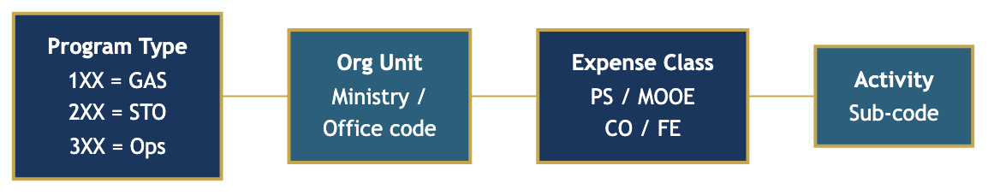

# Chapter 8: Designing Programs, Projects, and Activities

You have now completed the hardest conceptual work in the strategic planning process. Your Theory of Change (Chapter 7) makes explicit *how* your MOA believes change happens --- the causal pathways from activities to outputs to outcomes to impact. You have named the assumptions your theory depends on and the risks that could break each link.

This chapter turns that theory into a plan of action.

Programs, Projects, and Activities --- collectively called **PPAs** --- are the operational expression of your Theory of Change. Where the ToC says "if we deliver this output, then this short-term outcome will follow," the PPA Register says "here is the specific program, project, or activity that will deliver that output --- who owns it, when it begins and ends, how much it will cost, and what the annual target is."

This chapter is where strategy becomes operational. Without PPAs designed specifically to deliver your ToC outputs, your strategic objectives remain aspirations. Without ToC outputs tied back to PPAs, your PPAs become unaccountable activities that absorb budget without demonstrable connection to the goals your MOA has committed to.

Before you begin, keep two things in mind.

First, the PPA Register you produce in this chapter is a **planning instrument**, not a budget document. It captures what you intend to do and establishes the logical structure. The detailed costing, budget classification, and expenditure estimates are completed in Chapter 9 (Resource Planning). This chapter gives you the skeleton; Chapter 9 puts the numbers on the bones. Chapter 10 (Operational Planning and Annual Targets) takes the skeleton and builds the work plan.

Second, resist the temptation to copy last year's PPA list and call it done. Your ToC was built from your strategic direction and your understanding of how change happens. If you simply paste in the same programs and activities that ran last year, you are not designing for results --- you are repackaging compliance. Review your ToC outputs first. Then ask: what PPA is needed to deliver each output?

> *Open your MOA's current PPA list or last year's budget. How many of those PPAs were designed from a Theory of Change --- and how many were simply carried forward because "we have always done them"?*

---

## 8.1 Purpose

The purpose of this chapter is to help you translate your Theory of Change into concrete Programs, Projects, and Activities, each with a defined type, responsible unit, timeline, UACS code, and link to a ToC output.

Every PPA in your plan must answer four questions:

1. **What does it produce?** The output it is designed to deliver (traced to the ToC).
2. **Who owns it?** The responsible organizational unit.
3. **When does it run?** The start and end dates.
4. **How does it fit?** The UACS code that connects it to the national budget classification system.

A PPA that cannot answer all four questions is not ready to be included in a strategic plan. It belongs in a planning backlog --- a list of potential interventions to be developed further in the next planning cycle.

> *Pick any PPA currently in your MOA's plan. Can you answer all four questions --- what it produces, who owns it, when it runs, and its UACS code --- right now, without looking anything up? If not, that PPA is not ready.*

When this chapter is complete, you will have a PPA Register: a structured inventory of all the programs, projects, and activities your MOA plans to implement over the strategic planning period, with each PPA linked to one or more ToC outputs and assigned the attributes needed for budget preparation.

---

## 8.2 Key Concepts

### The PPA Hierarchy

PPAs are not equal in scope, duration, or function. Understanding the hierarchy prevents confusion during design and avoids the most common error: treating all planned work as if it belongs in the same category.

**Programs** are continuing, cross-cutting collections of related projects and activities that advance a strategic objective over multiple years. A program is not a one-time event --- it is an ongoing function of your MOA that will run for the entire planning period and likely beyond. Programs have:

- A recurring nature: they run year after year, with activities repeated within each implementation cycle.
- A cross-cutting function: they often serve multiple strategic objectives or deliver multiple types of outputs.
- A broad scope: a single program may contain several projects and many activities nested within it.
- An organizational home: typically a division or bureau that is accountable for program performance.

Programs correspond to three classifications under the national budget system. **General Administration and Support (GAS)** programs cover administrative and management functions that support the ministry's overall operations --- personnel management, financial management, records, procurement, and organizational development. **Support to Operations (STO)** programs provide technical support functions that enable the ministry's core work, such as planning, monitoring, legal services, and information systems. **Operations** programs are the core service delivery and regulatory functions that are the primary reason your MOA exists --- the programs your stakeholders see and feel.

**Projects** are time-bound interventions with a specific deliverable. Unlike programs, projects have a defined start and end. When the deliverable is produced --- a school building constructed, a management plan completed, a technology system deployed --- the project concludes. Projects have:

- A specific, deliverable output: you know the project is done when the output exists.
- A fixed duration: typically one to five years, rarely longer.
- A defined geographic scope: most projects target a specific area, population group, or institutional partner.
- An optional parent program: a project may sit inside a program (drawing on the program's continuing support functions) or stand alone as an independent intervention.

**Activities** are routine, recurring, operational work units. Activities are the building blocks of programs and projects --- the specific tasks your staff undertake, the trainings they deliver, the inspections they conduct, the reports they produce. An activity typically runs within a single fiscal year and repeats in subsequent years (with adjusted targets and costs). Activities have:

- A recurring or short-cycle nature: conducted monthly, quarterly, or annually.
- A direct relationship to a specific output: each activity produces something countable.
- A single responsible unit: the division or section that does the work.
- A cost structure: the personnel costs, maintenance and other operating expenses, and capital outlay associated with doing the work.

### The Flexible Hierarchy

Not every PPA needs all three levels. The hierarchy is flexible by design.

A standalone **activity** is valid. If your MOA conducts a recurring annual function --- a policy forum, a compliance audit cycle, a monitoring survey --- and it does not logically fit inside a program or project, register it as a standalone activity. A standalone activity must still link to a ToC output and carry a UACS code.

A standalone **project** is valid. If your MOA is implementing a time-bound, specific-deliverable intervention that is not part of a broader program framework --- a rehabilitation project funded by a development partner, a capital investment, a one-time study --- register it as a standalone project with its own foundation linkages.

A program **without projects** is valid. Some programs consist entirely of activities with no project-level interventions. A General Administration and Support program, for example, typically contains only activities (payroll processing, procurement management, HR development) without any projects nested beneath it.

A project **inside a program** is also valid. A large Operations program may contain several projects that implement specific capital investments or technical deliverables within the program's overall scope.

The rule is logical fit: choose the PPA type that most accurately describes the nature of the work and its relationship to other planned interventions.

> *Look at each item in your draft PPA list. Is it ongoing and cross-cutting (program), time-bound with a specific deliverable (project), or recurring operational work (activity)? If you are unsure, ask: does it have an end date? If yes, it is likely a project. If it repeats every year, it is likely an activity.*

### UACS: The Unified Accounts Code Structure

The Unified Accounts Code Structure (UACS) is the Philippine national government's standardized coding system for classifying all public expenditures. It was introduced by the Department of Budget and Management (DBM) to enable consistent reporting across all government agencies at all levels, and it is the coding system used in BARMM budget documents.[^1]

Every PPA in your strategic plan must carry a UACS code. This is not optional. The UACS code is what connects your strategic plan to your Annual Expenditure Program and, ultimately, to the Bangsamoro Annual Budget Act. Without UACS codes on your PPAs, your planning team will be unable to prepare budget requests properly, and BPDA reviewers will be unable to cross-reference your plan against your budget submission.

The UACS code structure has several components, but for planning purposes, the most important is the **program code** --- the standardized code that identifies the type of program (GAS, STO, or Operations) and the organizational unit responsible. Within each program code, projects and activities are assigned sub-codes that further classify the type of expenditure.

For example, a simplified UACS code for an Operations program activity might be structured as:



In practice, your Budget Officer and the BPDA budget review process will assist with the precise assignment of UACS codes. Your responsibility as a planning officer is to:

1. Know whether your PPA is GAS, STO, or Operations (this determines the first digits).
2. Know the organizational unit code for the division or bureau responsible.
3. Ensure that every PPA in your register carries a code before the document is submitted for budget review.

Do not leave UACS code fields blank with the intention of filling them in later. Blank UACS codes delay budget preparation and create tracking problems that persist throughout the fiscal year.

> *How many PPAs in your current register have blank UACS codes? For each one, have you coordinated with your Budget Officer to get the code assigned? If not, schedule that meeting before proceeding to Chapter 9.*

### Output-to-PPA Linkage

The ToC-to-PPA linkage is the most important discipline in this chapter. Every PPA must produce at least one output from your Theory of Change. And every ToC output must have at least one PPA delivering it.

The linkage has two directions:

- **Forward linkage:** When you design a PPA, you state which ToC output(s) it is designed to deliver. This justifies the PPA's existence in the strategic plan.
- **Backward coverage check:** After you have designed all your PPAs, you scan your ToC outputs and verify that each one is covered by at least one PPA. If a ToC output has no PPA, it will not be delivered --- meaning that a link in your causal chain is broken and your strategic objectives cannot be achieved.

A PPA with no ToC linkage is an orphan activity. Orphan activities are a warning sign: either the activity does not belong in a results-based strategic plan, or the ToC is incomplete and the output the activity produces has not been mapped.

> *Run the backward coverage check right now: scan your ToC outputs from Chapter 7. Can you name at least one PPA that will deliver each output? Mark any output that has no delivering PPA --- that is a broken link in your results chain.*

### The PPA Register vs. the Work Plan

The PPA Register (produced in this chapter) and the Annual Work Plan (produced in Chapter 10) are related but distinct documents.

The **PPA Register** is a multi-year inventory. It lists all PPAs over the entire strategic planning period (typically five years), identifies their type, links them to ToC outputs, assigns responsible units and UACS codes, and provides preliminary cost estimates. It answers: *What does our MOA plan to do over the next five years?*

The **Annual Work Plan** translates the multi-year PPA Register into a year-by-year operational schedule. It breaks each PPA into quarterly milestones, assigns personnel, specifies annual targets, and connects to the annual budget appropriation. It answers: *What will our MOA do this year, in what sequence, and by whom?*

Design the PPA Register first. The Work Plan depends on it.

---

## 8.3 Step-by-Step Instructions

### Step 1: Review Your Theory of Change Outputs

Before you design any PPAs, open your Theory of Change document and list all the outputs in your results chain. These are the outputs your MOA has committed to producing in order to advance its strategic objectives.

Group your outputs by the strategic objective they serve. This grouping will inform how you organize your programs in Steps 2 and 3.

For each output, ask: *What kind of intervention is needed to produce this output?* The answer will point you toward the appropriate PPA type:

- If the output is produced through recurring, ongoing work (annual training, routine inspections, regular monitoring) --- it likely belongs in a **program activity**.
- If the output is a one-time, specific deliverable (a management plan, a constructed facility, a deployed system) --- it likely belongs in a **project**.
- If the output is purely administrative or organizational support --- it belongs in a **GAS or STO program activity**.

> *For each ToC output, write down what type of intervention produces it. Are most of your outputs produced by recurring activities, one-time projects, or a mix? This pattern will shape the structure of your PPA Register.*

### Step 2: Group Related Activities into Logical Programs or Projects

Look at the outputs you have listed and ask: which of these are thematically and operationally related? Outputs that share a sector focus, target the same beneficiary group, or require the same team of staff are candidates for grouping into a single program.

Avoid creating too many programs. A strategic plan with fifteen programs and thirty projects will be impossible to manage effectively. Aim for three to six programs that reflect your MOA's major functional areas, with projects nested inside or standing alongside them.

The standard three-program structure (GAS, STO, Operations) works for most MOAs:

- **GAS Program:** All administrative support activities. One program, multiple activities.
- **STO Program:** Planning, monitoring, legal, information systems, public communications. One or two programs, primarily activities.
- **Operations Program(s):** Core mandate functions. One or more programs depending on the scale and diversity of the MOA's mandate. This is where most strategic work lives.

Some MOAs with diverse mandates may have two or three Operations programs aligned to distinct sectoral functions. This is acceptable, but each Operations program must link to at least one strategic objective.

> *How many programs are you planning? If the answer is more than six, you are likely creating management complexity that your MOA cannot sustain. Can you consolidate any of them without losing strategic focus?*

### Step 3: Determine PPA Type for Each Grouping

For each cluster of related work you identified in Step 2, determine the PPA type:

- If it is ongoing, cross-cutting, and multi-year: **Program**
- If it is time-bound with a specific deliverable: **Project** (inside or outside a program)
- If it is recurring operational work that does not warrant its own project structure: **Activity** (under a program, under a project, or standalone)

Document your determination and the reasoning. If you cannot articulate why a grouping is a program rather than a project (or vice versa), reconsider the categorization before proceeding.

> *For each PPA you have classified, ask: "Why is this a program and not a project?" or "Why is this a project and not an activity?" If you cannot articulate the distinction in one sentence, the classification may be wrong.*

### Step 4: Define PPA Attributes

For each PPA, define the following:

**PPA Code.** A sequential identifier unique within your plan. Use a consistent format: for example, P-01 for the first program, PR-01 for the first project, A-01 for the first standalone activity. Activities nested under a program or project can use a hierarchical code (P-01-A-01 for the first activity under Program 1).

**PPA Name.** Clear, specific, and descriptive. A reader who knows nothing about your MOA should understand what the PPA does from the name alone. Avoid bureaucratic abbreviations. "Environmental Monitoring and Assessment Program" is better than "EnvMon Prog."

**PPA Type.** Program (P), Project (Pr), or Activity (A).

**Description.** A two-to-four sentence explanation of what the PPA does, why it exists, and who it serves. This is not a budget justification --- it is a plain-language explanation for a non-specialist reader.

**Objective.** The strategic objective this PPA directly supports. Reference the strategic objective code from Chapter 6 (for example, SO-2: "Protect and rehabilitate critical watersheds and forest ecosystems").

**Expected Output(s).** The specific outputs from your ToC that this PPA is designed to deliver. Reference the output codes from your ToC worksheet.

**Responsible Unit.** The specific division, bureau, or office within your MOA that owns implementation. Avoid writing "Ministry of [Name]" --- specify the unit that actually does the work. If multiple units share responsibility, identify the lead unit.

> *For each PPA, have you named a specific division or section --- not just "the Ministry" or "the Office"? If no single unit is willing to be accountable for delivery, the PPA may be too broadly designed or there is an organizational gap.*

**Timeline.** Start month/year and end month/year. For ongoing programs with no defined end, write the start date and "Continuing." For activities, specify the implementation quarter within each fiscal year.

**UACS Code.** The national budget classification code. Enter "To be assigned by Budget Officer" if not yet determined, but flag it for resolution before budget submission.

**Estimated Cost (PhP).** A preliminary total cost for the PPA over the planning period, broken down by fiscal year if possible. Detailed costing is done in Chapter 9 --- this is an order-of-magnitude estimate for planning purposes.

**Annual Target.** The measurable output quantity your MOA commits to delivering each year. For a training activity: "9 officers trained per province per year." For a project: "Management plan drafted (Year 1), approved (Year 2), disseminated (Year 3)."

### Step 5: Link Each PPA to Its Theory of Change Output(s)

For each PPA, enter the ToC output code(s) it is designed to deliver. More than one PPA can deliver the same output (if multiple teams contribute to it). One PPA can deliver multiple outputs (if it is a broad program with diverse activities).

Record these linkages in the ToC-to-PPA Linkage Table (Section 8.4 shows an example). The linkage table is a quick verification tool: if every row has at least one PPA in the "Delivering PPA" column, your coverage is complete.

### Step 6: Verify Coverage --- No Orphan Outputs

Scan your ToC outputs. For each output, confirm that at least one PPA is linked to it. An output with no linked PPA means that result will not be produced --- and your causal chain is broken at that link.

If you find uncovered outputs:
- Either design a new PPA to deliver the output, or
- Revise your ToC to remove the output (if you have determined that your MOA will not actually deliver it in this planning cycle --- and update your causal logic accordingly).

Do not carry uncovered outputs in your ToC. They are false promises: you have told your stakeholders that you will produce a result, but you have designed no intervention to produce it.

> *Did you find any uncovered ToC outputs? If so, is the gap because your MOA genuinely cannot deliver that output this cycle (remove it from the ToC), or because you forgot to design a PPA for it (design one now)?*

### Step 7: Verify Coverage --- No Orphan PPAs

Scan your PPA Register. For each PPA, confirm that it links to at least one ToC output.

A PPA with no ToC linkage is an orphan activity. Ask:
- If this PPA produces a real output, is that output missing from your ToC? (Add it to the ToC.)
- If this PPA does not produce any output from the ToC, does it belong in the strategic plan? (Consider removing it or deferring to a future planning cycle.)

General Administration and Support activities are an exception: not all GAS activities produce externally-visible outputs in the ToC. However, they support the organizational capacity that enables all other PPAs. Record them in the PPA Register with a note indicating they are organizational support activities that enable the achievement of ToC outputs rather than producing specific ToC outputs directly.

### Step 8: Estimate Preliminary Costs

For each PPA, enter a preliminary cost estimate. At this stage, you do not need line-item precision --- that is Chapter 9's work. You need an order-of-magnitude figure that allows planners and decision-makers to assess whether the PPA portfolio is realistic given your MOA's expected budget envelope.

Use three categories:
- **Personnel Services (PS):** Salaries and benefits of staff assigned to this PPA.
- **Maintenance and Other Operating Expenses (MOOE):** Travel, training costs, supplies, contracted services, utilities, communications.
- **Capital Outlay (CO):** Infrastructure, equipment, vehicles, technology systems with useful life exceeding one year.

The total of PS + MOOE + CO is your preliminary estimated cost. The proportion will vary by PPA type: programs are PS-heavy, projects often have significant CO components, activities are primarily MOOE.

> *Add up all your preliminary cost estimates. Is the total within a reasonable range of your MOA's expected budget over the planning period? If it is two or three times your likely allocation, you need to prioritize now --- before investing further effort in detailed costing.*

### Step 9: Complete the PPA Register

Enter all PPAs into the PPA Register template in Section 8.7. Review the completed register for:

- Every row has a PPA Code, Name, Type, Responsible Unit, Timeline, and UACS code (or flag for assignment).
- Every row has at least one ToC Output Link.
- Every ToC output is covered by at least one row.
- Estimated costs are entered, even if approximate.
- Annual targets are specific and measurable.

The completed register is a submission-ready planning document. It is also the foundation document for Chapters 9 and 10.

---

## 8.4 Worked Example: Office for Other Bangsamoro Communities (OOBC)

Continuing the OOBC example from previous chapters, this section demonstrates how ToC outputs translate into PPAs.

Recall from Chapter 7 that OOBC's Theory of Change identified the following outputs for its three strategic objectives (SO-1: comprehensive OBC community database; SO-2: formalized coordination agreements; SO-3: increased OBC access to BARMM services):

- Output 1.1: Community profiling database / PSRRS (People and Stakeholder Registry and Referral System) operational
- Output 1.2: Community profiling instruments developed and deployed
- Output 1.3: Staff trained in key competencies (data management, coordination, advocacy)
- Output 2.1: MOUs/MOAs formalized with target LGUs in covered provinces
- Output 2.2: Coordination protocols established with partner NGAs and BARMM ministries
- Output 3.1: Advocacy materials produced and disseminated
- Output 3.2: FGDs and community consultations conducted (legal framework, OBC requests, support for vulnerable sectors)

OOBC also has standard GAS outputs (organizational management functions) and STO outputs (planning, monitoring, and communications).

### Grouping ToC Outputs into PPAs

OOBC's planning team reviews the outputs and identifies three natural groupings for the Operations program:

1. **OBC Community Profiling and Data Management Program** --- community profiling, database management, instrument development, and data-gathering activities. These are recurring functions that will run throughout the planning period as the office expands coverage to additional provinces and updates existing profiles.

2. **PSRRS Development Project** --- designing, building, and deploying the People and Stakeholder Registry and Referral System. This is a time-bound capital and technical investment with a specific deliverable (an operational database system) and a fixed timeline.

3. **Coordination and Advocacy Activities** --- recurring coordination meetings with LGUs, NGAs, and BARMM ministries; advocacy campaigns; FGDs and consultations with OBC communities. These are ongoing activities nested under the Operations program.

This grouping suggests the following PPA structure:

```
PROGRAM: General Administration and Support (GAS)
  Activity: Administrative and Financial Management
  Activity: Human Resource Management and Development
  Activity: Records, Procurement, and Property Management

PROGRAM: Support to Operations (STO)
  Activity: Strategic Planning and Performance Monitoring
  Activity: Legal and Regulatory Affairs
  Activity: Communications and Public Affairs

PROGRAM: OBC Community Profiling and Data Management (Operations)
  Project: PSRRS Development Project
    Activity: System Requirements Analysis and Design
    Activity: System Development, Testing, and Deployment
  Activity: Community Profiling and Assessment
  Activity: Quarterly Coordination Meetings with LGUs
  Activity: Advocacy and Information Campaigns
  Activity: FGDs and Community Consultations
```

### ToC-to-PPA Linkage Table (Selected Outputs)

<table>
<colgroup><col style="width:12%"><col style="width:30%"><col style="width:40%"><col style="width:18%"></colgroup>
<thead><tr><th>ToC Output Code</th><th>Output Description</th><th>Delivering PPA(s)</th><th>PPA Code</th></tr></thead>
<tbody>
<tr><td>Output 1.1</td><td>PSRRS community database operational</td><td>PSRRS Development Project</td><td>P-03-PR-01</td></tr>
<tr><td>Output 1.2</td><td>Community profiling instruments developed and deployed</td><td>Community Profiling and Assessment Activity</td><td>P-03-A-01</td></tr>
<tr><td>Output 1.3</td><td>Staff trained in key competencies</td><td>Administrative and Financial Management (GAS); Community Profiling Activity</td><td>P-01-A-02; P-03-A-01</td></tr>
<tr><td>Output 2.1</td><td>MOUs/MOAs formalized with target LGUs</td><td>Quarterly Coordination Meetings with LGUs Activity</td><td>P-03-A-02</td></tr>
<tr><td>Output 2.2</td><td>Coordination protocols with NGAs and ministries established</td><td>Quarterly Coordination Meetings with LGUs Activity</td><td>P-03-A-02</td></tr>
<tr><td>Output 3.1</td><td>Advocacy materials produced and disseminated</td><td>Advocacy and Information Campaigns Activity</td><td>P-03-A-03</td></tr>
<tr><td>Output 3.2</td><td>FGDs and consultations conducted</td><td>FGDs and Community Consultations Activity</td><td>P-03-A-04</td></tr>
</tbody>
</table>

### UACS Code Assignment (Selected PPAs)

<table>
<colgroup><col style="width:25%"><col style="width:15%"><col style="width:35%"><col style="width:25%"></colgroup>
<thead><tr><th>PPA</th><th>PPA Type</th><th>UACS Program Classification</th><th>Illustrative UACS Code</th></tr></thead>
<tbody>
<tr><td>GAS Program</td><td>Program</td><td>General Administration and Support</td><td>100-00-0-00</td></tr>
<tr><td>Administrative and Financial Management</td><td>Activity (GAS)</td><td>General Administration and Support</td><td>100-01-0-01</td></tr>
<tr><td>OBC Community Profiling and Data Management Program</td><td>Program</td><td>Operations</td><td>310-00-0-00</td></tr>
<tr><td>PSRRS Development Project</td><td>Project (Operations)</td><td>Operations — Capital Outlay</td><td>310-01-3-01</td></tr>
<tr><td>Community Profiling and Assessment</td><td>Activity (Operations)</td><td>Operations — MOOE</td><td>310-01-2-01</td></tr>
<tr><td>Quarterly Coordination Meetings with LGUs</td><td>Activity (Operations)</td><td>Operations — MOOE</td><td>310-02-2-01</td></tr>
</tbody>
</table>

*Note: UACS codes above are illustrative. Actual codes are assigned by the Budget Officer in coordination with BPDA. The structure follows DBM's UACS guidelines for the national government. BARMM offices apply the same classification principles in the BARMM budget process.*

### Partially Filled PPA Register (OOBC)

The table below shows four PPAs from OOBC's PPA Register in the format of the template in Section 8.7. Given OOBC's size (~25 staff), the register reflects a focused portfolio appropriate for a small office with nationwide field responsibilities.

<table>
<colgroup><col style="width:7%"><col style="width:10%"><col style="width:5%"><col style="width:18%"><col style="width:8%"><col style="width:10%"><col style="width:5%"><col style="width:5%"><col style="width:7%"><col style="width:7%"><col style="width:9%"><col style="width:9%"></colgroup>
<thead><tr><th>PPA Code</th><th>PPA Name</th><th>Type</th><th>Description</th><th>ToC Output Link</th><th>Responsible Unit</th><th>Start</th><th>End</th><th>UACS Code</th><th>Est. Cost (PhP)</th><th>Expected Output</th><th>Annual Target</th></tr></thead>
<tbody>
<tr><td>P-03-PR-01</td><td>PSRRS Development Project</td><td>Project (Pr)</td><td>Design, develop, test, and deploy the People and Stakeholder Registry and Referral System — a community database platform that profiles OBC communities across target provinces and tracks service referrals to BARMM ministries and NGAs.</td><td>Output 1.1</td><td>Planning and Information Management Unit</td><td>Q1 Year 1</td><td>Q4 Year 2</td><td>310-01-3-01</td><td>PhP 3.8M</td><td>PSRRS fully operational and populated with OBC community data</td><td>Y1: System designed and developed; piloted in 2 provinces. Y2: System deployed office-wide; data from all target provinces integrated</td></tr>
<tr><td>P-03-A-01</td><td>Community Profiling and Assessment</td><td>Activity (A)</td><td>Conduct field-based community profiling activities using standardized instruments to document OBC communities' demographic profiles, access gaps, priority needs, and referral requirements. Includes deployment of trained staff to Davao, Sultan Kudarat, Pagadian, and other field areas.</td><td>Output 1.2; Output 1.3</td><td>Field Operations Unit</td><td>Q1 Year 1</td><td>Continuing</td><td>310-01-2-01</td><td>PhP 2.4M (Year 1)</td><td>OBC communities profiled in target provinces; profiling instruments validated and deployed</td><td>Y1: Profiling instruments developed; 30% of target communities profiled. Y2: 70% of target communities profiled; database fully updated</td></tr>
<tr><td>P-03-A-02</td><td>Quarterly Coordination Meetings with LGUs</td><td>Activity (A)</td><td>Convene quarterly coordination meetings with LGUs in OOBC's coverage areas to advance MOU/MOA formalization, resolve service delivery referral issues, and establish joint coordination protocols with provincial and municipal governments.</td><td>Output 2.1; Output 2.2</td><td>Coordination and Partnerships Unit</td><td>Q1 Year 1</td><td>Continuing</td><td>310-02-2-01</td><td>PhP 1.2M (Year 1)</td><td>MOUs/MOAs formalized with target LGUs; coordination protocols established</td><td>Y1: 4 quarterly meetings conducted; at least 6 LGU MOAs signed. Y2: 4 quarterly meetings; remaining target LGU MOAs completed; protocols operational</td></tr>
<tr><td>P-03-A-03</td><td>Advocacy and Information Campaigns</td><td>Activity (A)</td><td>Develop and disseminate advocacy materials about OBC rights, BARMM services, and the legal framework under the BOL. Conduct information campaigns in coordination with BARMM ministries and partner NGOs to raise awareness among OBC communities outside the BARMM core territory.</td><td>Output 3.1</td><td>Communications and Advocacy Unit</td><td>Q1 Year 1</td><td>Continuing</td><td>310-03-2-01</td><td>PhP 800,000 (Year 1)</td><td>Advocacy materials produced and distributed; information campaigns conducted</td><td>Y1: Materials package produced; campaigns in 3 regions. Y2: Updated materials; campaigns expanded to additional provinces</td></tr>
</tbody>
</table>

---

## 8.5 For Decision-Makers

If you are the Executive Director or a member of OOBC's leadership reviewing this PPA Register, your task is not to rewrite it. Your task is to assess whether the portfolio merits the resource commitment it represents and whether approving it commits your organization to a realistic and strategically coherent course of action.

Apply three tests:

**Strategic Fit.** For each PPA, ask: does this PPA serve one of our strategic objectives? If you cannot quickly trace a PPA to a strategic objective and a ToC output, the PPA does not belong in the strategic plan --- regardless of how long it has been funded. A PPA that exists only because "we have always done it" is a legacy activity, not a strategic intervention. This is your opportunity to retire it or redesign it for relevance.

**Feasibility.** For each PPA, ask: can our MOA actually deliver this? Assess the responsible unit's existing capacity, staffing, and track record. A project that requires skills your staff do not have, in a location your logistics cannot reach, within a timeline that does not allow for procurement lead times, is not feasible even if it is strategically justified. Approval of an infeasible PPA wastes resources and produces failure reports, not outputs.

**Portfolio Balance.** Review the PPA Register as a whole. Ask: are we spreading ourselves too thin? A portfolio with twenty-five projects, each underfunded and understaffed, will produce twenty-five incomplete interventions. A portfolio of eight well-designed, adequately funded PPAs will produce eight completed outputs that advance your strategic objectives. Concentration is a virtue in strategic planning.

Also ask: are we balancing short-term deliverables with long-term investments? A PPA Register heavy with activities and light on projects may mean your MOA is operational but not building the institutional systems and infrastructure its mandate requires. A Register heavy with projects and light on recurring activities may mean you are building things that no one will maintain.

Decision-makers sign off on PPA Registers. That signature is a resource commitment. Review accordingly.

---

## 8.6 Common Pitfalls

**Orphan activities.** A PPA with no link to any ToC output is an orphan. It has no strategic justification in a results-based plan. Before finalizing the PPA Register, run the coverage check: every PPA should link to at least one ToC output. If a PPA cannot be linked, either the ToC is incomplete or the PPA does not belong.

**Mixing hierarchy levels without clarity.** The most common error is listing a program, a project, and a standalone activity side-by-side without distinguishing their relationships. Clarity on hierarchy is essential for budget preparation: the Budget Officer needs to know which activities sit inside which programs, and which projects are standalone. Use the PPA Code convention consistently to signal parent-child relationships.

**Ignoring UACS codes.** Planning officers sometimes defer UACS code assignment with the intention of handling it during budget preparation. This is a mistake. UACS codes determine how your PPA is classified in the budget, and the classification has downstream effects on expenditure reporting, audit, and performance monitoring. Assign codes during PPA design, in coordination with your Budget Officer, while the logic is still fresh. Codes assigned after the fact often generate classification errors that take months to correct.

**Overloading the register.** Every PPA you add to the register is a commitment of staff time, management attention, and budget. A PPA Register with forty line items for a ministry of 150 staff is not ambitious --- it is a guarantee of non-completion. Be ruthless: if a PPA is not essential to achieving a ToC output this planning cycle, defer it. A realistic PPA Register is more useful than an aspirational one.

**Copying last year's PPAs.** The previous year's PPAs were designed for the previous year's objectives. Your new strategic plan may have different priorities, different targets, or a different Theory of Change. Start from your ToC outputs and design PPAs to deliver them. Then check whether any of last year's PPAs remain appropriate. This is a forward-looking exercise, not a copy-paste exercise.

**PPAs with no clear responsible unit.** A PPA that lists the office as a whole as its responsible unit is not accountable. Accountability requires a specific division or unit --- a named section with a chief or coordinator who will be held responsible for delivery. If no unit can be identified as responsible, the PPA is either misdesigned (too broad) or there is an organizational gap that must be addressed before the PPA can be implemented.

**Confusing annual targets with planning period targets.** Your PPA Register should distinguish between the total target over the planning period and the annual targets for each year. Listing "45 officers trained" without specifying how many per year creates ambiguity in annual budgeting and monitoring. Specify annual targets for each PPA in every year it operates.

---

## 8.7 Template: PPA Register

Use the table below as the standard format for your MOA's PPA Register. Complete one row per PPA. PPAs should be grouped by program: list all activities under Program 1 before moving to Program 2. Standalone projects and activities are listed at the end.

The four rows in italics are from the OOBC example. Replace them with your MOA's PPAs.

<table>
<colgroup><col style="width:7%"><col style="width:10%"><col style="width:5%"><col style="width:18%"><col style="width:8%"><col style="width:10%"><col style="width:5%"><col style="width:5%"><col style="width:7%"><col style="width:7%"><col style="width:9%"><col style="width:9%"></colgroup>
<thead><tr><th>PPA Code</th><th>PPA Name</th><th>Type (P/Pr/A)</th><th>Description</th><th>ToC Output Link</th><th>Responsible Unit</th><th>Start</th><th>End</th><th>UACS Code</th><th>Est. Cost (PhP)</th><th>Expected Output</th><th>Annual Target</th></tr></thead>
<tbody>
<tr><td><em>P-03-PR-01</em></td><td><em>PSRRS Development Project</em></td><td><em>Pr</em></td><td><em>Design, develop, and deploy the People and Stakeholder Registry and Referral System for OBC community data management.</em></td><td><em>Output 1.1</em></td><td><em>Planning and Information Management Unit</em></td><td><em>Q1 Y1</em></td><td><em>Q4 Y2</em></td><td><em>310-01-3-01</em></td><td><em>PhP 3.8M</em></td><td><em>PSRRS fully operational</em></td><td><em>Y1: System developed; piloted in 2 provinces. Y2: Deployed office-wide</em></td></tr>
<tr><td><em>P-03-A-01</em></td><td><em>Community Profiling and Assessment</em></td><td><em>A</em></td><td><em>Field-based profiling of OBC communities using standardized instruments; deploys staff to all field areas.</em></td><td><em>Output 1.2; 1.3</em></td><td><em>Field Operations Unit</em></td><td><em>Q1 Y1</em></td><td><em>Continuing</em></td><td><em>310-01-2-01</em></td><td><em>PhP 2.4M (Y1)</em></td><td><em>OBC communities profiled; instruments validated</em></td><td><em>Y1: 30% of target communities profiled; Y2: 70% profiled</em></td></tr>
<tr><td><em>P-03-A-02</em></td><td><em>Quarterly Coordination Meetings with LGUs</em></td><td><em>A</em></td><td><em>Quarterly meetings with LGUs to advance MOU/MOA formalization and establish joint coordination protocols.</em></td><td><em>Output 2.1; 2.2</em></td><td><em>Coordination and Partnerships Unit</em></td><td><em>Q1 Y1</em></td><td><em>Continuing</em></td><td><em>310-02-2-01</em></td><td><em>PhP 1.2M (Y1)</em></td><td><em>MOUs/MOAs signed; coordination protocols established</em></td><td><em>Y1: 4 meetings; 6 LGU MOAs signed. Y2: 4 meetings; remaining MOAs completed</em></td></tr>
<tr><td><em>P-03-A-03</em></td><td><em>Advocacy and Information Campaigns</em></td><td><em>A</em></td><td><em>Development and dissemination of advocacy materials on OBC rights and BARMM services; information campaigns in field areas.</em></td><td><em>Output 3.1</em></td><td><em>Communications and Advocacy Unit</em></td><td><em>Q1 Y1</em></td><td><em>Continuing</em></td><td><em>310-03-2-01</em></td><td><em>PhP 800,000 (Y1)</em></td><td><em>Advocacy materials produced and disseminated; campaigns conducted</em></td><td><em>Y1: Materials produced; campaigns in 3 regions. Y2: Updated materials; expanded coverage</em></td></tr>
<tr><td></td><td></td><td></td><td></td><td></td><td></td><td></td><td></td><td></td><td></td><td></td><td></td></tr>
<tr><td></td><td></td><td></td><td></td><td></td><td></td><td></td><td></td><td></td><td></td><td></td><td></td></tr>
<tr><td></td><td></td><td></td><td></td><td></td><td></td><td></td><td></td><td></td><td></td><td></td><td></td></tr>
<tr><td></td><td></td><td></td><td></td><td></td><td></td><td></td><td></td><td></td><td></td><td></td><td></td></tr>
<tr><td></td><td></td><td></td><td></td><td></td><td></td><td></td><td></td><td></td><td></td><td></td><td></td></tr>
<tr><td></td><td></td><td></td><td></td><td></td><td></td><td></td><td></td><td></td><td></td><td></td><td></td></tr>
<tr><td></td><td></td><td></td><td></td><td></td><td></td><td></td><td></td><td></td><td></td><td></td><td></td></tr>
<tr><td></td><td></td><td></td><td></td><td></td><td></td><td></td><td></td><td></td><td></td><td></td><td></td></tr>
</tbody>
</table>

**Instructions for completing the register:**

- Group PPAs by program. List program header rows first, then nested projects and activities.
- Use consistent PPA Code conventions: P- for programs, PR- for projects, A- for activities. Indicate parent-child relationships in the code (P-01-PR-01 = first project under Program 1).
- In the ToC Output Link column, enter the ToC output code(s) from your Chapter 7 worksheet. If a PPA supports a GAS function with no direct ToC output, write "GAS Support — enables all ToC outputs."
- In the Type column, use: **P** for Program, **Pr** for Project, **A** for Activity.
- In the End column, write "Continuing" for ongoing programs and activities with no fixed end date.
- Estimated costs are preliminary. Chapter 9 will refine these into line-item budgets.

---

## 8.8 Quality Checklist

Before submitting your PPA Register as part of the strategic plan, verify each item:

- [ ] **Every ToC output is covered.** Run the backward coverage check: for each ToC output in your Chapter 7 worksheet, at least one PPA is linked to it in the ToC Output Link column.

- [ ] **No orphan PPAs.** Every PPA in the register links to at least one ToC output (or is documented as a GAS support function that enables ToC delivery).

- [ ] **PPA types are correctly assigned.** Programs are ongoing and cross-cutting; projects are time-bound with specific deliverables; activities are recurring operational work. Confirm that each PPA's assigned type matches its actual characteristics.

- [ ] **Responsible units are specific.** No PPA lists the MOA as a whole as its responsible unit. Each PPA identifies a named division, bureau, or office with accountability for delivery.

- [ ] **UACS codes are assigned or flagged.** Every PPA either has a UACS code or carries a note that the code is pending and who is responsible for assigning it before budget submission.

- [ ] **Annual targets are specific and measurable.** Annual targets use quantities and timeframes: "5 plans approved by Q4 Year 1," not "plans developed." They distinguish Year 1 targets from Year 2 targets and beyond.

- [ ] **Timelines are realistic.** Review start and end dates against your MOA's operational calendar, procurement lead times, and staff availability. A project that begins in Q1 but requires equipment that takes six months to procure cannot deliver output by Q3.

- [ ] **The portfolio is feasible in aggregate.** Add up the estimated costs for all PPAs. This total should be within a reasonable range of your MOA's expected budget allocation for the planning period. If the total is two or three times your likely budget, the register is aspirational, not operational --- prioritize and cut.

- [ ] **No last-year's PPAs carried forward without review.** Confirm that each PPA was deliberately included because it links to a ToC output in the current strategic plan --- not simply because it appeared in last year's budget.

- [ ] **GAS, STO, and Operations programs are all represented.** Your MOA needs administrative and support functions to operate. Confirm that the register includes GAS and STO program activities, not only Operations programs.

---

*You now have a PPA Register: a structured, linked inventory of all the programs, projects, and activities your MOA will implement to deliver the results your Theory of Change promises. The next chapter (Chapter 9: Resource Planning) takes this register and builds the cost estimates, budget classification, and resource framework that will support your Annual Expenditure Program and budget submission.*

---

[^1]: The Unified Accounts Code Structure (UACS) was established under DBM-COA-DOF Joint Circular No. 2013-1, dated October 18, 2013, to standardize public expenditure reporting across all government levels. BARMM ministries apply the same UACS coding framework in their budget documents as part of the interoperability requirements under Republic Act No. 11054 (Bangsamoro Organic Law) and the relevant BPDA budget circulars.
