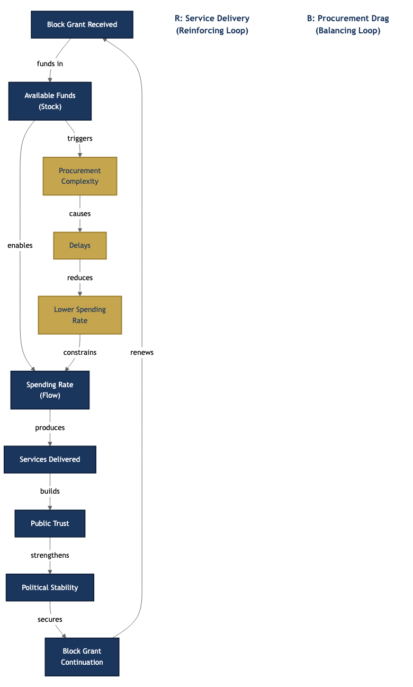
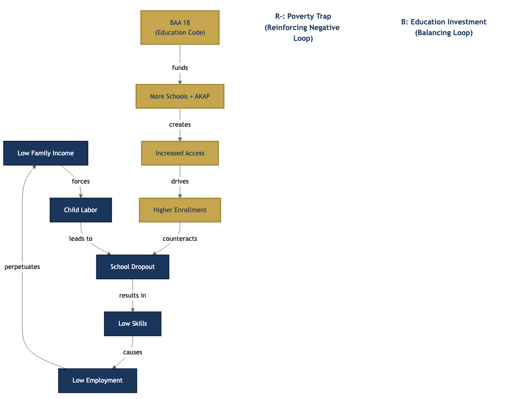
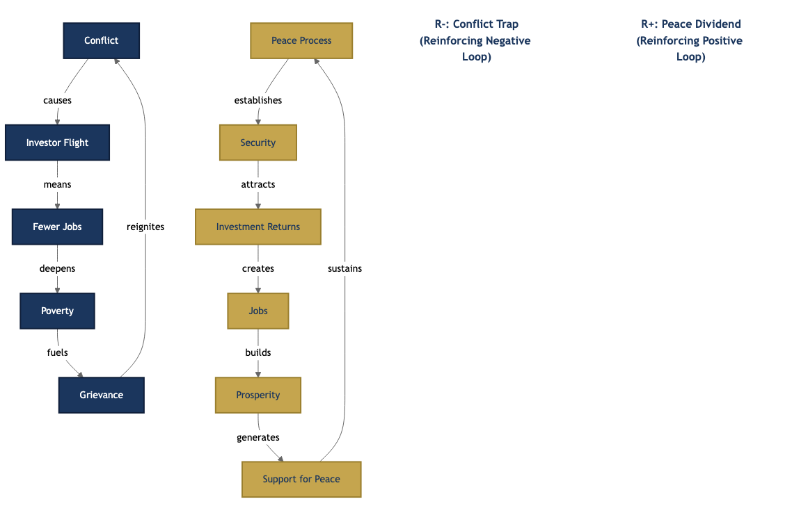

# Chapter 4 — Systems Mapping

---

You cannot change a system you cannot see. Every leader in BARMM carries a mental model of how the region works — but that model is incomplete, biased by experience, and rarely shared. Systems mapping makes the invisible visible. It puts your mental model on paper so others can challenge it, improve it, and act on it together.

The previous chapters gave you the language of systems thinking and the theories of change that explain how complex organizations transform. This chapter gives you the tools to apply those ideas. You will learn five mapping methods: causal loop diagrams, systems archetypes, stakeholder maps, incentives maps, and integrated systems maps. Each one reveals a different dimension of the system. Together, they give you a picture no single method can produce alone.

By the end of this chapter, you will be able to sit in a room with colleagues from different ministries, draw the system you are all trying to change, and have a conversation grounded in shared evidence rather than competing assumptions.

---

## 4.1 Why Map Systems?

### 4.1.1 The Problem with Mental Models

Every decision you make rests on a mental model. When you propose a budget increase for teacher training, you hold a model of how funding flows to classrooms, how training changes pedagogy, and how pedagogy affects learning outcomes. When you push for new health facilities, you carry assumptions about physician supply, patient behavior, and infrastructure adequacy. These models are invisible. You rarely write them down. You almost never share them with the people who must act on them.

Peter Senge defined mental models as "deeply ingrained assumptions, generalizations, or even pictures of how things work that influence how we understand the world and how we take action."[^1] The definition is precise. Mental models are not opinions. They are the hidden wiring behind your opinions. They determine what you notice, what you ignore, and what you believe is possible.

The problem is threefold. Your mental model is **invisible** — you act on it without examining it. It is **incomplete** — it captures only the variables you have personally encountered. And it is **different from your colleague's** — two people looking at the same problem from different positions will hold fundamentally different maps of how it works.[^2]

When a ministry director and a barangay captain map the same problem, their maps will differ. The director sees budget allocations, policy frameworks, and reporting lines. The captain sees clan dynamics, seasonal income patterns, and which government programs actually reach families. Neither map is wrong. But neither map is complete. The differences between them reveal where the real leverage lies.

### 4.1.2 Making Models Explicit

Mapping is the act of pulling your mental model out of your head and placing it where others can see it. Once on paper — or on a whiteboard, or in a facilitated group session — the model becomes **explicit**, **testable**, and **shareable**.[^3]

An explicit model can be challenged. When you draw an arrow from "teacher training" to "student outcomes," someone can ask: does training actually reach the right teachers? Do trained teachers stay in BARMM schools, or do they transfer to mainland positions? Are the curricula aligned with what the training delivers? Each question tests your model against reality.

A testable model can be improved. When data contradicts your arrow, you redraw it. When a new connection emerges that you missed, you add it. The model becomes a living document rather than a frozen assumption.

A shareable model creates alignment. When twenty people in a planning workshop all stare at the same systems map, they share a common picture. Disagreements surface immediately. Hidden assumptions become visible. The group can argue productively about which connections matter most, rather than talking past each other with incompatible mental models.[^4]

### 4.1.3 Shared Language Before Shared Maps

Before you can build a shared map, you need a shared vocabulary. Different stakeholders use the same words to mean different things. "Capacity building" means one thing to a human resource officer, another to a program manager, and something entirely different to a foreign development partner. "Good governance" means transparency and accountability to a CSO director. It means the 12 Pillars of Moral Governance to a BTA parliamentarian.[^5]

When operating across ministries, LGUs, and civil society organizations, misunderstanding is the default. Each actor brings their own professional heritage, their own institutional jargon, their own assumptions about what terms mean. Without understanding where people are coming from, conflict is inevitable — not over substance, but over words.[^6]

Take time at the beginning of any mapping exercise to define your terms. Write them on the wall. If two people mean different things by "poverty," say so explicitly. The mapping process itself will surface many of these definitional gaps. That is a feature, not a bug.

### 4.1.4 The Pirsig Principle

Robert Pirsig wrote in *Zen and the Art of Motorcycle Maintenance*: "If a factory is torn down but the rationality which produced it is left standing, then that rationality will simply produce another factory. If a revolution destroys a government, but the systematic patterns of thought that produced that government are left intact, then those patterns will repeat themselves."[^7]

This is the deepest reason for mapping. Changing behavior requires changing mental models. You cannot change mental models you cannot see. Mapping makes them visible. That is why, before any major reform in BARMM, the first step should always be the same: **map the system first.** Do not start with the solution. Start with the picture.

---

## 4.2 Causal Loop Diagrams

### 4.2.1 The Most Fundamental Tool

The **causal loop diagram** (CLD) is the most fundamental tool in systems mapping. It shows cause-and-effect relationships between variables in a visual format that reveals feedback loops — the circular chains of causation that drive system behavior over time.[^8]

CLDs were developed within the field of system dynamics, founded by Jay Forrester at MIT in the 1950s. Forrester originally built quantitative simulation models. But the qualitative diagrams — the CLDs — proved so useful for communication and shared understanding that they became tools in their own right. You do not need software or equations to build one. You need a whiteboard, sticky notes, and people who understand the problem.[^9]

### 4.2.2 Variables

A CLD starts with **variables** — named quantities that change over time. Good variable names are nouns or noun phrases, not verbs. They should be named in a positive direction — "public trust" rather than "distrust," "budget utilization" rather than "budget under-spending."[^10]

Examples of BARMM-relevant variables:

- **Poverty rate** — the percentage of families below the income threshold
- **Budget utilization** — the share of appropriated funds actually disbursed
- **Teacher quality** — a composite of qualifications, training, and retention
- **Public trust** — citizens' confidence in government institutions
- **Procurement complexity** — the number and difficulty of steps in government purchasing
- **Conflict intensity** — the frequency and severity of armed encounters and rido incidents

Each variable must be something that can increase or decrease. If it cannot change, it is a constant, not a variable.

### 4.2.3 Arrows and Polarity

**Arrows** represent causal links between variables. An arrow from A to B means "A influences B." Each arrow carries a **polarity** sign that tells you the direction of influence.[^11]

A **positive (+) link** means the two variables move in the same direction. When A goes up, B goes up (all else being equal). When A goes down, B goes down. Example: more investment in school construction (+) leads to more classroom capacity.

A **negative (-) link** means the variables move in opposite directions. When A goes up, B goes down. When A goes down, B goes up. Example: more procurement complexity (-) leads to less budget utilization.

The terms "positive" and "negative" carry no value judgment. A positive link between "conflict" and "displacement" is not a good thing. Positive only means same direction.[^12]

### 4.2.4 Reinforcing Loops

When a chain of causal links circles back to the starting variable and amplifies the original change, you have a **reinforcing loop** (labeled **R**). A reinforcing loop has either all positive links or an even number of negative links.[^13]

Reinforcing loops drive change — either growth spirals or death spirals. They are the engines of exponential increase and exponential decline.

**Growth example:** More economic investment (+) leads to more jobs (+) leads to higher family income (+) leads to better education outcomes (+) leads to a more skilled workforce (+) leads to more economic investment. This is a virtuous cycle. Each pass through the loop amplifies the last.

**Decline example:** More conflict (+) leads to more investor flight (+) leads to fewer jobs (+) leads to higher poverty (+) leads to more grievance (+) leads to more conflict. This is a vicious cycle. The same reinforcing structure, but spiraling downward.

The structure is identical. Whether the loop is virtuous or vicious depends on the direction of the initial push.[^14]

### 4.2.5 Balancing Loops

When a chain of causal links circles back and resists the original change, you have a **balancing loop** (labeled **B**). A balancing loop has an odd number of negative links.[^15]

Balancing loops create stability. They push the system toward equilibrium. They are the reason that many well-intentioned reforms produce frustratingly small results — the system absorbs the intervention and returns to its previous state.

**Example:** A thermostat. When room temperature drops below the desired setting, the gap increases (+), which triggers the heater (+), which raises the room temperature (+), which reduces the gap (-). The loop balances the system at the desired temperature.[^16]

Balancing loops explain why some systems seem "stuck." The balancing forces are not visible, but they are powerful.

### 4.2.6 Stocks and Flows

CLDs become more powerful when you add **stocks** and **flows**.

A **stock** is an accumulation — something that builds up or drains over time. Think of it as a bathtub. Money in the treasury, trained teachers in the workforce, hospital beds in a province, trust among citizens — these are all stocks. They change slowly.[^17]

A **flow** is the rate of change of a stock — the water entering or leaving the tub. Spending rate, graduation rate, hiring rate, attrition rate — these are flows. They change quickly.

The distinction matters because stocks create delays. You can turn on a faucet immediately, but filling the tub takes time. You can fund teacher training this quarter, but building a competent teaching workforce takes years. Policy interventions target flows. System outcomes depend on stocks.

### 4.2.7 Worked Example: The Budget Utilization Loop

Here is a BARMM causal loop diagram described in text. Imagine the following relationships drawn as arrows on a whiteboard:

**The reinforcing loop (R1 — Service Delivery Cycle):**

Block grant received (+) Available funds (stock) (+) Spending rate (flow) (+) Services delivered (+) Public trust (+) Political stability (+) Block grant continuation (+) Block grant received.

This loop says: when BARMM receives its block grant and spends it effectively on services, public trust grows, political stability strengthens, and the case for continued block grant funding is reinforced. Success breeds more success.[^18]

**The balancing loop (B1 — Procurement Drag):**

Available funds (+) Procurement complexity (+) Processing delays (+) Lower spending rate (-) Under-utilization (+) Funds reverted (+) Perceived absorption weakness (+) Reduced urgency for budget reforms (-) Procurement complexity.

This loop says: the more money is available, the more procurement transactions are required, the more delays accumulate, and the lower the spending rate falls. Under-utilization becomes the norm. And because everyone expects it, the pressure to reform procurement fades — reinforcing the very complexity that caused the problem.[^19]

**Why utilization stays at 67-72%.** The reinforcing loop (R1) pushes spending upward. The balancing loop (B1) pushes spending downward. The system reaches equilibrium around 67-72% — the point where the two forces cancel each other out. Budget utilization at 67.91% (FY2020) and 71.96% (FY2021) is not a failure of individual effort. It is a structural outcome of competing loops.[^20]

**The intervention question:** Do you push harder on R1 (allocate more money, demand higher utilization targets) or do you weaken B1 (simplify procurement, reduce processing layers, build procurement capacity at the LGU level)? The CLD tells you that pushing R1 alone will only temporarily raise utilization before B1 absorbs the change. Structural reform of procurement — weakening the balancing loop — is the higher-leverage intervention.

---

## 4.3 Systems Archetypes

### 4.3.1 Recurring Patterns

Systems archetypes are recurring patterns of behavior that appear across vastly different systems. They were first catalogued by Peter Senge in *The Fifth Discipline* and elaborated by Daniel Kim and Donella Meadows.[^21] Once you learn to recognize them, you start seeing them everywhere — in fisheries, in finance, in governance, in BARMM.

Each archetype has a characteristic structure, a predictable storyline, and a known set of high-leverage interventions. Learning archetypes is like learning chess openings. You do not need to analyze every position from scratch. You recognize the pattern and draw on established wisdom about what works.

Three archetypes are especially relevant to Bangsamoro governance.

### 4.3.2 Limits to Growth

**The pattern:** A reinforcing process drives growth. Early results are exciting. Everyone celebrates. But eventually, the growth engine hits a constraint — an invisible force that slows, stalls, or reverses progress. If you respond by pushing harder on the growth engine, you waste energy. The constraint, not the engine, now determines your trajectory.[^22]

**The generic structure:**

Effort (+) Performance (+) More effort. *This is the reinforcing loop — it works beautifully at first.*

But also: Performance (+) Limiting action (-) Performance. *This is the balancing loop — it activates as performance grows.*

A **constraint** feeds the limiting action. The constraint was always there. It just did not matter when performance was low.

**BARMM example: MSME growth hitting structural walls.**

Micro, small, and medium enterprise registrations in BARMM grew 161% between 2020 and 2021.[^23] That is the reinforcing loop working — government support programs, entrepreneurship training, and economic recovery from COVID drove registration growth. The numbers looked spectacular.

But growth will hit limits. Access to formal finance remains scarce. Infrastructure — roads, cold storage, port facilities — constrains logistics. Market access beyond the region is limited. And 213,196 hectares of contested lands (16% of BARMM territory) cannot be productively used for agriculture or industry.[^24]

If BARMM responds by pushing harder on the growth engine alone — more registration drives, more training programs, more entrepreneurship bootcamps — growth will stall. The MSMEs are registering, but they cannot scale. The constraint, not the engine, is the binding force.

**The intervention:** Identify and address the constraint. Expand microfinance access through the Al-Amanah Islamic Investment Bank. Resolve land tenure disputes through the Ministry of Indigenous Peoples' Affairs and the reconstituted Land Management Bureau. Build farm-to-market roads and port infrastructure. The archetype tells you: stop pushing the growth engine and start removing the brake.[^25]

### 4.3.3 Tragedy of the Commons

**The pattern:** Multiple actors share a common resource. Each acts rationally by taking more. Individually, each action makes sense. Collectively, they deplete the resource — and everyone suffers.[^26]

**The generic structure:**

Actor A's activity (+) A's gains (+) A's activity. *(R1)*
Actor B's activity (+) B's gains (+) B's activity. *(R2)*
A's activity (+) Total activity (+) Resource depletion (-) Gain per unit of activity (-) A's gains. *(B1)*
B's activity (+) Total activity (+) Resource depletion (-) Gain per unit of activity (-) B's gains. *(B2)*

The reinforcing loops (R1, R2) run fast — each actor sees immediate gains. The balancing loops (B1, B2) run slow — resource depletion takes time to become visible. By the time the constraint bites, the damage is done.

**BARMM example: Contested lands.**

BARMM has 213,196 hectares of contested lands — 16% of its total territory.[^27] Multiple claimants occupy the same space. CARP beneficiaries hold land reform certificates. Indigenous peoples assert ancestral domain claims. Private individuals present old titles. Government agencies claim public domain. Each claimant pursues their individual claim rationally. A farmer clears land because their CARP certificate says it is theirs. An IP community fences territory because their CADT covers it. A government office designates land for a project because public domain law permits it.

Individually, each action is defensible. Collectively, the land becomes ungovernable and unproductive. No one invests in improvements because no one is sure their claim will survive. Agricultural productivity on contested lands is a fraction of what it could be. Conflict over land feeds rido — clan feuding that has persisted for generations.[^28]

**The intervention:** Change the incentive structure. Create collective governance mechanisms — joint land management councils with representation from all claimant groups. Establish binding conflict resolution processes before claims escalate to violence. Develop shared stewardship agreements where multiple parties benefit from productive use rather than competing for exclusive control. The Tragedy of the Commons is never solved by individual restraint alone. It requires institutional redesign.[^29]

### 4.3.4 Success to the Successful

**The pattern:** Two activities or groups compete for the same limited resources. The one that performs better — or is perceived to perform better — receives more resources. This makes it more successful. The other receives less, making it less successful. The gap widens with each cycle. Small initial differences compound into vast inequalities.[^30]

**The generic structure:**

Resources to A (+) Success of A (+) Allocation to A instead of B. *(R1)*
Allocation to A instead of B (-) Resources to B (-) Success of B (-) Allocation to A instead of B. *(R2)*

**BARMM example: Mainland versus island provinces.**

Maguindanao del Norte, Maguindanao del Sur, and Lanao del Sur sit on the Mindanao mainland. They are connected to national road networks. They host the regional capital. They receive more infrastructure investment because projects are easier to implement — equipment can be trucked in, engineers can drive to sites, monitoring visits do not require a sea crossing.[^31]

The BaSulTa provinces — Basilan, Sulu, and Tawi-Tawi — are islands. Everything costs more. Construction materials must be shipped. Personnel must fly or take ferries. Security conditions in some areas add further costs and delays. Because projects are harder to implement, fewer projects are approved. Because fewer projects are approved, infrastructure remains poor. Because infrastructure is poor, the next round of projects gravitates toward the mainland, where success is more likely.

Success breeds more success. Neglect breeds more neglect. The gap between mainland and island provinces widens with each budget cycle — not because anyone intends inequity, but because the structure of resource allocation rewards past performance.[^32]

**The intervention:** Decouple resource allocation from ease of implementation. Explicitly weight investment toward underserved areas. Create an island development equalization fund within the block grant. Set minimum infrastructure spending floors for BaSulTa provinces. The archetype tells you: if you allocate resources based on where success is easiest, you will systematically starve the places that need resources most.[^33]

---

## 4.4 Stakeholder Mapping

### 4.4.1 Who Shapes the System?

Systems do not exist in the abstract. People create them, operate them, benefit from them, and suffer under them. **Stakeholder mapping** answers the questions that causal loop diagrams cannot: Who has power? Who has interest? Who has resources? Who has information? And who has no voice but will be most affected?[^34]

### 4.4.2 The Mapping Process

Follow five steps.

**Step 1: Define system boundaries.** Before you list stakeholders, decide what system you are mapping. "The Bangsamoro governance system" is too broad. "The land tenure dispute resolution system in Maguindanao del Sur" is precise enough to be useful. Boundaries should be wide enough to capture relevant actors and narrow enough to be manageable.[^35]

**Step 2: List all stakeholders.** Brainstorm every actor who influences or is influenced by the system. Include the obvious — ministries, LGUs, the BTA Parliament. Then push further. Who are the informal actors? Traditional leaders (sultans, datus). Religious leaders (ulama, ustadz). Civil society organizations. Development partners. Private sector actors. Diaspora communities. Armed groups. Media. Youth organizations. Women's groups. Do not stop at the first layer.

**Step 3: Assess influence dimensions.** For each stakeholder, ask four questions. What **power** do they hold — formal authority, budget control, information access, social capital? What **interest** do they have in the issue — will it affect them directly? What **resources** can they mobilize — money, people, expertise, networks? What **information** do they control — data, local knowledge, technical expertise?

**Step 4: Map flows between stakeholders.** Draw the relationships. Who gives resources to whom? Who reports to whom? Who influences whom informally? Who blocks whom? These flows reveal the real structure of decision-making, which often differs dramatically from the organizational chart.[^36]

**Step 5: Analyze from each actor's perspective.** Step into each stakeholder's shoes. What do they want? What do they fear? What would they gain from the proposed change? What would they lose? This empathetic analysis is where the real insights emerge.

### 4.4.3 Power Mapping

Not all stakeholders are equal. **Power mapping** identifies your **primary targets** — the decision-makers who can authorize the change you seek — and your **secondary targets** — the influencers who can move the decision-makers.[^37]

A ministry secretary is a primary target for a policy reform. But who influences the secretary? Perhaps a trusted bureau director. Perhaps a senior parliamentarian who chairs the relevant committee. Perhaps a development partner whose funding the ministry depends on. These secondary targets are often more accessible and more persuadable than the primary target.

Remember that power comes in multiple forms. **Formal authority** flows through the parliamentary system and the bureaucratic hierarchy. **Informal authority** flows through clan networks, traditional leadership structures, ulama councils, and peace process stakeholder groups. **Information power** belongs to those who control data, research, or media narratives. **Resource power** belongs to those who control budgets, land, or labor.[^38]

In BARMM, formal and informal power structures often run in parallel. A barangay captain holds formal authority over local governance. But the traditional datu or sultan may hold deeper legitimacy in the community. A minister controls budget allocations. But the political clan that supported their appointment may influence how those allocations flow. Mapping only formal power structures gives you half the picture.

### 4.4.4 Information Flows Shape Organizations

Pay attention to how information moves through the system. **Centralized communication** — where all information flows through a single node — produces hierarchical organizations. **Networked communication** — where information flows freely between many nodes — produces distributed organizations.[^39]

This principle has direct implications for reform design. If you want a ministry to become more responsive, changing the org chart is not enough. Change the information flows. Give field offices direct access to performance data. Let barangay-level service providers report outcomes directly, not just through provincial intermediaries. Create horizontal information channels between ministries that share the same beneficiaries.

### 4.4.5 BARMM Application

Before any legislative reform, map the stakeholders. Ask:

- **Who benefits** from the proposed change? Are they organized? Can they advocate for it?
- **Who loses?** Will they resist? How much power do they have to block the reform?
- **Who has veto power?** In a parliamentary system, committee chairs and the Chief Minister's office can stall legislation. Identify these chokepoints early.
- **Who has no voice but will be most affected?** Indigenous communities, women in conflict-affected areas, out-of-school youth, informal sector workers — these groups are often absent from the policy table but bear the largest consequences of policy decisions.[^40]

Map these actors before you draft the bill. Not after.

---

## 4.5 Incentives Mapping

### 4.5.1 Incentives Drive Behavior

Charlie Munger said: "Show me the incentive and I'll show you the outcome."[^41] This is the single most underappreciated principle in governance reform. If you do not understand the incentive structure, you do not understand the system. Full stop.

People respond to incentives. Not to speeches. Not to memos. Not to strategic plans. They respond to what gets rewarded and what gets punished. If the incentive structure rewards a behavior, that behavior will persist — regardless of what the policy manual says.

### 4.5.2 Positive and Negative Incentives

**Positive incentives** are rewards. Performance bonuses. Promotions. SEAL awards for exemplary governance. Budget allocations tied to utilization rates. Public recognition. Career advancement.[^42]

**Negative incentives** are sanctions. Audit findings from COA. Administrative charges. Budget disallowances. Public censure. Criminal liability for malversation.

Organizations use a combination of both to shape behavior. Environmental regulation, for example, uses negative incentives (bans on polluting activities) alongside positive incentives (subsidies for clean technology). Effective governance systems do the same — they make the right thing easy and rewarding, and the wrong thing difficult and costly.[^43]

### 4.5.3 Game Theory Framework

Game theory provides a rigorous way to analyze incentive structures. At its simplest, game theory asks: given the rules of the game, what strategy is rational for each player?[^44]

**Zero-sum games.** One player's gain is another's loss. The total value is fixed. These games produce pure competition. In a zero-sum game, cooperation makes no sense — anything I give you is something I lose.

*BARMM example:* If parliamentary seats are the only path to political power, and seats are fixed in number, then politics becomes zero-sum. My district's gain in representation is your district's loss. This structure incentivizes competition, not collaboration.[^45]

**Non-zero-sum games.** The total value can grow or shrink depending on whether players cooperate. In a non-zero-sum game, both sides can win — or both can lose.

*BARMM example:* Economic development is non-zero-sum. When Maguindanao's agricultural output grows, it creates supply chains that benefit Cotabato City's processing industry, which creates jobs that reduce poverty across the region. One province's success does not diminish another's.[^46]

**Cooperative versus non-cooperative games.** Does the system provide mechanisms for players to coordinate, communicate, and enforce agreements? Cooperative games have these mechanisms. Non-cooperative games do not.

Cooperation can emerge from three sources. First, from the structure of the game itself — when payoffs are positively correlated, self-interest and collective interest align naturally. Second, from institutional enforcement — when a third party (like a court or a regulatory body) punishes defection and rewards compliance. Third, from repeated interaction — when players expect to deal with each other repeatedly, they develop trust and reputation that makes cooperation rational.[^47]

### 4.5.4 BARMM Incentive Analysis

Apply the game theory lens to Bangsamoro governance. Ask: is the current incentive structure zero-sum or non-zero-sum?

| Domain | Incentive Dynamic | Game Type |
|--------|-------------------|-----------|
| Block grant allocation | Provinces compete for shares of a fixed amount | Zero-sum |
| Moral Governance framework | Rewards ethical behavior across all entities | Non-zero-sum aspiration |
| Parliamentary seat allocation | Districts compete for fixed representation | Zero-sum |
| Development outcomes | Reduced poverty, better health, and higher education benefit everyone | Non-zero-sum |
| Infrastructure project siting | Locations compete for limited construction budget | Zero-sum |
| Revenue generation | Growing local revenue expands the total pie for everyone | Non-zero-sum |

The pattern is revealing. Many of BARMM's core governance processes — budget allocation, seat distribution, project siting — are structured as zero-sum games. They incentivize competition between provinces, districts, and clans. Meanwhile, the outcomes everyone claims to care about — poverty reduction, health improvement, educational quality — are inherently non-zero-sum.[^48]

**The design question:** How do you restructure incentives to make BARMM governance more cooperative and less competitive? Consider performance-based block grant allocation that rewards collaboration between provinces on regional development targets. Consider joint infrastructure planning that ties budget release to inter-provincial coordination. Consider incentive bonuses for ministries that achieve cross-cutting outcomes jointly — not just their own KPIs.[^49]

Local revenue generation is instructive. BARMM currently generates less than 1% of its total revenue locally.[^50] This creates a dependency on the block grant that makes budget allocation feel zero-sum — there is only one pie, and everyone fights for a bigger slice. If BARMM grows its own revenue base, the pie expands. Budget discussions shift from "how do we divide what Manila gives us" to "how do we grow what we generate together." That is a structural shift from zero-sum to non-zero-sum governance.

---

## 4.6 BARMM Systems Maps: Worked Examples

### 4.6.1 Bringing the Tools Together

The previous sections gave you individual mapping tools. This section shows what happens when you use them together. Each worked example integrates causal loop diagrams, stakeholder analysis, incentives mapping, and archetype identification into a single systems picture.

These examples are described as text narratives. In practice, you would draw them on a whiteboard or produce visual diagrams. The value is not in the diagram itself — it is in the conversation that produces it.

### 4.6.2 Example 1: The Education-Poverty Feedback System

**The reinforcing loop (R1 — Poverty Trap):**

Low family income (+) children work instead of attending school (+) dropout rate (+) low skills (+) low employability (+) low income in the next generation (+) low family income.

This is a death spiral. Each generation reproduces the poverty of the last. BARMM's functional literacy rate of 71.6% and dropout rate of 8.36% are symptoms of this loop in action.[^51] The loop is self-sustaining. Without external intervention, it will run indefinitely.

**The balancing loop (B1 — Education Access Expansion):**

BAA No. 18 (Bangsamoro Education Code) (+) construction of new schools (+) AKAP scholarship program (+) increased access (+) higher enrollment (-) dropout rate.

This is the policy response. More schools, more scholarships, more access. It pushes back against the reinforcing loop. The question is whether B1 is strong enough to overcome R1.[^52]

**Stakeholders:** MBHTE (lead ministry for education), LGUs (school site provision and local support), parents (decision-makers about whether children attend school or work), teachers (service delivery), madaris (alternative education pathway for Muslim communities), TVET providers (skills training for out-of-school youth), employers (demand side of the skills equation).

**Incentives analysis:**
- Teachers are paid regardless of student outcomes. This is a misaligned incentive. It rewards attendance at work, not effectiveness in the classroom.
- The AKAP program provides scholarships tied to enrollment. This is an aligned incentive — it directly addresses the financial barrier that keeps children out of school.
- Parents face a painful trade-off: a child in school today means lost income today, in exchange for uncertain returns years from now. The discount rate for impoverished families is very high. Future benefits are heavily discounted against present needs.[^53]

**Where to intervene:** Building more classrooms addresses a parameter — the number of available seats. It is a low-leverage intervention if the real constraint is that families cannot afford to send their children. The higher-leverage interventions target structure: conditional cash transfers that replace the income lost when a child attends school instead of working; teacher quality improvements that make schooling more valuable; and livelihood programs that raise family income enough to make the education investment rational.[^54]

### 4.6.3 Example 2: The Governance Trust Cycle

**Reinforcing loop (R1 — Virtuous Cycle):**

Effective governance (+) service delivery quality (+) public trust (+) political support (+) resource allocation (+) institutional investment (+) staff quality (+) effective governance.

When this loop dominates, government works. Services improve. Citizens notice. Trust grows. Political leaders gain legitimacy and resources. They invest in building institutional capacity. Better staff deliver better services. The wheel turns upward.[^55]

**Reinforcing loop (R2 — Vicious Cycle):**

Weak institutional capacity (+) poor service delivery (+) public distrust (+) political instability (+) brain drain (+) weaker institutional capacity.

When this loop dominates, government deteriorates. Services fail. Citizens lose faith. Talented people leave for better opportunities in Manila, Davao, or abroad. The institutions they left behind grow weaker. The wheel turns downward.[^56]

**The tipping point.** Both loops operate simultaneously in BARMM today. Some ministries and LGUs are in the virtuous cycle — they deliver visible services, enjoy community support, attract competent staff, and improve year over year. Others are trapped in the vicious cycle — understaffed, underperforming, distrusted, losing their best people to attrition.

Which loop dominates depends on whether the system crosses a tipping point. The tipping point is the moment when enough institutional capacity accumulates that the virtuous cycle becomes self-sustaining. Below the tipping point, every gain is fragile — one leadership change, one budget disruption, one political crisis can push a ministry back into the vicious cycle.[^57]

**Stakeholders:** BTA Parliament (legislative framework), the 16 MOAs (service delivery), LGUs across 116 municipalities and 2,590 barangays (frontline governance), civil servants (institutional capacity), citizens (ultimate beneficiaries and judges of performance), CSOs (accountability monitors), development partners (technical assistance and funding).[^58]

**Current state:** BARMM's poverty reduction from 54.20% (2018) to 29.80% (2021) suggests that R1 is gaining strength.[^59] But the physician-to-population ratio of 1:51,187 and the coverage of only 117 barangay health stations for 2,590 barangays suggest that R2 still dominates in health service delivery.[^60] The system is not uniformly in either cycle. It is a patchwork.

**The intervention:** Do not try to push all ministries toward the virtuous cycle simultaneously. Identify the ministries and LGUs closest to the tipping point. Concentrate capacity-building resources there. Create demonstration effects — visible proof that the virtuous cycle works. Then expand outward. This is the strategy of building islands of excellence and connecting them into an archipelago of good governance.

### 4.6.4 Example 3: The Investment-Conflict Nexus

**Reinforcing loop (R1 — Conflict Trap):**

Conflict (+) investor flight (+) fewer jobs (+) higher poverty (+) grievance (+) recruitment into armed groups (+) conflict.

This is the most destructive loop in the Bangsamoro system. It has run for decades. Each cycle strips another layer of economic potential from the region. BARMM contributes just 1.4% of national GDP despite holding significant agricultural, fishery, and mineral resources.[^61] The economic underperformance is not an accident. It is the predictable output of a system where conflict destroys the conditions for investment, and the absence of investment creates the conditions for conflict.

**The balancing loop (B1 — Peace and Investment):**

Peace process (+) security improvement (-) conflict (-) investor confidence (+) investment (+) jobs (+) income (-) grievance (-) recruitment (-) conflict.

The BOL and the Bangsamoro Transition Authority represent a massive intervention in this system. They are designed to break the conflict trap by providing a credible governance framework that restores investor confidence. The creation of BEZA (Bangsamoro Economic Zone Authority) is a specific mechanism to attract investment by de-risking the business environment.[^62]

**Why no single ministry can break this loop.** Trace the variables: security (MILF normalization, Philippine military, MNLF integration), investment (MED, BEZA, BOI), jobs (MOLE, TVET, MAFAR), income (local economies), grievance (justice system, land disputes, MIPA), conflict (armed groups, rido, political violence). The causal chain crosses at least six institutional domains. No single ministry controls enough variables to break the loop alone.[^63]

**The intervention:** Simultaneous action on multiple variables. The peace process must reduce conflict. BEZA and investment promotion must attract capital. Skills training and livelihood programs must create employable workers. Justice reform and land dispute resolution must address grievance. None of these alone is sufficient. All of them together can shift the system.

This is why **cross-system collaboration** — the subject of Chapter 7 — is not optional. It is a structural requirement imposed by the system itself. The causal loop diagram makes this visible. Without the diagram, each ministry can argue that its piece of the puzzle is the most important. With the diagram, everyone can see that their piece is necessary but not sufficient.[^64]

---

## 4.7 From Maps to Action

These maps are not the territory. They are tools for thinking. The value is not in the diagram — it is in the conversation that produces it.

When leaders from different sectors sit together and map a system, they see connections they never saw alone. A health official sees how education dropout rates feed into early pregnancy rates, which feed into maternal mortality — and suddenly MBHTE's work becomes relevant to MOH's mandate. A finance officer sees how procurement complexity drives under-utilization, which drives fund reversion, which drives the perception that BARMM cannot absorb its budget — and suddenly procurement reform becomes a political priority, not just an administrative detail.

That shared understanding is the foundation for everything that follows. Chapter 5 will show you how to use these maps to envision the future the Bangsamoro wants to build. Chapter 6 will show you how to develop strategies that target the leverage points your maps reveal. And Chapter 7 will show you how to build the cross-system collaborations that the maps demand.

But it starts here. With a whiteboard. With sticky notes. With the willingness to draw your mental model, put it on the wall, and let others challenge it.

Map the system. Then change it.

---

## Footnotes

[^1]: Peter Senge, *The Fifth Discipline: The Art and Practice of the Learning Organization* (New York: Currency Doubleday, 1990), 8.

[^2]: The Sustainability Laboratory, *Systems Thinking and Systems Modelling* (Systems Innovation, n.d.), Module 2, Section 2.1.

[^3]: The Sustainability Laboratory, *Systems Thinking and Systems Modelling*, Module 2, Section 2.2.

[^4]: The Sustainability Laboratory, *Systems Thinking and Systems Modelling*, Module 2, Section 2.4 ("Group Model Building").

[^5]: 2nd Bangsamoro Development Plan 2023-2028, Ch. 1.

[^6]: Systems Innovation, *Systems Change* (Systems Innovation, n.d.), "Shared Language" section.

[^7]: Robert Pirsig, *Zen and the Art of Motorcycle Maintenance* (New York: William Morrow, 1974), 88.

[^8]: The Sustainability Laboratory, *Systems Thinking and Systems Modelling*, Module 2, Section 2.2.

[^9]: Jay Forrester developed system dynamics at MIT Sloan School of Management in the 1950s. See The Sustainability Laboratory, *Systems Thinking and Systems Modelling*, Module 2, Section 2.3.

[^10]: The Sustainability Laboratory, *Systems Thinking and Systems Modelling*, Module 3, Section 3.1 ("A Note on Naming Variables").

[^11]: The Sustainability Laboratory, *Systems Thinking and Systems Modelling*, Module 3, Section 3.1.

[^12]: The Sustainability Laboratory, *Systems Thinking and Systems Modelling*, Module 3, Section 3.1 ("Two Types of Causal Relationships").

[^13]: The Sustainability Laboratory, *Systems Thinking and Systems Modelling*, Module 3, Section 3.2 ("Reinforcing Feedback Loops").

[^14]: The Sustainability Laboratory, *Systems Thinking and Systems Modelling*, Module 3, Section 3.2.

[^15]: The Sustainability Laboratory, *Systems Thinking and Systems Modelling*, Module 3, Section 3.2 ("Balancing Feedback Loops").

[^16]: The Sustainability Laboratory, *Systems Thinking and Systems Modelling*, Module 3, Section 3.2 ("Balancing Feedback Loops and Goals").

[^17]: The Sustainability Laboratory, *Systems Thinking and Systems Modelling*, Module 4. Stocks and flows are fundamental system dynamics concepts.

[^18]: Rep. Act No. 11054, sec. 12, art. XII (Annual Block Grant provision).

[^19]: 2nd Bangsamoro Development Plan 2023-2028, Ch. 7 (Governance and institutional development).

[^20]: 2nd Bangsamoro Development Plan 2023-2028, Ch. 7.

[^21]: Peter Senge, *The Fifth Discipline* (New York: Currency Doubleday, 1990), chapters 5-6. See also Daniel Kim, "Systems Archetypes I," *The Toolbox Reprint Series* (Pegasus Communications, 1992).

[^22]: The Sustainability Laboratory, *Systems Thinking and Systems Modelling*, Module 3, Section 3.4 ("Limits to Growth: A Systems Archetype").

[^23]: 2nd Bangsamoro Development Plan 2023-2028, Ch. 5 (Economic development).

[^24]: 2nd Bangsamoro Development Plan 2023-2028, Ch. 4 (Land, natural resources, and environment).

[^25]: Rep. Act No. 11054, sec. 4, art. XII (Bangsamoro power to create economic zones and investment incentives).

[^26]: The Sustainability Laboratory, *Systems Thinking and Systems Modelling*, Module 3, Section 3.4 ("Tragedy of the Commons Archetype"). See also Garrett Hardin, "The Tragedy of the Commons," *Science* 162, no. 3859 (1968): 1243-1248.

[^27]: 2nd Bangsamoro Development Plan 2023-2028, Ch. 4.

[^28]: 2nd Bangsamoro Development Plan 2023-2028, Ch. 3 (Peace, security, and reconciliation).

[^29]: Systems Innovation, *Systems Change*, "Incentives Mapping" section.

[^30]: The Sustainability Laboratory, *Systems Thinking and Systems Modelling*, Module 3, Section 3.4 ("Success to the Successful Archetype").

[^31]: 2nd Bangsamoro Development Plan 2023-2028, Ch. 6 (Infrastructure and connectivity).

[^32]: The Sustainability Laboratory, *Systems Thinking and Systems Modelling*, Module 3, Section 3.4.

[^33]: 2nd Bangsamoro Development Plan 2023-2028, Ch. 7 (Governance reform recommendations for equitable development).

[^34]: Systems Innovation, *Systems Change*, "Stakeholder Mapping" section.

[^35]: Systems Innovation, *Systems Change*, "Stakeholder Mapping."

[^36]: Systems Innovation, *Systems Change*, "Power Mapping" section.

[^37]: Systems Innovation, *Systems Change*, "Power Mapping."

[^38]: Systems Innovation, *Systems Change*, "Power Mapping."

[^39]: Systems Innovation, *Systems Change*, "Information Flows" discussion within stakeholder mapping.

[^40]: 2nd Bangsamoro Development Plan 2023-2028, Ch. 2 (Social development — vulnerable and marginalized sectors).

[^41]: As cited in Systems Innovation, *Systems Change*, "Incentives Mapping" section.

[^42]: 2nd Bangsamoro Development Plan 2023-2028, Ch. 7 (Moral Governance framework).

[^43]: Systems Innovation, *Systems Change*, "Incentives Mapping."

[^44]: Systems Innovation, *Systems Change*, "Incentives Mapping" (game theory framework).

[^45]: Rep. Act No. 11054, sec. 7, art. VII (Composition of the Bangsamoro Parliament).

[^46]: 2nd Bangsamoro Development Plan 2023-2028, Ch. 5.

[^47]: Systems Innovation, *Systems Change*, "Incentives Mapping" (cooperative and non-cooperative games).

[^48]: Analysis based on BARMM governance structure. See Rep. Act No. 11054, art. XII (Fiscal autonomy) and 2nd Bangsamoro Development Plan 2023-2028, Ch. 7.

[^49]: 2nd Bangsamoro Development Plan 2023-2028, Ch. 7 (Performance-based governance recommendations).

[^50]: 2nd Bangsamoro Development Plan 2023-2028, Ch. 7.

[^51]: 2nd Bangsamoro Development Plan 2023-2028, Ch. 2 (Education indicators).

[^52]: BAA No. 18 (Bangsamoro Education Code).

[^53]: 2nd Bangsamoro Development Plan 2023-2028, Ch. 2 (Education access and retention challenges).

[^54]: Donella Meadows, *Thinking in Systems: A Primer* (White River Junction, VT: Chelsea Green Publishing, 2008), 145-165 (leverage points framework — parameters versus structural change).

[^55]: 2nd Bangsamoro Development Plan 2023-2028, Ch. 7.

[^56]: 2nd Bangsamoro Development Plan 2023-2028, Ch. 7 (Institutional capacity challenges).

[^57]: The concept of tipping points in complex systems is discussed in The Sustainability Laboratory, *Systems Thinking and Systems Modelling*, Module 3, Section 3.3 ("S-shaped Growth").

[^58]: Rep. Act No. 11054, sec. 1, art. V (Bangsamoro government structure — 16 executive units, 116 municipalities, 2,590 barangays).

[^59]: 2nd Bangsamoro Development Plan 2023-2028, Ch. 1 (Poverty reduction achievement).

[^60]: 2nd Bangsamoro Development Plan 2023-2028, Ch. 2 (Health service delivery gaps).

[^61]: 2nd Bangsamoro Development Plan 2023-2028, Ch. 5 (BARMM GDP contribution and GRDP growth).

[^62]: Rep. Act No. 11054, sec. 8, art. XII (Bangsamoro economic zones).

[^63]: 2nd Bangsamoro Development Plan 2023-2028, Ch. 7 (Cross-cutting governance challenges).

[^64]: Systems Innovation, *Systems Change*, "Strategy" section (oblique strategy and cross-system interventions).
